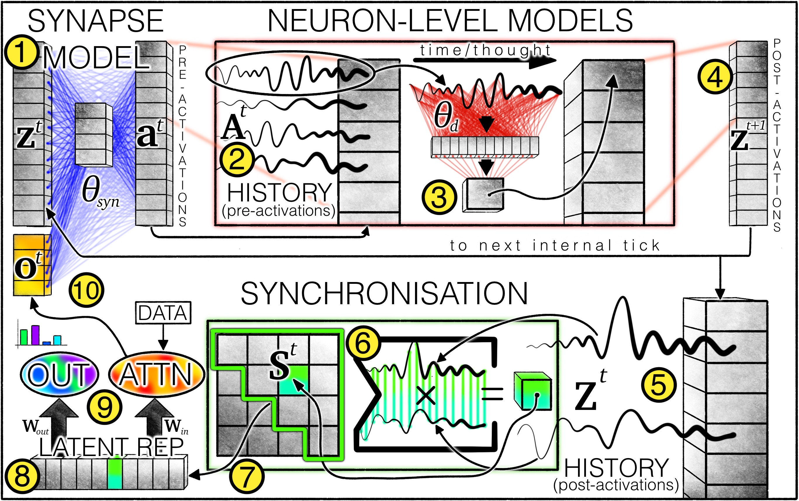
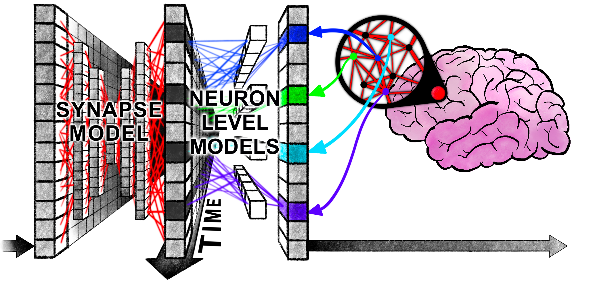



 A novel brain-inspired architecture that introduces the concept of "temporality" to existing time-agnostic neuron models, giving rise to a series of brain-like emergent phenomena.   

## Preface  

This paper caught my attention precisely because of the "magical" emergent phenomena it claims—introducing temporal information into neuron models results in **human-like thought patterns** of attention. These phenomena are not manually designed but naturally emerge during training, which is the most exciting part.  

The most intuitive example is the official "maze model." From the visualized results, we can directly observe the model's attention focus moving through the maze, much like how humans solve maze problems. Additionally, the official team provided an interactive demo page: [Demo](https://pub.sakana.ai/ctm/), where you can directly command the model to solve mazes and observe its attention focus in real time.  

Moreover, the official [code repository](https://github.com/SakanaAI/continuous-thought-machines) includes detailed documentation and code comments, with clean and intuitive file organization—a kind of "artistic sense" only programmers would appreciate.  



After wading through mountains of spaghetti code, one might truly appreciate the "elegance" of well-structured code 😇 and deeply understand the effort behind this "elegance."


## Introduction  

Neural networks were initially inspired by biological brains but have diverged significantly. Biological brains exhibit complex neurodynamic processes that evolve over time, while modern neural networks, for the sake of large-scale deep learning, have largely discarded "temporal" features.  

The official paper provides a clear rationale for this research, so I won't elaborate further:  

"Why conduct this research? Admittedly, modern AI's outstanding performance in many practical domains might suggest that simulating neurodynamics is unnecessary or that explicitly considering the temporal dimension of intelligence is counterproductive. However, human intelligence exhibits high flexibility, data efficiency, and exceptional generalization to unseen scenarios, existing in an open world where learning and adaptation are tightly bound to the arrow of time. Thus, human intelligence naturally possesses commonsense reasoning, ontological inference, transparency/interpretability, and strong generalization—qualities not convincingly demonstrated in current AI."  

The core technical contributions of this paper are as follows:  

1. Decoupled internal temporal dimension  
2. Neuron-level models (NLMs)  
3. Neural activity synchronization  

Of course, without delving into the code implementation, these terms are meaningless. But the author's perspective can still be understood:  

1. Reasoning models and loops: The author critiques current reasoning models, pointing out that the "continue scaling current model architectures" approach has been questioned by many studies. While loop mechanisms can indeed improve performance, the author argues that **loop mechanisms are important, but the precise timing and interactions between neuron activities unlocked by loops are equally critical**.  
2. Interesting side effects: CTM's internal loops resemble human thinking. Without any explicit supervision, it **automatically allocates appropriate computational resources to tasks of varying difficulty**—simple tasks terminate early, while complex tasks undergo deeper computation.  
3. **Information can be encoded in temporal dynamics**, granting the network stronger information compression capabilities.  



My thoughts on the third point: According to the "compression is intelligence" view, encoding information into temporal dynamics would greatly enhance the network's information "compression rate," thereby improving "intelligence" to some extent.  


Finally, the author clarifies the goal of this research:  

"By explicitly modeling neural timing mechanisms in CTM, we aim to pioneer new pathways for developing more biologically plausible and high-performance AI systems."  

## Methodology  

  

Overview of the CTM architecture: ① The synaptic model (weights represented by blue lines) generates pre-activation values by simulating interactions between neurons. Each neuron retains ② a pre-activation history, where the latest data is used by ③ the neuron-level model (weights represented by red lines) to produce ④ post-activation values. The system also maintains ⑤ a post-activation history, from which ⑥ a synchronization matrix is computed. Based on this matrix, ⑦ neuron pairs are selected, and the resulting ⑧ latent representations are used by CTM to ⑨ generate outputs and modulate data via cross-attention. The modulated data (e.g., attention outputs) are ⑩ concatenated with post-activation values as input for the next internal clock step.  

If the goal were merely to introduce a temporal dimension, traditional RNN architectures could achieve it. CTM's innovations lie in:  

1. Replacing traditional activation functions with **neuron-level models**.  
2. Using **neural synchronization** as latent representations to modulate data and generate outputs.  

### Continuous Thought: Internal Sequence Dimension  

The paper defines an internal **temporal dimension**:  


$$
t\in \{1,\dots,T\}
$$

The superscript in the diagram refers to a specific time step, and each time step involves a complete computation cycle (from ① to ⑩).  

This internal dimension is not a new concept—RNNs and Transformers also use it. However, traditional architectures process data sequentially, **implicitly** tying the internal temporal dimension to the input data order.  

For example, RNNs also have an internal temporal dimension, but at each time step, the model receives a new token input, generates the next token based on the internal hidden state, and updates the hidden state. If we only look at token inputs, we essentially default to using the data's inherent order as the model's internal temporal dimension.  



Transformers are inherently "orderless": At each time step, the attention mechanism processes all tokens in parallel. Perhaps this is the source of their power 🤔. The only step related to input data order is "positional embedding."  


CTM completely decouples this association, making internal processing independent of input data. It's not just order-agnostic but also independent of input sequence length, which might be the point the author emphasizes more 🤔.  

This "decoupling" allows the model's internal "thinking" to have arbitrary length, iteratively construct and refine internal representations, and extend to "non-sequential" tasks like solving mazes.  

Current CoT (Chain-of-Thought) techniques can be seen as attempting "decoupling" work: The input data is already there, and directly generating answers doesn't work well, so intermediate tokens—the so-called thought process—are produced with lengths unaffected by the data sequence. But when models overthink simple problems, Anthropic leaves the question of "how much thinking is appropriate" to the model user, which is a pragmatic engineering solution. CTM, however, seems poised to solve this problem 😃 by decoupling the data sequence from the internal temporal dimension at the architectural level 🤔.  

For a deeper understanding of current CoT techniques, check out [Why we think - Lil'log](https://lilianweng.github.io/posts/2025-05-01-thinking/), which offers a more academic yet accessible explanation.  

### Recurrent Weights: Synaptic Model  

This section explains the **synaptic model**, corresponding to step ① in the diagram. Formally, the synaptic model performs the following computation:  


$$
a^t=f_{\theta_{syn}}(concat(z^t,o^t))\in R^D
$$

Here, \(z^t\in R^D\) represents the **post-activation vector** at time step \(t\), and \(o^t\) is the **modulated data** computed in the previous time step. These are concatenated and fed into the **synaptic model** to produce \(a^t\), the **pre-activation vector**.  



Note the lowercase \(z\) here versus the uppercase \(Z\) in the diagram: \(z\) refers to the post-activation vector for a single neuron, while \(Z\) is a matrix of post-activation vectors for all neurons.  


The synaptic model is essentially a function \(f_{\theta_{syn}}\), which can be expressed in various ways. Experiments in the paper use an MLP, specifically a U-NET-esque MLP.  

The most recent \(M\) pre-activation vectors are stored in a matrix \(A^t\):  


$$
A^t=[a^{t-M+1}\quad a^{t-M+1}\dots a^{t}]\in R^{D\times M}
$$

The first \(M\) elements in the history sequence and the initial \(z\) values at \(t=1\) require initialization. Experiments show that making them learnable parameters yields the best results.  



Note that \(z^t\) is not the input data at time step \(t\)! As shown in the diagram, the entire computation flow hardly involves input data—only when computing \(o^t\) (the orange block) does external input data participate 🤔.  


### Parameter-Private Neuron-Level Models  

The synaptic model explains how a single neuron (synapse) processes input and generates a history matrix. Now, assume there are \(D\) identical neurons, each with its own \(A^t\). We denote the history vector of neuron \(d\) as \(A^t_{d}\).  

Each neuron then performs the following computation:  


$$
z^{t+1}_{d}=g_{\theta_{d}}(A^t_{d})
$$

Here, \(\theta_{d}\) represents the **private** computational parameters of neuron \(d\); \(z^{t+1}_{d}\) is the **post-activation value** of neuron \(d\) at the next time step, meaning:  


$$
z^t=[z^{t+1}_{1} \quad z^{t+1}_{2}\dots z^{t+1}_{D}]
$$

\(g_{\theta_{d}}\) is a single-hidden-layer MLP that takes an \(M\)-dimensional vector \(A^t_{d}\) and outputs \(z^{t+1}_{d}\in R^D\).  

In plain terms, this step means: Each neuron generates its next post-activation value based on its last \(M\) pre-activation values.  



😢 I initially thought \(z_{d}^t\) was a vector, but it's actually a scalar.  


### Neuron Synchronization: Input and Output Modulation  

This step ensures that data-model interactions no longer rely on a single moment's model state but on continuous, dynamic neural activity. Specifically, post-activation vectors are collected into a matrix:  


$$
Z^t = [z^1 \quad z^2 \dots z^t]\in R^{D\times t}
$$

**Neuron synchronization** is then described as the inner product of \(Z^t\):  


$$
S^t=Z^t \cdot (Z^t)^T\in R^{D\times D}
$$



Mathematically, \(S^t\) is an unnormalized covariance matrix where the \((i,j)\) element represents the "degree of coordination" between the \(i\)-th neuron and the \(j\)-th neuron across all time steps, which is what the paper refers to as "neural synchronization."


This neuron synchronization matrix undergoes **downsampling**: Randomly select \(D_{out}\) and \(D_{action}\) elements to form two neuron synchronization **representation vectors**, \(S^t_{out}\in R^{D_{out}}\) and \(S^t_{action}\in R^{D_{action}}\).  

\(S^t_{out}\) is projected into the output space:  


$$
\mathbf{y}^t = W_{out}\cdot S^t_{out}
$$

\(S^t_{action}\) is used to generate actions in the world (respecting the original paper's phrasing, though it's a bit confusing 🤔): 


$$
q^t = W_{in}\cdot S^t_{action}
$$

Here, \(W_{in}\) and \(W_{out}\) are learnable matrix parameters.  

The computed \(q^t\) undergoes additional computation to produce \(o^t\in R^{d_{input}}\), which is concatenated with \(z^t\) in the first step. In the author's experiments, this additional computation is typically an attention layer:  


$$
o^t=Attention(Q=q^t, KV=FeatureExtractor(data))
$$

Here, \(FeatureExtractor(\cdot)\) is another neural network model, such as ResNet.  

Since \(S^t\) aggregates information from all time steps, later steps may have a greater impact. To enhance model flexibility, a learnable **decay coefficient** is introduced:  


$$
\mathbf{R}_{i j}^{t}=\left[\begin{array}{llll} \exp \left(-r_{i j}(t-1)\right) & \exp \left(-r_{i j}(t-2)\right) & \cdots & \exp (0) \end{array}\right]^{\top} \in \mathbb{R}^{t}
$$

This coefficient scales the original neuron synchronization matrix elements:  


$$
\mathbf{S}_{i j}^{t}=\frac{\left(\mathbf{Z}_{i}^{t}\right)^{\top} \cdot \operatorname{diag}\left(\mathbf{R}_{i j}^{t}\right) \cdot\left(\mathbf{Z}_{j}^{t}\right)}{\sqrt{\sum_{\tau=1}^{t}\left[\mathbf{R}_{i j}^{t}\right]_{\tau}}}
$$



The author's experiments show that these learnable decay coefficients are rarely used: In ImageNet classification, only 3 out of 8196 coefficients are effective; in maze-solving, it's slightly higher but still around 3%.  


### Loss Function: Optimization Across Time Steps  

Using a classification task as an example, the loss at a given time step is:  


$$
\mathcal{L}^{t}=\operatorname{CrossEntropy}\left(\mathbf{y}^{t}, y_{\text {true}}\right)
$$

The author also defines a confidence vector \(C^t\):  


$$
C^t=1-\frac{\mathcal{L}^{t}}{\sqrt{ (\mathcal{L}^{t})^T \cdot \mathcal{L}^{t} }}
$$

Collecting these losses across all time steps yields two matrices: \(\mathcal{L}\in R^T\) and \(C\in R^T\).  

A natural question arises: How should \(\mathcal{L}\) be reduced to a scalar loss function for learning? This paper's loss function aims to optimize CTM's performance along the internal temporal dimension. Instead of forcing the model to output results at a specific time step (typically the last), the author adopts a dynamic aggregation strategy, integrating information from two internal moments: the point of minimum loss and the point of maximum confidence. This approach offers the following advantages:  

1. Encourages CTM to build meaningful representations and computations across multiple internal moments.  
2. Naturally forms a curriculum learning effect, where the model first uses later steps for complex computations and gradually transitions to earlier steps for simpler tasks.  
3. Enables CTM to **adaptively adjust computational intensity** based on the inherent difficulty of each data point.  

The specific operations are as follows:  


$$
\begin{matrix} t_{1}=argmin(\mathcal{L})\\ t_{2}=argmax(C)\\ L=\frac{\mathcal{L}^{t_{1}} + \mathcal{L}^{t_{2}}}{2} \end{matrix}
$$

Stochastic gradient descent is then used to optimize the model parameters. This concludes the algorithm.  

The author reiterates the superiority of this architecture:  

"Introducing temporality as a fundamental functional element of CTM has many beneficial properties. Most critically, we can train CTM without restricting the number of internal clock cycles used. This seemingly minor freedom is profound—it allows CTM to allocate variable computational resources to different data points. This adaptive/dynamic computation aligns with modern test-time scaling paradigms, with the key difference being that this highly regarded modeling feature is a natural derivative of CTM, not an afterthought or constraint imposed during learning."  

## Summary  

At this point, the paper's core ideas are clear. However, some algorithmic details require further contemplation 🤔.  

### Internal Temporal Dimension  

The paper seems to use two different terms for the "internal temporal dimension" concept: In the conceptual introduction (Section 1), it's called the "internal temporal dimension," while in the loss function section (final section), it's referred to as the "internal thought dimension" 🤔.  

This suggests that the "internal temporal dimension" here differs from RNN time steps, despite their similarities. But how exactly? 🤔  

In the section introducing the "internal temporal dimension," the paper emphasizes CTM's distinction from traditional models:  

"Unlike traditional sequence models (e.g., RNNs or Transformers)—which process inputs sequentially (e.g., words in a sentence or frames in a video)—CTM operates along an autonomously generated internal thought timeline."  

Combining the [interactive webpage](https://pub.sakana.ai/ctm) 's detailed videos and text, I realized something astonishing, as noted at the end of the [Recurrent Weights Synaptic Model]() section:  

\(z^t\) is not the input data at time step \(t\)! As shown in the diagram, the entire computation flow hardly involves input data—only when computing \(o^t\) (the orange block) does external input data participate.  

This is indeed a surprising design. I initially misinterpreted \(z^t\) as input data 😢. With the correct interpretation, the separation of input data and internal temporal dimension becomes understandable: The cyclic generation of internal activation vectors is independent of the data sequence.  

A simple example: If the input data is a natural language text, CTM can generate many internal thought steps while the input data remains the same text. Of course, you could also "generate" new characters, much like a Transformer.  

This means that for any input—sequential or non-sequential—the model can freely unfold arbitrary-length internal thinking. Compared to CoT techniques, this design offers greater expressiveness: CoT expresses thoughts in language, while CTM's thought process is encoded in internal parameters.  

### Synaptic Model and Neuron-Level Model  

  

The above diagram vividly illustrates the operations performed by the synaptic model part and the neuron-level model part: the former enables information interaction between different neurons at the same moment, while the latter facilitates the interaction of historical information across different moments for the same neuron. As shown in the figure, a vertical information fusion is immediately followed by a horizontal information fusion 🤔  

How does the model interact with external data? It is achieved by downsampling the neuronal synchronization matrix and then applying a linear projection. This sounds very abstract, but from another perspective, the logic becomes clear: if we imagine CTM as a brain, then sampling the neural synchronization matrix is akin to extracting a portion of information from it, which is then mapped through a matrix to drive behavior.  

A very reasonable idea is: would replacing this matrix with an MLP network yield better results? 🤔 Does the downsampling strategy impact the capabilities of the CTM model? Could some form of attention mechanism be used to construct an "intelligent" downsampling strategy?  



🤔 I’m actually quite curious: if the number of neurons \(D\) is scaled up to the magnitude of neurons in the human brain, and an attention mechanism is employed, would some form of sparse activation features naturally emerge?


### About Temporal Information

As early as 1997, Maass proposed the Spiking Neural Network (SNN), which is hailed as the third generation of neural networks. Its most prominent feature is: fully mimicking biological neural networks and transmitting information in the form of spikes. This, of course, includes rich temporal information. Therefore, utilizing temporal information in neural networks is not a "novel" idea but rather has a very long history.

However, the equations corresponding to SNNs are mathematically non-differentiable, making it difficult to directly optimize SNNs using the BP algorithm. This might be the biggest obstacle to the large-scale application of SNNs. In other words, the greatest defect of SNNs does not lie in the model's expressive power but in the training algorithm—training algorithms are crucial for large neural networks.

CTM implements a neural network capable of utilizing temporal information based on traditional neuron models. Moreover, it can be seen from the paper's description that the authors have constructed a new type of neuron, where the activation value at time \(t+1\) is connected to the historical activation states of many other neurons through both neuron-level and synaptic-level models. Thus, the output of each neuron can integrate a large amount of historical information.



A somewhat less rigorous thought: SNN processes temporal information and activation values simultaneously, leading to higher model complexity, whereas CTM decouples the computation of temporal information and activation values 🤔


## Code Analysis

The official `README.md` file provides a clear explanation of the project's directory structure, so I won't go into detail here. After briefly reviewing the model code in the `models` folder, you can directly look at the specific training code in the `tasks` folder.



Just looking at the model code actually makes it not very easy to understand how the model interacts with the data🤔


### Maze Problem

This task is a typical one emphasized in the CTM paper. There is an interactive version of the demonstration on the [interactive webpage](https://pub.sakana.ai/ctm/), which very intuitively explains the logic and final results of this task. Most of the code is quite easy to understand, so here are some Q&As that may help with comprehension🤔

---

Q: What is the `prediction_reshaper` parameter?

A: It can be understood as the shape of the output parameters, and each task has different configurations.

In the maze problem, this parameter is set to `[args.maze_route_length, 5]`, where the number 5 indicates that the model predicts from five actions—"up, down, left, right, stop"—and outputs the normalized probability distribution of these five actions; `maze_route_length` represents the number of steps for prediction, which is set to 75 steps on the web interface.

---

Q: What does the following piece of code do?

```python
try:
	# Determine pseudo input shape based on dataset
	h_w = 39 if args.dataset in ['mazes-small', 'mazes-medium'] else 99 # Example dimensions
	pseudo_inputs = torch.zeros((1, 3, h_w, h_w), device=device).float()
	model(pseudo_inputs)
except Exception as e:
	 print(f"Warning: Pseudo forward pass failed: {e}")
print(f'Total params: {sum(p.numel() for p in model.parameters())}')
```

A: Create a "pseudo input" to test the algorithm's correctness.

---
