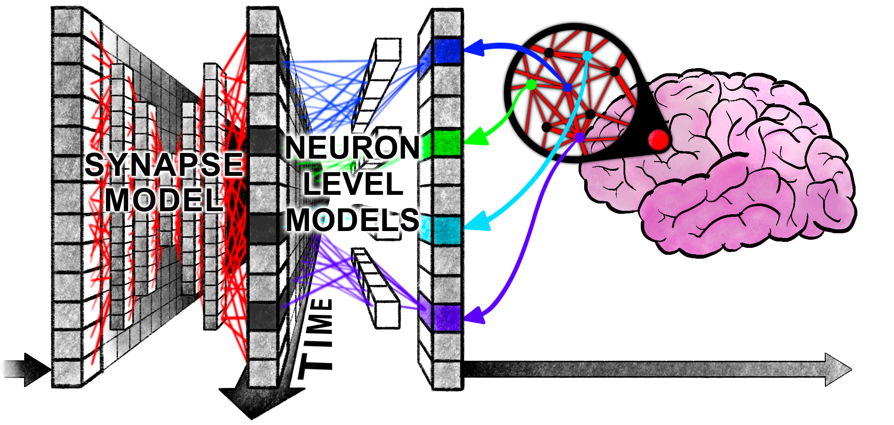



一个新型的人脑启发式架构，在现有时序无关的神经元模型的基础上引入了"时序"概念，涌现出一系列类似人脑的现象


## 前言

关注到这篇论文其实就是因为其宣称的那种"奇妙"的涌现现象，将时序信息引入神经元模型之后产生了**类似人类思维模式**的注意力现象。这些现象并非人为设计的，而是在训练过程中自然产生的，这是最令人振奋的。

最直观的例子就是官方给出的"迷宫模型"，从可视化的结果可以直观地看到，模型的注意力焦点在迷宫中游走，就像人类求解迷宫问题一样。另外官方还给出了一个可交互的展示网页：[Demo](https://pub.sakana.ai/ctm/)，在这个网页中你可以直接指挥模型求解迷宫，并实时查看模型的注意力焦点。

另外，官方的[代码仓库](https://github.com/SakanaAI/continuous-thought-machines)中配置了详尽的说明文档和代码注释，代码文件的切分也非常简洁直观，有一种程序员才懂的"艺术感"。


在阅读了大量的屎山代码之后，可能才会对代码的"优雅"程度有所体会😇并深刻理解这份"优雅"背后的工作量


## 引入

神经网络最初受生物大脑启发，却与生物大脑差异巨大。生物大脑展现出随时间演变的复杂神经动力学过程，而现代神经网络为了便于大规模深度学习，可以摒弃了"时序"特征。

关于为什么要开展这项研究，官方论文中已经有了非常明确的表述，无需多言：

"为何开展此项研究？诚然，现代人工智能在诸多实践领域展现出的卓越性能似乎表明，对神经动力学的模拟实无必要，抑或显式考量智能的时间维度实属反实用之举。然而，人类智能具有高度灵活性、数据高效性以及优异的未见情境外推能力，且存在于学习与适应皆与时间之箭紧密关联的开放世界中。因此，人类智能天然具备常识运用、本体论推理能力、透明性/可解释性以及强大的泛化能力——这些特质在现有人工智能中尚未得到令人信服的体现。"

这篇文章的核心技术贡献如下所示：

1. 解耦的内部时间维度
2. 神经元层面的模型(NLMs)
3. 神经活动同步

当然，在没有详细看代码实现的情况下，光看这些名词是没有意义的。但是作者的思路和观点还是可以了解：

1. 推理模型和循环：作者锐评了当前推理模型，指出"继续扩展当前模型架构"这条技术路线已经被很多研究质疑。而使用循环技术也的确能够让现有模型架构产生更加良好的表现，但是作者认为，**循环机制很重要，但是被循环机制解锁的神经元活动之间的精确时序与交互同样重要**
2. 有趣的副作用：CTM 内部的循环类似于人类的思考，在没有任何显式的监督函数引导的情况下就能够**为不同难度的任务自动分配合适的计算资源**，简单的任务将会提前终止计算，而复杂的任务将会进行更加深入的计算
3. **信息可以被编码在时序动态中**，这将赋予网络更加强大的信息压缩能力


说明一下我对第三点的思考，按照"压缩即智能"的观点，将将信息编码到时序动态中将极大地提高网络的信息"压缩率"，从某种程度上来说也就提升了"智能"


最后作者也明确了自己这个研究的目的所在：

"通过CTM显式建模神经时序机制，我们旨在为开发更具生物合理性且高性能的人工智能系统开辟新路径。"

## 方法

CTM架构概述：①突触模型（权重以蓝线表示）通过模拟神经元间相互作用生成预激活值。每个神经元会保留 ②预激活历史记录，其中最新数据被 ③神经元级模型（权重以红线表示）用于产生 ④后激活值。系统同时维护 ⑤后激活历史记录，并据此计算⑥同步矩阵。基于该矩阵 ⑦筛选神经元对，由此产生的 ⑧潜表征被CTM用于 ⑨生成输出并通过交叉注意力机制调节数据。经调节的数据（如注意力输出）会 ⑩与后激活值拼接，作为下一内部时钟步的输入

如果只是单纯的引入时间维度的话，传统的 RNN 架构也能够实现，但 CTM 的创新之处在于：

1. 使用**神经元级模型**取代了传统的激活函数
2. 使用**神经同步**作为潜在表征来调制数据并生成输出

### 连续思考：内部序列维度

论文定义了一个内部的**时间维度**：

$$
t\in \{1,\dots,T\}
$$

图中参数右上角的角标就指代的是某一个特定的时间步，而每一个时间步中都会进行一次图中完整的计算流程(从①到⑩)

这种内部维度并非全新的概念，RNN 和 Transformer 中都有使用。但是传统的架构按照数据输入的顺序来逐步处理，这**隐含**地将内部的时间维度与数据的输入顺序挂钩了。

举个例子，RNN 中也有内部时间维度的概念，只是每一个时间步模型都会接受一个新的 token 输入，然后根据内部隐状态去产生下一个 token 并更新内部隐状态。如果只看 token 的输入就会发现我们其实是默认将数据内在的顺序作为模型的内部时间维度


Transformer 本身是"无序"的：每一个时间步注意力机制都会并行处理原来所有的 token 或许这也是其强大所在🤔真正和输入数据顺序相关的步骤在于"位置嵌入"


而 CTM 则完全解耦了这种关联，让内部的处理与输入数据无关。不只是顺序无关，还与输入序列的长度无关，这也可能是作者更想强调的🤔

这种"解耦"使得模型内部的"思考"可以有任意长度，可以迭代地构建和完善内部表征，并且可以扩展到"非序列化"的任务上，例如求解迷宫问题。

其实目前 CoT 那一系列的技术可以理解为在做"解耦"的工作：数据输入已经摆在那里了，直接生成答案效果不太行，那就多产生一些**长度不受数据序列影响的**中间 token 也就是所谓的思考过程。但发现在非常简单的问题中模型想太多结果也不太好，怎么办呢？Anthropic 就把"思考多少合适"这个问题丢给了模型使用者，这从工程上也不失为一个明智之举。但 CTM 貌似有望解决这个问题😃其貌似从底层架构上解耦了数据序列与内部时间维度的关系🤔

如果你想对当前的 CoT 技术有一个更加深入而全面的了解，可以去看看 [Why we think - Lil'log](https://lilianweng.github.io/posts/2025-05-01-thinking/) 里面有更加学术化的严谨表达，但又非常容易理解。

### 循环权重：突触模型

这一部分主要讲解**突触模型**，对应图中的番号①部分。形式化来讲突触模型进行的工作如下：

$$
a^t=f_{\theta_{syn}}(concat(z^t,o^t))\in R^D
$$

其中 \(z^t\in R^D\) 表示 \(t\) 时间步的**后激活向量**，\(o^t\) 是上一个时间步计算得出的**调制数据**，与原来的 \(z^t\) 进行拼接后整体送入**突触模型**进行计算，然后就得出 \(a^t\) 也就是**预激活向量**


注意这里用的是小写的 \(z\) 而大图中使用的是大写的 \(Z\)：\(z\) 表示作用在单个神经元上的后激活向量；而 \(Z\) 表示所有神经元的后激活向量构成的一个矩阵


突触模型本质上就是一个函数 \(f_{\theta_{syn}}\) 可以用多种方式表达，经过实验，原论文中使用了 MLP 来表示这个函数，更具体的就是 U-NET-esque MLP

然后将最近的 \(M\) 个预激活向量用一个矩阵 \(A^t\) 存储起来：

$$
A^t=[a^{t-M+1}\quad a^{t-M+1}\dots a^{t}]\in R^{D\times M}
$$

历史序列中的前 \(M\) 个元素及初始时刻 \(t=1\) 的 \(z\) 值需要进行初始化，实验表明将其设置为可学习参数能获得最佳效果。


注意 \(z^t\) 并不是 \(t\) 时间步上的输入数据！实际上从大图中可以看出，整个模型的计算流程几乎不涉及输入数据，只有计算 \(o^t\) (橙色方块)时才有外部输入数据的参与🤔


### 参数私有化的神经元级模型

在突触模型中介绍了单个神经元(突触)是如何处理输入，并产生一个历史记录矩阵。现在假设有 \(D\) 个同样的神经元，每一个神经元都有各自的 \(A^t\) 我们将其中编号为 \(d\) 的神经元的历史记录向量写作 \(A^t_{d}\)

然后每一个神经元都会进行如下计算：

$$
z^{t+1}_{d}=g_{\theta_{d}}(A^t_{d})
$$

\(\theta_{d}\) 表示编号为 \(d\) 的神经元**私有**的计算参数；\(z^{t+1}_{d}\) 如其角标所示，就是下一个时间步 \(d\) 号神经元的**后激活值**，也就是说：

$$
z^t=[z^{t+1}_{1} \quad z^{t+1}_{2}\dots z^{t+1}_{D}]
$$

而 \(g_{\theta_{d}}\) 就是一个单隐层的 MLP，接受一个 \(M\) 维的向量 \(A^t_{d}\) 输出 \(z^{t+1}_{d}\in R^D\)

用大白话描述这一步操作就是：每一个神经元都根据自己前 \(M\) 次的预激活值产生下一个后激活值。


😢我一开始还以为 \(z_{d}^t\) 是一个向量，但其实是一个标量


### 神经元同步：输入与输出的调制

这一步是让数据与模型的交互不再依赖某一个时刻的模型状态，而是持续的动态的神经活动。具体而言就是将后激活向量收集起来，形成一个矩阵：

$$
Z^t = [z^1 \quad z^2 \dots z^t]\in R^{D\times t}
$$

然后将**神经元同步**描述为 \(Z^t\) 的内积：

$$
S^t=Z^t \cdot (Z^t)^T\in R^{D\times D}
$$

然后对这个神经元同步矩阵进行**下采样**：从中随机选取 \(D_{out}\) 和 \(D_{action}\) 个元素值，分别形成两个神经元同步的**表征向量**，即 \(S^t_{out}\in R^{D_{out}}\) 和 \(S^t_{action}\in R^{D_{action}}\)

\(S^t_{out}\) 被投影到输出空间：

$$
\mathbf{y}^t = W_{out}\cdot S^t_{out}
$$

而 \(S^t_{action}\) 则用于在世界中产生行为(尊重原论文表述，但其实有些迷惑🤔)：

$$
q^t = W_{in}\cdot S^t_{action}
$$

\(W_{in}\) 和 \(W_{out}\) 都是可学习的矩阵参数

计算得出的 \(q^t\) 会再经过额外的计算产生 \(o^t\in R^{d_{input}}\)，并在第一步中与 \(z^t\) 进行拼接，在作者的实验中这个额外的计算一般就是注意力层：

$$
o^t=Attention(Q=q^t, KV=FeatureExtractor(data))
$$

其中 \(FeatureExtractor(\cdot)\) 也是一个神经网络模型，例如 \(ResNet\)

由于 \(S^t\) 聚合了当前所有时间步的信息，较晚的时间步可能对结果的影响更大。为了让模型的灵活性更强，引入了一个可学习的**衰减系数**：

$$
\mathbf{R}_{i j}^{t}=\left[\begin{array}{llll} \exp \left(-r_{i j}(t-1)\right) & \exp \left(-r_{i j}(t-2)\right) & \cdots & \exp (0) \end{array}\right]^{\top} \in \mathbb{R}^{t}
$$

然后用这个衰减系数去放缩原本的神经元同步矩阵的元素值：

$$
\mathbf{S}_{i j}^{t}=\frac{\left(\mathbf{Z}_{i}^{t}\right)^{\top} \cdot \operatorname{diag}\left(\mathbf{R}_{i j}^{t}\right) \cdot\left(\mathbf{Z}_{j}^{t}\right)}{\sqrt{\sum_{\tau=1}^{t}\left[\mathbf{R}_{i j}^{t}\right]_{\tau}}}
$$


作者经过实际研究，发现这些可学习的衰减系数很少用到：在 ImageNet 视觉分类任务中在 8196 个衰减系数中只有 3 个是有效的；而在迷宫求解问题中更多一些，但也只有大约 3%


### 损失函数：在不同时间步中优化

这里用分类任务举例子，假设某一个分类任务有 \(C\) 个类别，某一个时间步上的损失就是：

$$
\mathcal{L}^{t}=\operatorname{CrossEntropy}\left(\mathbf{y}^{t}, y_{\text {true}}\right)
$$

作者还给出了一个置信度向量 \(C^t\)：

$$
C^t=1-\frac{\mathcal{L}^{t}}{\sqrt{ (\mathcal{L}^{t})^T \cdot \mathcal{L}^{t} }}
$$

然后在所有时间步上收集这些损失就形成了两个矩阵：\(\mathcal{L}\in R^T\) 和 \(C\in R^T\)

一个自然产生的问题是：应如何将L降维为标量损失函数以用于学习？本研究的损失函数旨在优化 CTM 在内部时间维度上的性能表现。相较于让模型在某一个特定的时间步输出结果(典型的就是最后一步)，作者采用了动态聚合的策略，整合两个内部时刻的信息：损失最小点和确定性最高点。该方法优势如下：

1. 促使CTM在多个内部时刻建立有意义的表征与计算
2. 自然形成课程学习效应，模型可先利用后期内部时刻处理复杂计算，再逐步过渡至早期步骤处理简单任务
3. 使CTM能够根据数据集中各样本点的固有难度**自适应调整计算强度**

具体操作如下公式所示：

$$
\begin{matrix} t_{1}=argmin(\mathcal{L})\\ t_{2}=argmax(C)\\ L=\frac{\mathcal{L}^{t_{1}} + \mathcal{L}^{t_{2}}}{2} \end{matrix}
$$

然后使用随机梯度下降算法优化模型参数。整个算法流程到这里就结束了。

然后作者又强调了一下这模型架构的优越性：

"将时序作为 CTM 的基本功能要素引入，具有诸多有益特性。其中尤为关键的是，我们能够在不限制内部时钟周期使用数量的情况下训练 CTM。这种看似微妙的自由度实则意义深远，它使得 CTM 能够为不同数据点分配可变的计算量。这种自适应/动态计算理念与现代测试时计算范式(Test time Scaling)相契合，其区别在于：这一备受推崇的建模特性是 CTM 的自然衍生结果，而非事后施加的约束或学习过程中的限制条件。"

## 小结

其实论文读到这里，基本已经能够理解作者想要表达的含义了。但是某一些具体的算法细节上还需要更进一步琢磨一下🤔

### 内部时间维度

论文中貌似使用了两种不同的称谓来指代"内部时间维度"这个概念：在概念提出的章节，也就是第一节，使用的是"内部时间维度"；以及损失函数的章节，也就是最后一节，使用的是"内部思考维度"🤔

这似乎表示了本文中的"内部时间维度"与 RNN 中的时间步并不相同，尽管非常非常相似。但具体的区别点如何理解？🤔 

在"内部时间维度"这个概念提出来的章节，论文着重强调了 CTM 与传统模型的差异：

"与传统序列模型（如 RNN 或 Transformer）不同——这些模型需要按照数据固有的顺序（如句子中的单词或视频中的帧）逐步处理输入——CTM 沿着自主生成的内部思维步骤时间轴进行操作。"

综合[可交互网页](https://pub.sakana.ai/ctm)中的详细视频和文字说明，我发现一个非常令人震撼的事实，在[循环权重：突触模型]()这个章节中的最后我也有标注：

\(z^t\) 并不是 \(t\) 时间步上的输入数据！实际上从大图中可以看出，整个模型的计算流程几乎不涉及输入数据，只有计算 \(o^t\) (橙色方块)时才有外部输入数据的参与

这确实是一个非常令人惊讶的设计，我一开始还将 \(z^t\) 错误解读为了输入数据😢在正确解读的情况下，输入数据和内部时间维度的分离就是一个非常可理解的事情：内部的激活值向量的循环生成过程与数据序列没有关系

一个简单的例子就是：假设输入数据是一串自然语言文本，CTM 可以生成很多个内部思考时间步，但输入数据却一直都是原来那串文本。当然如果你想的话，也可以不断"生成"新的字符，就像 Transformer 做的一样。

这意味着对于任何输入，包括序列化和非序列化的输入，都能够在内部自由地展开任意长度的思考。相比于 CoT 技术，这样的设计表达力更强：CoT 中的思考过程用语言来表达，而 CTM 的思考过程则使用内部参数表达。

### 突触模型和神经元级模型

上面这幅图非常直观地解释了突触模型部分和神经元级模型部分进行的操作：前者让同一时刻在不同神经元之间的信息进行交互；后者让不同时刻统一神经元的历史信息进行交互。如图中所示，一个纵向的信息融合之后紧跟一个横向的信息融合🤔

先鸽了，还要期末考试😢