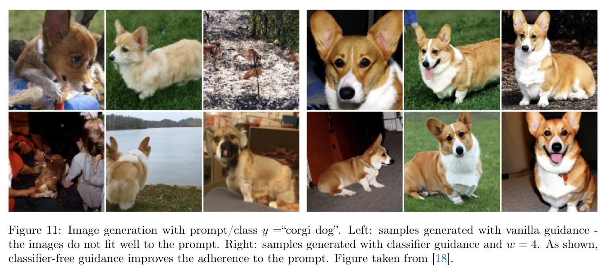
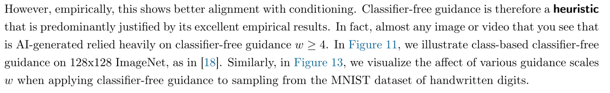
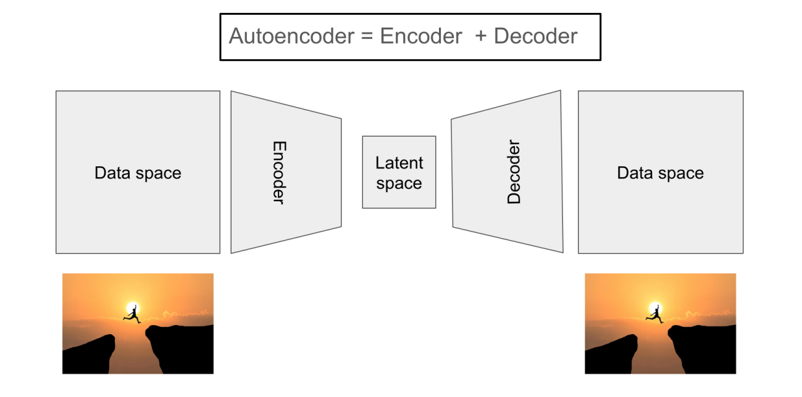
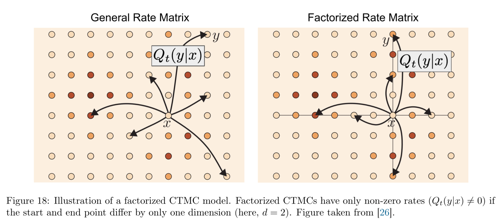



Denoising diffusion and flow matching models are the backbone of the best image, audio and video generation models. So being familiar with the relevant technics and build some intuition for that is both significant and interesting.

This article is mainly a note taking for a fantastic course [MIT 6.S184](https://diffusion.csail.mit.edu/2026/index.html).

## Overview

Firstly, we want to generate something which could be an image or an vedio. That's the original purpose of our work. But actually what does "something" mean and how can we represent it formally?

Actually, all the object we interest can be represented as a vector \(z \in \mathbb{R}^d\) or can be flatten to a vector. Instead of saying I wanna an image, now we can say that I wanna the vector of image. So here is the key idea:

> **An object is a vector.**

The next informal word is "generation". Intuitively, there should be a lot of figures in your mind when you thinking "a picture of dog" and you cannot tell which one is correct but which one is better. Noticing the similarity of rolling an instance from a data distribution, we can tell that "generation" is the same with "sampling". So the key idea here is:

> **Generation can be viewed as sampling.**

And now the target is much more clear: we need to find the distribution of the vector we need. Taking a step more, we may need to "switch" the distribution when we want something different such as swtiching from the "dog distribution" to the "cat distribution".

*So the final formal target is to sampling a vector \(z\) from the conditional distribution \(p_{\text{data}(\dot{}|y)}\) where \(y\) is a prompt describes what we want.*

## Motivation

How to represent a distribution if we just want to generate the images of dog? This is a weaken version of our final target and simply we can apply a neural network to be the distribution. It's just like a bandit that takes stochastic seeds as input and simply generate pictures of dog.

This idea is quite reasonable and is exactly the things what we do in the past decade. The key challenge is how to bind the random seeds with the actual dog images: here is an image of husky and what random seed of it? If you ignore this and directly train a model with MSE loss you will get an "averaged" dog. That may be something you can hardly tell it is a dog. 🤣

To solve this problem, we can redefine the challenge since it's not neccessary to tell which seed is "husky seed" and what we actually need is to train our distribution (model) to be **as near as possible** to the "dog distribution".

This naturally shifts our goal from comparing individual pixels to measuring the "distance" between two probability distributions. Once we stop obsessing over exact pairings and instead use clever setups, like an adversarial critic (GANs) or multi-step denoising (Diffusion), to pull the generated distribution towards the real one as a whole, that blurry average ghost disappears, and realistic, sharp dogs finally pop right out.

But here comes the catch: even if we drop pixel-to-pixel MSE and turn to distribution-matching games (like GANs), asking a network to morph a simple Gaussian blob into a wildly complex, disconnected image manifold in a single leap is **mathematically brutal**. The required mapping is horribly discontinuous and ill-conditioned. This single-step leap is precisely why older generative models suffered from notorious instability, mode collapse, or severe architectural restrictions.

This brings us to the grand paradigm shift in MIT 6.S 184, **Flows and Diffusion**:

> **Instead of taking an impossible giant leap, why not build a continuous bridge?**

If jumping directly from pure noise \(z \sim \mathcal{N}(0, I)\) to a crisp husky \(x \sim p_{\text{data}}\) in one step is too hard, we can break the journey down into smooth, incremental steps along a time trajectory \(t \in [0, 1]\). At any point along the path, the network no longer needs to predict the entire dog out of thin air; it only needs to tell us **which local direction to nudge the sample**—whether that means predicting a local velocity vector (Flow Matching) or removing a tiny speck of noise (Diffusion). By turning a chaotic global mapping into a sequence of easy, locally stable regressions, we finally get stable training and astonishing sample quality.

> [!NOTE]+ Note
> This also brings us some bonus. With flow or diffision progress, your prompt can be reseaonablly injected. You can imagine how complex the mapping function will be when attempting to get the final distribution in one step.

From a general perspective, this method can be view as getting "depth" in the time dimension instead of in the model dimension.

## Flow model

To summarize, our current task is to describe the evolution of how a simple noise distribution gradually turns into the target data distribution.

Fortunately 🐸, Ordinary Differential Equations (ODEs) provide an elegant framework to describe this transformation. Specifically, if we can find a time-dependent vector field \(u_t(x)\) that generates the desired probability density path \(p_t(x)\) from \(t = 0\) to \(t = 1\), we can train a neural network \(u_t^\theta(x)\) with weights \(\theta\) to approximate it.

Naturally, the regression objective, the **Flow Matching loss**, is formulated as:

$$
\mathcal{L}_{\text{FM}}(\theta) = \mathbb{E}_{t \sim \text{Unif}[0, 1], \, x \sim p_t} \left[ \| u_t^\theta(x) - u_t(x) \|^2 \right]
$$

However, a fundamental dilemma arises immediately:  \(u_t(x)\) is completely intractable in practice. We only have access to empirical samples from \(p_{\text{data}}\), so how can we determine the marginal vector field \(u_t(x)\) that moves the entire distribution?

To understand how \(u_t(x)\) is defined and how we can compute it, let us formalize the dynamics from single particles to probability distributions.

A particle's trajectory \(X: [0, 1] \to \mathbb{R}^d, \, t \mapsto X_t\) is governed by a time-dependent vector field \(u_t: \mathbb{R}^d \to \mathbb{R}^d\) specifying the velocity at each point and moment in time:

$$
\frac{d}{dt} X_t = u_t(X_t), \quad X_0 = x_0
$$

The continuous solution across time is characterized by the flow map \(\psi_t: \mathbb{R}^d \to \mathbb{R}^d\), which tracks the position \(\psi_t(x_0) = X_t\), satisfying:

$$
\frac{d}{dt}\psi_t(x_0) = u_t(\psi_t(x_0)), \quad \text{with } \psi_0(x_0) = x_0
$$

Physically, \(u_t\) is simply a function that takes a time \(t\) and a coordinate \(x\), and returns the instantaneous velocity vector of a particle at that location.

Things become interesting when we consider a whole ensemble of particles forming a continuous **probability distribution** \(p_t(x)\) over time (termed a **probability density path**). 

Because probability mass is conserved (particles cannot be created or destroyed), the spatial density \(p_t(x)\) carried along by the vector field \(u_t(x)\) must satisfy the **continuity equation**:

$$
\frac{\partial p_t(x)}{\partial t} = - \nabla \cdot \big( p_t(x) u_t(x) \big)
$$

Since the marginal distribution \(p_t(x)\) and vector field \(u_t(x)\) are difficult to work with globally, we introduce a conditioning variable \(z\) (e.g., target data points \(x_1 \sim p_{\text{data}}\) or pairs \((x_0, x_1)\)):

$$
p_t(x) = \int p_t(x \mid z) p(z) \, dz
$$

Here, each conditional path \(p_t(x \mid z)\) has its own simple, well-defined conditional vector field \(u_t(x \mid z)\) satisfying its own continuity equation:

$$
\frac{\partial p_t(x \mid z)}{\partial t} = - \nabla \cdot \big( p_t(x \mid z) u_t(x \mid z) \big)
$$

Taking the time derivative of the marginal distribution \(p_t(x)\):

$$
\begin{aligned} \frac{\partial p_t(x)}{\partial t} &= \int \frac{\partial p_t(x \mid z)}{\partial t} p(z) \, dz \\ &= - \nabla \cdot \int p_t(x \mid z) u_t(x \mid z) p(z) \, dz \\ &= - \nabla \cdot \left( p_t(x) \int u_t(x \mid z) \frac{p_t(x \mid z) p(z)}{p_t(x)} \, dz \right) \\ &= - \nabla \cdot \left( p_t(x) \int u_t(x \mid z) p_t(z \mid x) \, dz \right) \end{aligned}
$$

Comparing this with the original marginal continuity equation \(\frac{\partial p_t(x)}{\partial t} = - \nabla \cdot \big( p_t(x) u_t(x) \big)\), we can define the marginal vector field simply as:

$$
u_t(x) = \int u_t(x \mid z) p_t(z \mid x) \, dz = \mathbb{E}_{z \sim p_t(z \mid x)} \left[ u_t(x \mid z) \right]
$$

This crucial result shows that the complex global vector field \(u_t(x)\) is simply the aggregate expectation of tractable, conditional vector fields \(u_t(x \mid z)\).

Recall our original Flow Matching objective:

$$
\mathcal{L}_{\text{FM}}(\theta) = \mathbb{E}_{t \sim \text{Unif}[0, 1], \, x \sim p_t} \left[ \| u_t^\theta(x) - u_t(x) \|^2 \right]
$$

Substituting the marginal field \(u_t(x) = \mathbb{E}_{z \sim p_t(z \mid x)} [u_t(x \mid z)]\) directly into this loss and expanding the square reveals a remarkable fact: \(\mathcal{L}_{\text{FM}}(\theta)\) differs from the Conditional Flow Matching objective by only a constant term independent of \(\theta\):

$$
\mathcal{L}_{\text{CFM}}(\theta) = \mathbb{E}_{t \sim \text{Unif}[0, 1], \, z \sim p(z), \, x \sim p_t(x \mid z)} \left[ \| u_t^\theta(x) - u_t(x \mid z) \|^2 \right]
$$

Specifically, one can show that:

$$
\mathcal{L}_{\text{CFM}}(\theta) = \mathcal{L}_{\text{FM}}(\theta) + C \quad \implies \quad \nabla_\theta \mathcal{L}_{\text{FM}}(\theta) = \nabla_\theta \mathcal{L}_{\text{CFM}}(\theta)
$$

The proof of this can be find in [lecture_notes](https://diffusion.csail.mit.edu/2026/docs/lecture_notes.pdf) and the key preliminary is \(u_t(x)\) can be represented as the aggregate expectation of conditional vector fields which has been proved before.

Since their gradients with respect to \(\theta\) are identical, minimizing the tractable conditional objective \(\mathcal{L}_{\text{CFM}}(\theta)\) is mathematically equivalent to minimizing the intractable marginal objective \(\mathcal{L}_{\text{FM}}(\theta)\). All we need in practice is to sample \(z\), sample \(x \sim p_t(x \mid z)\) which is a simpile evolution we can freely define, compute the closed-form conditional velocity \(u_t(x \mid z)\), and train our network via simple mean squared error regression.

## Diffusion model

The mathematics of score matching is actually completely self-contained right from the start. We define the marginal score as the gradient of the log-density, \(\nabla \log p_t(x)\). Even though the true marginal density \(p_t(x)\) is intractable, we have the elegant marginalization identity:

$$
\nabla \log p_t(x) = \int \nabla \log p_t(x|z) \frac{p_t(x|z)p_{\text{data}}(z)}{p_t(x)} \mathrm{d}z
$$

By expanding the mean squared error against this marginal score, the intractable marginal objective reduces directly to the conditional denoising score matching loss: \(\mathbb{E}[\|s_t^\theta(x) - \nabla \log p_t(x|z)\|^2]\). In theory, this single identity is all we need: score matching can be formulated, trained, and completed entirely on its own without knowing anything about vector fields or flow models.

However, training a score model is only half the story, because having the score function alone is not enough to generate new samples. A score function merely indicates the local direction of increasing probability density; it does not inherently transport probability mass forward from the initial noise \(p_{\text{init}}\) to the data distribution \(p_{\text{data}}\). If we want to generate samples by simulating a SDE while ensuring that the marginal distribution of \(X_t\) strictly follows the desired probability path \(p_t\), the Fokker-Planck equation dictates that the trajectory must follow:

$$
\begin{aligned} \mathrm{d}X_t &= u_t(X_t) \mathrm{d}t + \frac{\sigma_t^2}{2} \nabla \log p_t(X_t) \mathrm{d}t + \sigma_t \mathrm{d}W_t \\ &= \left[ u_t(X_t) + \frac{\sigma_t^2}{2} \nabla \log p_t(X_t) \right] \mathrm{d}t + \sigma_t \mathrm{d}W_t \end{aligned}
$$

Here, the Brownian motion \(\sigma_t \mathrm{d}W_t\) injects stochastic kicks, while the term \(\frac{\sigma_t^2}{2} \nabla \log p_t(X_t)\) serves as an inward correction to counteract the dispersion caused by the noise. But look closely at the drift: it explicitly requires *both* the deterministic velocity field \(u_t(X_t)\) and the score function \(\nabla \log p_t(X_t)\). Score alone only gives the corrective pull, not the baseline forward trajectory.

This leads to an awkward reality: for an arbitrary probability path, the velocity field \(u_t\) and the score field \(\nabla \log p_t\) are fundamentally distinct mathematical objects with no simple relation. If we chose an arbitrary distribution, we would be trapped in an engineering nightmare where we must train *two separate neural networks*, one via flow matching to learn \(u_t\), and another via score matching to learn \(\nabla \log p_t\), just to run a single SDE sampling loop.

This awkward dilemma is precisely why practical diffusion models almost universally settle on Gaussian probability paths, \(p_t(x|z) = \mathcal{N}(x; \alpha_t z, \beta_t^2 I_d)\). Under a Gaussian path, both the conditional velocity field \(u_t(x|z)\) and the conditional score \(\nabla \log p_t(x|z)\) happen to be affine functions of \(x\) and \(z\). Once integrated against the posterior, both collapse into linear reparameterizations of the exact same posterior mean \(\mathbb{E}[z \mid x]\) (the denoiser). This yields the closed-form bridge:

$$
u_t(x) = a_t \nabla \log p_t(x) + b_t x
$$

Because of this exact equivalence, training a single network gives us the other quantity entirely for free.

> [!NOTE] Thought
> Why we introduce some stochastic factor? A converged explaination is about **diversity**. Flow model is simple and graceful but too rigrid and determinated. Moreover, there are some errors for flow model training which cannot be tackled theoritically. By introducing the stochastic factor, we hope to achieve a better performance by adjusting the \(\sigma\) of SDE.

## Guided Generation

The algorithms above does not take the user's prompt into considertation. Usually, we want to push the result to the direction that follows our prompt or other possible extra information.

The vanilla guided conditional flow matching objective is:

$$
\mathcal{L}_{\mathrm{CFM}}^{\mathrm{guided}}(\theta) = \mathbb{E}_{(z,y) \sim p_{\mathrm{data}}(z,y), \, t \sim \mathrm{Unif}[0,1], \, x \sim p_t(\cdot | z)} \| u_t^\theta(x|y) - u_t(x|z) \|^2.
$$

This loss function has nothing different to our previous one but added \(y\) tags into it. And the final \(X_{1}\) should faithfully follow the guided distribution \(p_{\text{data}}(\cdot |y)\). Theoritically perfect but practically failed. Here is an evidence: the left pictures is low-quality comparing to the right ones.

And here refer a piece of content from [lecture_notes](https://diffusion.csail.mit.edu/2026/docs/lecture_notes.pdf) p.35 bottom.

> This can have a diversity of reasons: the model might underfit (i.e. we do not actually learn the true marginal vector field) or our data might be imperfect (e.g. text-image pairs from the world wide web have a lot of errors). Therefore, to truly generate samples that fit better to a prompt, we have to find a way to artificially **reinforce** the prompt variable \(y\).

So we start by the equation of velosity and score. Then apply Beyes' rule to get the result. 

$$
\begin{aligned} u_t(x|y) &= a_t \nabla_x \log p_t(x|y) + b_t x \\ &= a_t \nabla_x \log \left[ \frac{p_t(x) p_t(y|x)}{p_t(y)} \right] + b_t x \\ &= b_t x + a_t \left[ \nabla_x \log p_t(x) + \nabla_x \log p_t(y|x) \right] \\ &= u_t(x) + a_t \nabla_x \log p_t(y|x) \end{aligned}
$$

The euqation says that the vanilla guided velosity filed is the unguided file puls the score filed \(\nabla_x \log p_t(y|x)\). A simple way to reinforce \(y\) is to apply a scale factor \(w > 1\) to the score:

$$
\tilde{u}_t(x|y)=u_t(x) + w\cdot a_t \nabla_x \log p_t(y|x)
$$

And this is the core of **classifier guidance**. But why is "classifier"? Actually, to get the reinforced velosity file \(\tilde{u}_t(x|y)\) we need two neural network, one is for the standard velosity filed and the other for the score filed \(\nabla_x \log p_t(y|x)\). The second network is to generate the distribution of \(y\) given \(x\) which means to classify the "dirty" interval \(x\) to some tags \(y\). So that's why we call this classifier guidance.

As you can imagine, it's annoying and unstable to train a network to do classification job on dirty \(x\). So we need to convert the ugly score into something simpler. Recall the score is just a reparameterization of velosity when the basic distribution is Gaussian. There should be a chance to convert score into velosity.

$$
\begin{aligned} \tilde{u}_t(x|y) &= u_t(x) + w a_t \nabla \log p_t(y|x) \\ &= u_t(x) + w a_t (\nabla \log p_t(x|y) - \nabla \log p_t(x)) \\ &= u_t(x) - (w b_t x + w a_t \nabla \log p_t(x)) + (w b_t x + w a_t \nabla \log p_t(x|y)) \\ &= (1 - w) u_t(x) + w u_t(x|y) \end{aligned}
$$

The euqation tells us that the reinforced filed \(\tilde{u}_t(x|y)\) is a linear conbination of standard filed \(u_t(x)\) and guided filed \(u_t(x|y)\). Can we move the conbination operation into the data layer? In other word, can we apply a drop out trick to estimate both \(u_t(x)\) and \(u_t(x|y)\) in a single neural network? Yes, we can and here is a proof.

To formalize this, consider augmenting our label space to \(\tilde{\mathcal{Y}} = \mathcal{Y} \cup \{\emptyset\}\), where \(\emptyset\) denotes a designated null token representing the absence of conditioning. During training, for each data pair \((z, y) \sim p_{\mathrm{data}}(z, y)\), we introduce an independent Bernoulli trial with probability \(\eta \in (0, 1)\) that decides whether to drop the label. The active conditioning variable \(c \in \tilde{\mathcal{Y}}\) fed into the model is thus defined as \(c = y\) with probability \(1 - \eta\), and \(c = \emptyset\) with probability \(\eta\).

Crucially, because the dropout mechanism is an independent coin toss, the event \(c = \emptyset\) is statistically independent of the sample state \(x\). Applying Bayes' rule to the intermediate noisy distribution yields:

$$
p_t(x \mid c = \emptyset) = \frac{p(c = \emptyset \mid x) p_t(x)}{p(c = \emptyset)} = \frac{\eta \cdot p_t(x)}{\eta} = p_t(x).
$$

This identity shows that the intermediate data distribution conditioned on the dummy label \(\emptyset\) is strictly identical to the true unconditional marginal distribution \(p_t(x)\). 

Now consider parameterizing a single vector field \(u_t^\theta(x|c)\) trained over this augmented data distribution with the standard mean squared error:

$$
\mathcal{L}_{\mathrm{CFM}}^{\mathrm{CFG}}(\theta) = \mathbb{E}_{(z, c), \, t \sim \mathrm{Unif}[0,1], \, x \sim p_t(\cdot|z)} \| u_t^\theta(x|c) - u_t(x|z) \|^2.
$$

Under the \(L_2\) regression objective, the Bayes optimal estimator for any given input slice \((x, c)\) is the posterior conditional expectation of the target vector field, namely \(u_t^*(x|c) = \mathbb{E}[u_t(x|z) \mid x_t = x, c]\). Evaluating this pointwise minimizer under the two label regimes reveals:

$$
u_t^*(x \mid y) = \mathbb{E}[u_t(x|z) \mid x_t = x, c = y] = u_t(x|y),
$$

which recovers the target conditional vector field, while for the null label:

$$
u_t^*(x \mid \emptyset) = \mathbb{E}[u_t(x|z) \mid x_t = x, c = \emptyset] = \mathbb{E}[u_t(x|z) \mid x_t = x] = u_t(x),
$$

which naturally recovers the unguided marginal vector field due to the conditional independence of \(\emptyset\).

This proves that by simply augmenting the training data distribution with a statistically independent null condition, a single neural network \(u_t^\theta(x|c)\) learns both target fields over different conditioning slices. At sampling time, we can evaluate the exact same network with prompt \(y\) and empty prompt \(\emptyset\), respectively, and compute the guided trajectory via \(\tilde{u}_t(x|y) = (1 - w) u_t^\theta(x|\emptyset) + w u_t^\theta(x|y)\) without training two distinct models.

Noticing we do not need a classifier anymore, so the method is called **classifier-free guidance**.

You may consider: can we get apply different weight to \(u_t^\theta(x|\emptyset)\) and \(u_t^\theta(x|y)\) according to \(\tilde{u}_t(x|y) = (1 - w) u_t^\theta(x|\emptyset) + w u_t^\theta(x|y)\) by adjusting the data distribution? We cannot since the desired \(w\) should be greater than \(1\) and \(1-w<0\) which is not a correct probability.

One more thing that should emphasize: reinforced \(\tilde{X_{1}}\) is not necessarily aligned with \(X_{1} \sim p_{\text{data}}(\cdot|y)\). Actually, what the model learnt is a **sharped** distribution with lower diversity but higher precision. Here is what the lecture note says:

## Autoencoder

In the previous sections, we know how to train a model to matching velosity filed \(u_t(x)\). And in inference time, we simulate the ODE/SDE to get final distribution. But there is a problem when we simulating the ODE/SDE in practice: if we want to generate a high-quality image, the \(u_t(x)\) should be working in a extremely high dimensional space which is costly and hard to train.

> [!NOTE]+ Note
> In the context of image generation, \(u_t(x)\) actually tells us how to modify **every** pixel across the channels.

And more over, there should be a lot of redundancy in the real image generation. For example, the dark part of the picture below should always be dark. This revels that we can represent the original image with a more compressed form that is easier to tackel by our generative models.

And that is the **autoencoder** which means an encoder to convert the image into a low dimensional space (**latent space**) and a decoder to convert data point in latent space back to an image.

### Standard Autoencoders

Formally, we denote \(u_{\phi}: \mathbb{R}^d \to \mathbb{R}^k\) as encoder and \(u_{\theta}: \mathbb{R}^k \to \mathbb{R}^d\) as decoder. A standard autoencoder is trained with the naive reconstruction loss:

$$
\mathcal{L}_{\mathrm{Recon}}(\phi, \theta) = \mathbb{E}_{x \sim p_{\mathrm{data}}} \left[ \| \mu_\theta(\mu_\phi(x)) - x \|^2 \right]
$$

The loss function is easy to understand. However, our goal is not simply getting an autoencoder but getting an latent space for generative model. That means we need more control on the latent space should be.

### Variational Autoencoders

The first difference of variational autoencoders comparing to standard autoencoder is viewing the conversion operation as a sampling operation on a latent distribution. So the encoder and decoder is defined as:

$$
q_\phi(z|x) = \mathcal{N}(z; \mu_\phi(x), \operatorname{diag}(\sigma_\phi^2(x))), \quad p_\theta(x|z) = \mathcal{N}(x; \mu_\theta(z), \sigma_\theta^2(z)I_d)
$$

where \(\mu_\phi(x) \in \mathbb{R}^k\), \(\sigma_\phi^2(x) \in \mathbb{R}_{\ge 0}^k\), \(\mu_\theta(z) \in \mathbb{R}^d\), and \(\sigma_\theta^2(z) \in \mathbb{R}_{\ge 0}\) are parameterized as neural networks and \(\operatorname{diag}\) denotes the diagonal matrix. To encode or decode a variable, we sample

$$
z \sim q_\phi(\cdot|x), \ x \sim p_\theta(\cdot|z)
$$

Under this view, the reconstruction loss is:

$$
\mathcal{L}_{\text{VAE-Recon}}(\phi, \theta) = -\mathbb{E}_{x \sim p_{\text{data}}(x), z \sim q_\phi(\cdot|x)} \left[ \log p_\theta(x|z) \right]
$$

This means given a sampled \(z\) from a conditional distribution \(q_\phi(\cdot|x)\), we should get the largest log probability at \(x\). For the Gaussian case, the loss becomes:

$$
\mathcal{L}_{\text{VAE-Recon}}(\phi, \theta) = \mathbb{E}_{x \sim p_{\text{data}}(x), z \sim q_\phi(z|x)} \left[ \frac{1}{2\sigma_\theta^2(z)} \|x - \mu_\theta(z)\|^2 + \frac{d}{2} \log \sigma_\theta^2(z) \right] + \mathrm{const}
$$

Practically, to avoid pathological behavior and get better numerical stability, the \(\sigma_{\phi}(x)\) and \(\sigma_{\theta}(z)\) are usually fixed. The loss now is:

$$
\mathcal{L}_{\text{VAE-Recon}}(\phi, \theta) = \mathbb{E}_{x \sim p_{\text{data}}(x), z \sim q_\phi(z|x)} \left[ \frac{1}{2\sigma_\theta^2} \|x - \mu_\theta(z)\|^2 \right] + \mathrm{const}
$$

Now the loss is mathematically equals the standard reconstruction loss. To get a "nicer" latent distribution, we should claim what is a nicer distribution. The Gaussian is so special and widely valided that here we define that Gaussian is a nice distribution. So we introduce some regularization term into the loss to make sure the latent distribution to be somewhat similar with Gaussian.

$$
\begin{align*} \mathcal{L}_{\text{VAE}}(\phi, \theta) &= \mathcal{L}_{\text{VAE-Recon}}(\phi, \theta) + \beta \mathcal{L}_{\text{VAE-Prior}}(\phi) \\ &= -\mathbb{E}_{x \sim p_{\text{data}}(x), z \sim q_\phi(z \mid x)} \left[ \log p_\theta(x \mid z) \right] + \beta \mathbb{E}_{x \sim p_{\text{data}}(x)} \left[ D_{KL}(q_\phi(\cdot \mid x) \parallel p_{\text{prior}}) \right] \\ &= \mathbb{E}_{x \sim p_{\text{data}}(x), z \sim q_\phi(z \mid x)} \left[ \underbrace{\frac{1}{2\sigma_\theta^2(z)} \|x - \mu_\theta(z)\|^2}_{\text{recon. error}} + \underbrace{\frac{d}{2} \log \sigma_\theta^2(z)}_{\text{decoder confidence}} + \underbrace{\frac{\beta}{2}\mathcal{K}(\sigma_\phi^2(x))}_{\text{make latent variance=1}} + \underbrace{\frac{\beta}{2} \|\mu_\phi(x)\|^2}_{\text{make latent mean=0}} \right] \end{align*}
$$

where \(\beta\) means how important the similarity term should be, the \(D_{KL}\) is the KL divergence which represents the distance between two distribution.

Notablly, \(z\) now relies on trainable parameters which is mathematically invalid to do backpropagation. Due to the fine property of Gaussian, we can move the parameter into the loss expression:

$$
\mathcal{L}_{\text{VAE}}(\phi, \theta) = \mathbb{E}_{x \sim p_{\text{data}}(x), \epsilon \sim \mathcal{N}(0, I_k)} \left[ \frac{1}{2\sigma_\theta^2(z)} \|x - \mu_\theta(\mu_\phi(x) + \sigma_\phi(x)\epsilon)\|^2 + \frac{d}{2} \log \sigma_\theta^2(z) + \frac{\beta}{2} \mathcal{K}(\sigma_\phi^2(x)) + \frac{\beta}{2} \|\mu_\phi(x)\|^2 \right]
$$

## Discrete Diffusion Models

Why we want a discrete diffusion model? Because not all data is naturally modeled as a point in Euclidean space \(\mathbb{R}^d\), such as text or DNA which is more naturally viewed as elements of a discrete state space \(S\).

Remember the ODE/SDE defines a continuous evolution, the core task now is to propose the "discrete ODE/SDE", which is actually called Continuous-Time Markov chain (CTMC).

$$
\frac{\mathrm{d}}{\mathrm{d}h} p_{t+h|t}(X_{t+h} = y \mid X_t = x) \Big|_{h=0} = Q_t(y \mid x) \quad \text{for all } x, y \in S, 0 \le t
$$

\(Q_{t}(y|x)\) defines a **rate matrix** that summarizes the rate of switching from state \(x\) to \(y\). \(p_{t+h|t}(X_{t+h} = y \mid X_t = x)\) tells us the probability of switching from \(x\) to \(y\) during a time step \(h\).

By applying Tailor expansion on the transition equation, we can simulate the CTMC.

$$
p_{t+h|t}(X_{t+h} = y \mid X_t = x) = p_{t|t}(X_t = y \mid X_t = x) + h Q_t(y \mid x) + R_t(h) = 1_{y=x} + h Q_t(y \mid x) + R_t(h)
$$

Just like flow model, by simulating the CTMC, the distribution \(p_{\text{init}}\) becomes \(p_{\text{data}}\) which is what we expected.

However, the state space of \(Q_{t}(y|x)\) can be very large. In paticular, \(|S|=V^d\) where \(V\) is our vocabulary size and \(d\) is sequence length. To make it practical, we need to constrain the model and the most widely-used method is **factorization**. Here is a picture to get some intuition.

And now the rate matrix is much affordable:

$$
x \mapsto \{Q_t^\theta(y \mid x)\}_{y \in N(x)} = \begin{pmatrix} Q_t^\theta(v_1, 1 \mid x) & \dots Q_t^\theta(v_V, 1 \mid x) \\ \dots & \\ Q_t^\theta(v_1, d \mid x) & \dots Q_t^\theta(v_V, d \mid x) \end{pmatrix}
$$

The element of the matrix means given the masked sequence of \(x\) the rate of position \(i\) turns into \(v_{j}\). That's all for the inference time.

And for the training time, it's almost the same with flow model. First, we solve the conditional problem:

$$
\begin{align*} Q_t^z(y \mid x) &= \left(Q_t^z(v_i, j \mid x_j)\right)_{v_i, j} \\ Q_t^z(v_i, j \mid x_j) &= \frac{\dot{\kappa}_t}{1 - \kappa_t} \left(\delta_{z_j}(v_i) - \delta_{x_j}(v_i)\right) \\ &= \frac{\dot{\kappa}_t}{1 - \kappa_t} \begin{cases} 0 & \text{if } x_j = z_j \\ 1 & \text{if } v_i = z_j, \, x_j \neq z_j \\ 0 & \text{if } v_i \neq z_j, \, x_j \neq z_j \\ -1 & \text{if } v_i = x_j, \, x_j \neq z_j \end{cases} \end{align*}
$$

Some illustration for expanded items: 

1. if \(x_{j}\) is the tag \(z_{j}\) then the rate is \(0\) means the probability should keep the same;
2. if \(v_{i}\) is tag \(z_{j}\) but \(x_{j}\) now is not \(z_{j}\) then the rate is \(1\) means the probability should flow into it;
3. if both \(v_{i}\) and \(x_{j}\) is not \(z_{j}\) then do nothing;
4. if \(x_{j}\) now is \(v_{i}\) but \(v_{i}\) is not the tag \(z_{j}\) then the probability should flow out.

Then we take a weighted average for all known samples to get the marginal rate matrix:

$$
Q_t(y \mid x) = \sum_{z \in S} Q_t^z(y \mid x) p_{1|t}(z \mid x)
$$

The only term we do not know is \(Q_t^z(y \mid x)\) and that should be replaced by our neural network. The meaning of the term is that given a internal "dirty" \(x\) how the rate should be for the specific sample \(z\). This is exactly the BERT model do: give the masked sentence to predict the masked word. So the loss function should also be the classic cross entropy loss:

$$
\mathcal{L}_{\mathrm{DFM}}(\theta) = \mathbb{E}_{z \sim p_{\mathrm{data}}, \, t \sim \mathrm{Unif}_{[0, 1]}, \, x \sim p_t(\cdot \mid z)} \left[ \sum_{j=1}^d -\log p_{1|t}^\theta (z_j \mid x) \right]
$$

It's not hard to comprehend but kind of strange: is this necessary for text generation? or what's the advantage and disadvantage?

Now it's an opening problem, someone hold that the diffusion text generation is faster and enables the model to edit the generated text (stronger performance), but others hold that these models are hard to implement KV cache and maybe no notable performance improvement over tytpical autoregressive generation. 🤔
