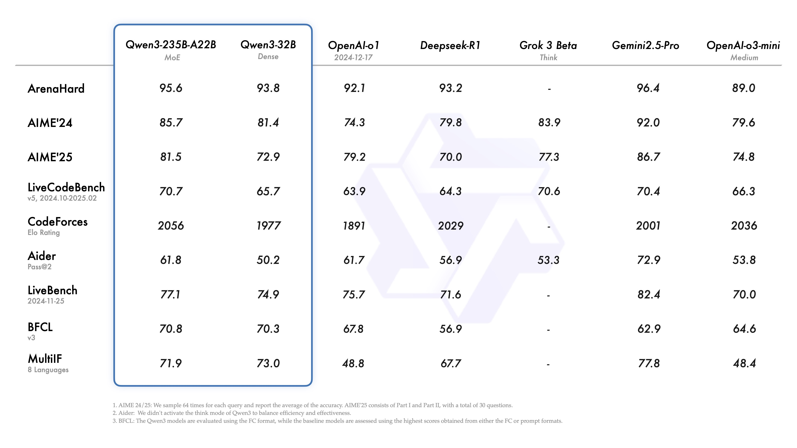


A summary of thoughts on the memory of large language models


## Introduction

This reflection originates from a common issue encountered in AI-assisted programming: the need to repeatedly familiarize itself with the code repository from scratch.

Current AI-assisted programming tools provide a wealth of foundational information to help AI quickly understand a code project. They use various functions to read project code, directory structures, and edit file contents. During each interaction, the AI model goes through a "from-scratch" familiarization process with the project: when you instruct it to solve a specific problem, the AI explores your code repository step by step, understands the relevant details, and makes the corresponding changes. This seems reasonable enough.

However, when you start a new round of conversation, the AI completely forgets what changes it made previously and also forgets the details of your code repository that are worth "remembering." It then begins a new round of exploration and familiarization with the code repository.

The obvious issues are as follows:

1. **Waste of computational resources**: Repeatedly exploring the repository without utilizing the useful information obtained from the **historical exploration process**.
2. **Difficulty in handling complex projects**: The need to start from scratch each time leads to an incomplete understanding of the repository, resulting in incoherent code.

But this issue is not unique to AI-assisted programming. The "seven-second memory" characteristic of large language models (LLMs) limits their application in multiple commercial fields:

1. **Code development**: As mentioned, it cannot form a coherent understanding of a project.
2. **Intelligent education**: It struggles to provide coherent guidance to students.
3. **Emotional companionship**: It fails to form a coherent user profile.

In summary, the problem boils down to one thing: Current large language models cannot achieve a coherent, accurate, and dynamically adjustable understanding of complex matters.

In contrast, human performance is quite different: A company employee may not initially understand the core logic and important details of a project, but over time, they become more and more familiar with the project code and can even apply their unique understanding to code development; a human teacher can gradually explore a student's characteristics based on their own experience and tailor their teaching accordingly; your good friend will not forget the travel experiences you shared yesterday, nor will they forget your personality traits.

This is also an important reason why current large language model technologies are difficult to implement: Although large language models have consumed all the text information on the internet and are even expanding into multimodal information such as images and videos, there is no effective "experience accumulation" pathway for specific engineering projects that cannot be fully conveyed through text (such as project concepts and technology stack selection). No matter how powerful the large language model is, it cannot effectively handle these tasks.

## Current Status Analysis

First, we provide a general analysis of the current focus of large language model evaluations, highlighting that current evaluations emphasize isolated tasks while neglecting coherent tasks. We then analyze the typical interaction patterns, demonstrating that current interaction modes lack effective and coherent experience accumulation.

### Large Language Model Evaluation

There are a multitude of benchmark tests for large language models. Since Qwen 3 recently released its benchmark scores, we will use the benchmark scores from Qwen 3 as an example here.



#### ArenaHard

Official GitHub link: [ArenaHard](https://github.com/lmarena/arena-hard-auto); Online demo: [Arena-Hard-Auto Benchmark Viewer](https://huggingface.co/spaces/lmarena-ai/arena-hard-viewer)

ArenaHard is a benchmark test based on model versus model scoring. The test set is derived from 200,000 real user queries collected from the Chatbot Arena, from which 500 high-quality prompts are selected as the test set.

Each test in the test set is sent to the model under test to obtain the corresponding response. The responses of the baseline model (GPT-4-0314) have been pre-generated by the official team. Another large model is then used as a referee to evaluate the responses of these two models. Finally, the model's win-loss record is collected and further processed to calculate a score out of 100. This score represents "the probability that the referee model expects you to defeat GPT-4-0314 on 500 high-difficulty instructions."

The benchmark test has released version 2.0, which is significantly more challenging than before. As of May 3, 2025, the latest benchmark results for the high-difficulty prompts and style control tests are as follows:

```
                                      Model  Scores (%)         CI (%)
0                             o3-2025-04-16        85.9  (-0.8 / +0.9)
1                   o4-mini-2025-04-16-high        79.1  (-1.4 / +1.2)
2                                gemini-2.5        79.0  (-2.1 / +1.8)
3                        o4-mini-2025-04-16        74.6  (-1.8 / +1.6)
4                          gemini-2.5-flash        68.6  (-1.6 / +1.6)
5                   o3-mini-2025-01-31-high        66.1  (-1.5 / +2.1)
6                        o1-2024-12-17-high        61.0  (-2.0 / +2.1)
7   claude-3-7-sonnet-20250219-thinking-16k        59.8  (-2.0 / +1.8)
8                           Qwen3-235B-A22B        58.4  (-1.9 / +2.1)
9                               deepseek-r1        58.0  (-2.2 / +2.0)
10                            o1-2024-12-17        55.9  (-2.2 / +1.8)
11                          gpt-4.5-preview        50.0  (-1.9 / +2.0)
12                       o3-mini-2025-01-31        50.0  (-0.0 / +0.0)
13                                  gpt-4.1        50.0  (-1.9 / +1.7)
14                             gpt-4.1-mini        46.9  (-2.4 / +2.1)
15                                Qwen3-32B        44.5  (-2.2 / +2.1)
16                                  QwQ-32B        43.5  (-2.5 / +2.1)
17                            Qwen3-30B-A3B        33.9  (-1.6 / +1.5)
18               claude-3-5-sonnet-20241022        33.0  (-2.3 / +1.8)
19                                 s1.1-32B        22.3  (-1.7 / +1.5)
20           llama4-maverick-instruct-basic        17.2  (-1.5 / +1.2)
21                           Athene-V2-Chat        16.4  (-1.4 / +1.4)
22                           gemma-3-27b-it        15.0  (-1.4 / +1.0)
23                                 Qwen3-4B        15.0  (-1.1 / +1.5)
24                             gpt-4.1-nano        13.7  (-1.1 / +1.0)
25       Llama-3.1-Nemotron-70B-Instruct-HF        10.3  (-0.8 / +1.0)
26                     Qwen2.5-72B-Instruct        10.1  (-0.9 / +1.3)
27                         OpenThinker2-32B         3.2  (-0.3 / +0.3)
```

From the above introduction, it is clear that ArenaHard only tests the model's ability to solve isolated problems.

#### AIME

AIME, the American Invitational Mathematics Examination, is not strictly a benchmark test for large language models, but it does reflect a model's mathematical reasoning ability.

The competition consists of 15 questions, all of which have numerical answers, with no points for steps. The final score is simply the accuracy rate, which may be averaged or take the highest value over multiple tests, but there is no unified standard.

Clearly, AIME also only tests the large language model's ability to solve isolated problems in one go.

### Typical Interaction Patterns

Do large language models have memory? Yes, but only short-term memory. The current interaction between humans and large language models can be summarized as follows:

1. Humans provide background information for the task.
2. The large language model attempts to complete the task based on the background information.
3. The model continuously interacts with humans during task execution (short-term memory).
4. The model completes the task.

The so-called "short-term" memory is reflected in its "short" duration: no longer than the length of the large language model's context window. The specific implementation method is to simply put all the interaction history between the user and the model into the window.



Although the context window of existing large language models is getting longer and longer, and can even reach 2 million tokens (equivalent to 1.5 copies of Dream of the Red Chamber), this does not mean that we can put all interaction information into the window and expect the model to generate content at a low cost and with high accuracy.😢


### Summary

The current focus of evaluation and interaction patterns are very suitable for isolated tasks. However, in reality, the tasks we need to complete are all "subtasks" under a larger goal framework, and these "subtasks" are interrelated and mutually restrictive.

An interesting phenomenon is that after we try to solve one of the subtasks, solving the other tasks becomes easier. The reason is that some of the exploration results obtained in the process of solving other subtasks are beneficial to solving other subtasks because these subtasks all belong to the same goal.

Therefore, the direction for improvement is now clear: introduce an online learning long-term memory module for large language models, enabling them to accumulate experience from historical exploration.

## Related Work

### Titans

The [Titans](https://arxiv.org/abs/2501.00663v1) architecture is Google's latest improvement on the Transformer architecture, proposing the concept of "Test-time Memory." It aims to expand the model's context length while providing a more accurate attention mechanism. It introduces a parameter network that can be dynamically updated at test time to store long-term memory information and enhance the performance of the attention mechanism.

### KBLaM

[KBLaM](https://github.com/microsoft/KBLaM) is an official implementation of "KBLaM: Knowledge Base augmented Language Model."

### TTRL

The [TTRL](https://arxiv.org/abs/2504.16084) algorithm can update the model's weight parameters using reinforcement learning at test time, achieving real-time dynamic updates of model parameters.

### rStar

[rStar](https://arxiv.org/abs/2408.06195v1) uses Monte Carlo Tree Search (MCTS) to explore high-quality reasoning paths. Unlike model distillation methods that require a strong model as guidance, this framework borrows the idea of peer-to-peer verification learning, using a voting mechanism to obtain a simulated "correct answer" to guide the generation of high-quality paths.

### Tokenformer

The [Tokenformer](https://arxiv.org/abs/2410.23168) framework embraces the philosophy of "everything can be tokenized."

### SD-LoRA

[SD-LoRA](https://openreview.net/forum?id=5U1rlpX68A)

### Differential Transformer

[Differential Transformer](https://arxiv.org/abs/2410.05258)

## Ideas and Thoughts

### Memory in Large Language Models

When we run a large language model offline and ask it a question: "Who proposed the theory of relativity?" It can tell us: "The theory of relativity was proposed by Einstein." This actually shows that the model's parameters already store relevant factual information, which is the so-called "memory."

This section mainly answers: Where is the memory of Transformer stored?

#### Deconstructing Transformer

Research on the interpretability of Transformer has been ongoing. This article interprets the structure of Transformer based on DeepMind's [related research](https://www.alignmentforum.org/s/hpWHhjvjn67LJ4xXX) and Anthropic's [related research](https://transformer-circuits.pub/).

In summary: The residual connections throughout the process are regarded as a "data bus," running through the entire model's computation process; the Attention Layer and MLP Layer are seen as the read/write heads for information, reading and writing data on the data bus.

##### **Embedding**

The embedding process is the first step in the Transformer processing pipeline:

1. Tokenization: Tokenize the text.
2. Embedding: Convert tokens into vectors and add positional encoding.

Intuitively, this step turns a sentence into a cluster of vectors. The embedding matrix is used to convert tokens into reasonable numerical vectors. This means that the embedding matrix stores some factual information, including relationships between different entities and differences between tokens. However, this information is based on the average of a large amount of text and cannot represent dynamic semantics.

For example, the word "bank" can mean both "riverbank" and "financial institution," but the embedding matrix describes a kind of "average" of these two meanings.

##### **Multi-head Attention**

As mentioned above, the embedding matrix alone cannot describe dynamic semantics based on context. Therefore, the multi-head attention mechanism was introduced to construct more precise word vectors.

A vivid description is: After embedding, a cluster of vectors is generated, and these vectors influence each other. The parameters in the multi-head attention layer model this complex mutual influence. According to the circuit interpretation framework, the Attention Layer calculates the "increment of mutual influence" between this cluster of vectors and writes this increment back into the "data bus."

##### **MLP**

Research by DeepMind has shown that factual information is mostly stored in the MLP layer. Here, the operations in the MLP layer are broken down into two steps:

1. Fact matching
2. Calculating the facts to be injected

The vectors processed by the multi-head attention have been shifted to the correct positions in the current context, and these vectors already contain a large amount of complex information superimposed together (a large number of explicit semantics are additively fused into a single vector). The role of the embedding matrix here is similar to a checklist: each row is a check item (the specific meaning of these items is also highly superimposed), and the check items and word vectors are matched through dot products to obtain "matching scores," which are then filtered out by the nonlinear truncation function (ReLU) to remove unrelated matches. This step is the "fact matching" process.

The projection matrix then acts as the "calculation of fact increment": based on the matching scores, it calculates which factual information needs to be added to the original word vectors, adds all the necessary factual information together to form a fact increment vector.

The MLP layer then writes the "fact increment vector" back into the residual flow.

##### **Stacking**

Transformer stacks the above structure repeatedly, and the information extracted by deeper layers becomes more complex and harder to understand.

#### Fact Injection

The above text has described how factual information participates in token generation as model parameters. But how is this information stored in the parameters? Simply put, it is by using backpropagation to adjust the parameters. However, if we continue to ask:

1. What kind of training samples are needed to store a particular factual piece of information? How many training samples are required?
2. How does the stored information "accommodate" new information?
3. Is the process of storing factual information inseparable from the entire network training process?

If we knew the answers to the above questions, we could build a framework that continuously absorbs factual information: simply keep inputting training samples in a specified format and execute backpropagation in real time.

### Existing Approaches

This section mainly answers: What are the current methods to achieve "long-term memory"? What are their respective advantages and disadvantages?

#### RAG

RAG was originally designed to alleviate the hallucination problem in large language models, but its essence is to use an external information processing module (vector database) to directly incorporate useful natural language information into the prompt.

Following this line of thinking, not only can it alleviate the hallucination problem in large language models, but it can also enable the model to perform specific tasks directly (prompt engineering). Many current AI applications are implemented in this way:

1. Cursor: Automatically adds background information about the code repository and a variety of tools, then relies on the model's own capabilities to complete complex code writing tasks.
2. Manus: Provides more complex information processing tools, using the large language model's ultra-long context to record all collected information to complete tasks.
3. MCP: Although it is just a tool calling protocol, its underlying layer is still prompt engineering.

There have been many promising results in using RAG to achieve long-term memory:

1. [mem0](https://github.com/mem0ai/mem0): A large language model memory system based on a vector database, allowing the model to remember user preferences from conversations.
2. [graphiti](https://github.com/getzep/graphiti): A memory system based on a vectorized graph database, building a real-time knowledge graph for large language models, capable of storing a large amount of past factual information and accurately extracting relevant memories.
3. [memobase](https://github.com/memodb-io/memobase): A memory system based on file storage combined with a vector database, writing user preferences and other information into user profile files and continuously updating them.

The advantages of this approach are very clear:

1. Simple and convenient: Humans are very familiar with natural language, so using natural language to drive program execution is relatively easy to understand.
2. Controllable information: By explicitly programming to integrate information into a long but logically coherent prompt, it is easy to control complex information.
3. Application of large language model technology: The large language model itself is a top-tier natural language processing technology, capable of participating in various aspects of background information organization and enhancing the ability to handle complex information.

The disadvantages of using RAG are also present:

1. Context window limitation: The attention layer of the large language model can only support a limited context, and too long a context will be automatically truncated.
2. Attention dispersion: Filling too much information into the context window will degrade the performance of the model's attention mechanism, making it difficult to capture truly important information.
3. Limited expressive ability: Complex information is difficult to express in natural language, and even if it is forcibly expressed, key information will be lost, leading to understanding 偏差 by the large language model. For example, the development philosophy of a complex software project, if not experienced in practice, will become empty words when described in natural language.
4. Difficult memory maintenance: Even with the support of large language model technology, updating, maintaining, and extracting memories remains a tricky problem, and it is difficult to balance response speed, accuracy, and cost.

#### Network Parameters

There is currently very little work in this area. Although OpenAI has recently launched a memory function, it has not revealed the specific implementation method, and there is not much discussion online. Here, we mainly summarize the implementation method of the Titans architecture.

## Early Ideas

This section contains some very early ideas.

Consider the question: Where does the capability of large language models come from? It comes from the vast amount of internet text.

Large language models are trained on a vast amount of text, using backpropagation to compress the mutual influence of text and factual information into the parameters of the neural network. While modeling language, they also complete the modeling of the abstract concepts represented by language. Of course, this process is very slow and requires a lot of computational power.

After completing such a large amount of knowledge compression, how to handle new information? This is a problem that still needs to be solved, but it is not an unsolvable problem: Human knowledge is accumulated from little to much, and the brain must process and store continuously input new information and integrate new information with existing information.

## References

* [Arena-Hard: An Open-Source High-Quality Large Language Model Evaluation Benchmark](https://blog.csdn.net/weixin_57291105/article/details/138132998)
* [Titans](https://arxiv.org/abs/2501.00663v1)
* [KBLaM](https://github.com/microsoft/KBLaM)
* [TTRL](https://arxiv.org/abs/2504.16084)
* [rStar](https://arxiv.org/abs/2408.06195v1)
* [Tokenformer](https://arxiv.org/abs/2410.23168)
* [SD-LoRA](https://openreview.net/forum?id=5U1rlpX68A)
* [Differential Transformer](https://arxiv.org/abs/2410.05258)
* [A Mathematical Framework for Transformer Circuits](https://transformer-circuits.pub/2021/framework/index.html)
* [An Intuitive Explanation of the Attention Mechanism, the Core of Transformer](https://www.bilibili.com/video/BV1TZ421j7Ke/?spm_id_from=333.1387.collection.video_card.click&vd_source=38d0addc11facdcdfe9d401e43b75680)
* [Fact Finding: Attempting to Reverse-Engineer Factual Recall on the Neuron Level (Post 1)](https://www.alignmentforum.org/posts/iGuwZTHWb6DFY3sKB/fact-finding-attempting-to-reverse-engineer-factual-recall)
* [Fact Finding: Simplifying the Circuit (Post 2)](https://www.alignmentforum.org/posts/3tqJ65kuTkBh8wrRH/fact-finding-simplifying-the-circuit-post-2)
-  [An Intuitive Explanation of How Large Language Models Store Facts](https://www.bilibili.com/video/BV1aTxMehEjK?spm_id_from=333.788.recommend_more_video.-1&vd_source=38d0addc11facdcdfe9d401e43b75680)
