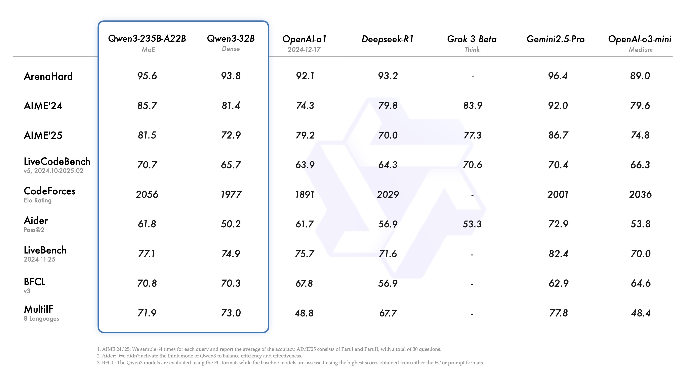


梳理和总结一下关于大模型记忆的想法


## 前言

思考来源于一个在 AI 辅助编程中经常碰到的问题：每次都要从头开始理解我的代码仓库。

目前 AI 辅助编程工具会提供大量的基础信息供 AI 迅速熟悉代码项目，然后利用各种函数工具读取项目代码、目录层级、编辑文件内容等等。在一轮交互过程中，AI 模型会完成"从零开始的"项目熟悉过程：当你发出指令让它解决某个具体的问题时，AI 会逐步探索你的代码仓库，了解相关细节然后进行相应的更改。这看起来还不错。

然而当你开启新的一轮对话后，AI 完全忘记了自己上一次进行了什么更改，也完全忘记了你的代码仓库有哪些值得"记住"的细节，又会进行新的一轮代码仓库的探索和熟悉过程。

非常明显的问题如下：

1. 浪费算力资源：反复探索仓库，无法在利用在**历史探索过程**中获得的有用的信息
2. 难以处理复杂的项目：每次都需要从头开始熟悉代码仓库，有限的探索过程导致对于仓库的理解不透彻，写出来的代码没有连贯性

但是类似的问题并不只存在于 AI 辅助编程这个领域，大模型的"7秒记忆"属性在多个商业领域限制了大模型技术的落地：

1. 代码开发：如上，不能形成连贯的项目理解
2. 智慧教育：难以对学生形成一个连贯的指导
3. 情感陪伴：难以形成连贯的用户画像

这些问题总结下来其实就只有一条：现有大模型做不到对于复杂事物连贯的、准确的、动态调整的理解。

反观人类的表现：企业员工刚开始或许不能理解项目的核心逻辑和重要细节，但是在长时间的开发过程中会对项目代码越来越熟悉，甚至能够将自己的独特理解应用在代码开发中；人类教师能够依据自身经验逐步探索学生的特点，因材施教；你的好朋友不会忘记你昨天才分享的旅游体会，也不会忘记你的性格特点。

这也是当前大模型技术难以落地的重要原因：尽管大模型吞噬了整个互联网上的文本信息，甚至还在向图像、视频等多模态信息扩张，但是对于特定工程项目中难以用文本一次性传递的信息（项目理念、技术栈选型），没有有效的"经验累积"途径，大模型能力再强也难以有效处理。

## 现状分析

首先概括分析当前大模型评测的侧重点，说明当前大模型的评测侧重于孤立任务而忽视了连贯任务；然后分析当前典型的交互模式，说明当前交互模式缺乏有效而连贯的经验积累。

### 大模型评测

大模型的基准测试实在是多而杂。最近 Qwen3 上新发布，因此这里直接偷个懒，使用 Qwen3 发布的跑分表中的基准测试来举例子。



#### ArenaHard

官方 Github 链接：[ArenaHard](https://github.com/lmarena/arena-hard-auto)；在线 demo：[Arena-Hard-Auto Benchmark Viewer](https://huggingface.co/spaces/lmarena-ai/arena-hard-viewer)

ArenaHard 是一种基于模型间对战来进行评分的基准测试。测试集基于大模型竞技场（Chatbot Arena）收集的 20 万个真实用户查询，从中筛选出 500 个高质量提示词作为测试集。

将测试集中的每一个测试都发送给待测模型，获取相应的回复结果，基准模型（GPT‑4‑0314）的生成结果官方已经预先生成。然后使用另外的大模型作为裁判，对这两个模型的回复进行评判。最后收集到模型的对战胜负表做进一步的数据处理，然后就可以计算出一个上限为 100 的分数。这个分数意味着"在 500 条高难指令上，裁判模型预计你能打败 GPT‑4‑0314 的概率"

该基准测试已经发布了 2.0 版本，难度较之前大幅提升，在难提示词和风格控制测试中最新的跑分结果如下（截至 2025-05-03）：

```
                                      Model  Scores (%)         CI (%)
0                             o3-2025-04-16        85.9  (-0.8 / +0.9)
1                   o4-mini-2025-04-16-high        79.1  (-1.4 / +1.2)
2                                gemini-2.5        79.0  (-2.1 / +1.8)
3                        o4-mini-2025-04-16        74.6  (-1.8 / +1.6)
4                          gemini-2.5-flash        68.6  (-1.6 / +1.6)
5                   o3-mini-2025-01-31-high        66.1  (-1.5 / +2.1)
6                        o1-2024-12-17-high        61.0  (-2.0 / +2.1)
7   claude-3-7-sonnet-20250219-thinking-16k        59.8  (-2.0 / +1.8)
8                           Qwen3-235B-A22B        58.4  (-1.9 / +2.1)
9                               deepseek-r1        58.0  (-2.2 / +2.0)
10                            o1-2024-12-17        55.9  (-2.2 / +1.8)
11                          gpt-4.5-preview        50.0  (-1.9 / +2.0)
12                       o3-mini-2025-01-31        50.0  (-0.0 / +0.0)
13                                  gpt-4.1        50.0  (-1.9 / +1.7)
14                             gpt-4.1-mini        46.9  (-2.4 / +2.1)
15                                Qwen3-32B        44.5  (-2.2 / +2.1)
16                                  QwQ-32B        43.5  (-2.5 / +2.1)
17                            Qwen3-30B-A3B        33.9  (-1.6 / +1.5)
18               claude-3-5-sonnet-20241022        33.0  (-2.3 / +1.8)
19                                 s1.1-32B        22.3  (-1.7 / +1.5)
20           llama4-maverick-instruct-basic        17.2  (-1.5 / +1.2)
21                           Athene-V2-Chat        16.4  (-1.4 / +1.4)
22                           gemma-3-27b-it        15.0  (-1.4 / +1.0)
23                                 Qwen3-4B        15.0  (-1.1 / +1.5)
24                             gpt-4.1-nano        13.7  (-1.1 / +1.0)
25       Llama-3.1-Nemotron-70B-Instruct-HF        10.3  (-0.8 / +1.0)
26                     Qwen2.5-72B-Instruct        10.1  (-0.9 / +1.3)
27                         OpenThinker2-32B         3.2  (-0.3 / +0.3)
```

从上面的介绍中就可以看出：ArenaHard 只测试了模型解决孤立问题的能力。

#### AIME

AIME 即美国数学邀请赛，严格意义上来说不算是专门的大模型基准测试，但确实能够反映模型的数学推理能力。

整个比赛包含 15 道题，答案都是数值，没有步骤分。最终得出的跑分结果也就是正确率，可能会有多次测试取平均值或者最高值，但并没有统一的标准。

很明显，AIME 也只测试了大模型一次性解决孤立问题的能力。

### 典型交互模式

现在的大模型有记忆能力吗？有，但只是短期记忆。目前人类与大模型的交互方式概括如下：

1. 人类提供任务的背景信息
2. 大模型依据背景信息尝试完成这个任务
3. 大模型在执行任务的过程中不断与人类进行交互（短期记忆）
4. 模型完成任务

所谓"短期"记忆就体现在"短"：最长不超过大模型的上下文窗口的长度。而具体的实现方法就是：直接把用户和模型的交互历史全部放入窗口之中。



尽管现有大模型的上下文窗口越来越长，甚至能够达到 200 万 token 的上下文（1.5 部红楼梦），但是这并不意味着我们能把所有的交互信息都塞进窗口之中还期望模型能够低成本、高准确地生成内容😢


### 小结

目前的评测重点和交互模式对于孤立的任务非常适用，但是事实上我们需要完成的任务都是在一个大目标框架下的"子任务"，这些"子任务"之间彼此关联，相互牵制。

一个有趣的现象是：当我们尝试去解决其中一个子任务后，解决其他的任务会更加轻松。原因就是：在探索如何解决别的子任务的时候，有部分探索结果对于解决别的子任务有增益，因为这些子任务都归属于同一个目标。

因此现在改进的方向也很明确了：为大模型引入一个在线学习的长期记忆模块，使大模型能够从历史探索中积累经验。

## 相关工作

### Titans

[Titans](https://arxiv.org/abs/2501.00663v1) 架构是谷歌最新推出的对于 Transformer 架构的改进架构，提出了"Test-time Memory"的概念，旨在扩展模型的上下文长度的同时提供更加准确的注意力机制。引入了一个能够在测试时动态更新的参数网络，能够将长期的记忆信息保存其中，提升注意力机制的性能。

### KBLaM

[KBLaM](https://github.com/microsoft/KBLaM)

### TTRL

[TTRL](https://arxiv.org/abs/2504.16084) 算法能够在测试时利用强化学习来更新模型的权重参数，实现了模型参数的实时动态更新

### rStar

[rStar](https://arxiv.org/abs/2408.06195v1) 使用 MCTS 来探索生成高质量推理路径的框架。有别于需要一个强模型作为指导的模型蒸馏方法，该框架借鉴了同伴之间相互验证学习的方法，利用投票机制获得一个模拟的"正确答案"来指导生成高质量路径。

### Tokenformer

[Tokenformer](https://arxiv.org/abs/2410.23168) 框架秉持着"万物皆可tokenize"的理念，

### SD-LoRA

[SD-LoRA](https://openreview.net/forum?id=5U1rlpX68A)

### Differential Transformer

[Differential Transformer](https://arxiv.org/abs/2410.05258) 改进了传统 Transformer 架构中的注意力机制，提出了"差分注意力机制"的概念。与传统的softmax注意力不同，Diff Transformer 将查询（query）和键（key）向量分为两组，分别计算两个独立的softmax注意力图，然后通过减法操作消除噪音。这一机制类似于电子工程中的**差分放大器**，通过两个信号的差值来消除共模噪音。

## 思路梳理

### 大模型记忆

当我们断网本地运行一个大模型时，我们向其提问：相对论是谁提出的？它能够告诉我们：相对论是爱因斯坦提出的。这其实就说明了在模型的参数中已经存储了相关的事实信息，也就是所谓的"记忆"。

那么这部分主要回答：Transformer 的记忆存储在哪里？

#### 解构Transformer

对于 Transformer 的可解释性研究一直都在进行之中，本文根据 DeepMind 的[相关研究](https://www.alignmentforum.org/s/hpWHhjvjn67LJ4xXX)和 Anthropic 的[相关研究](https://transformer-circuits.pub/)来对 Transformer 的结构进行解读。

概括来讲：整个过程中的残差连接被视作一个"数据总线"，贯穿整个模型的计算过程；将 Attention Layer 和 MLP Layer 视作信息的读写头，在数据总线上进行数据的读写。

##### **Embedding**

Embedding 过程是 Transformer 处理流程的第一步：

1. Tokenize：对文本进行词元化处理
2. Embedding：将词元转化为向量并写入位置编码

这一步直观来讲就是：把一句话变成了一簇向量。在这个过程利用了嵌入矩阵将词元转化为了合理的数值向量。也就是说嵌入矩阵中就存储了一些事实信息，包括不同实体之间的关系、不同词元之间的差距等等，但是这些信息是建立在大量文本之上的平均值，无法表示动态的语义。

举个经典的例子："bank"一词既有"河岸"的意思，又有"银行"的意思，但是嵌入矩阵描述的是这两个意思的某种"平均值"。

##### **Multi-head Attention**

正如上文所说，单纯的嵌入矩阵无法描述基于上下文的、动态的语义，因此多头注意力机制被引入，用于构建更加精确的词向量。

一个形象的描述就是：通过 Embedding 之后产生了一簇向量，而这些向量之间会相互影响，而多头注意力层中的参数就建模了这种复杂的相互影响。按照电路的解释框架，也就是说 Attention Layer 计算出了这一簇向量之间的"相互影响增量"，然后将这个增量写回"数据总线"之中。

##### **MLP**

DeepMind 的研究表明，事实性的信息大部分都存储在 MLP 层中。在这里将 MLP 层中的操作分解为两个步骤：

1. 事实匹配
2. 计算需要注入的事实

经过多头注意力处理的向量都偏移到了当前语境中的正确位置，这些向量中已经包含了大量叠加在一起的复杂信息（大量明确的语义通过加法融合在了一个向量之中）。而扩展矩阵的作用就类似于一个检查表：每一行都是一个检查项目（这些项目的具体含义同样是高度叠加的），检查项目和词向量通过点积得到"匹配分数"，然后通过非线性截断函数（ReLU）剔除不相关的匹配。这一步就是"事实匹配"过程。

例如，使用扩展矩阵去检测"相对论"这个词元时，某一行可能会同时检测："是否是一个学术概念+是否是球类运动+是否是星系名称"。检测结果可能是相关的，也可能是不相关的，但最后都会线性叠加在一起。



为什么可以叠加？因为向量点乘的分配律："先叠加再匹配"和"先匹配再叠加"是等价的


然后投影矩阵则充当了"计算事实增量"的作用：根据匹配分数，计算原本的词向量中到底需要添加哪些事实信息，把所有需要添加的事实信息都加在一起，表示为一个事实增量向量。

然后 MLP 层将"事实增量向量"写回残差流之中。

##### **堆叠**

Transformer 通过将上述结构进行反复堆叠，更深入的层提取的信息也就更加复杂而难以理解。

需要注意的是：事实信息的注入并非发生在单独某一层的 MLP 中，甚至不单独发生在某一个 Transformer Block 之中，而是在整个网络之中不断迭代，逐步产生更加清晰明确的影响。

这种复杂的事实信息注入机制给可解释工作带来了不小的困难，也让人们难以精确控制大模型内部的信息流动。但是这个过程恰恰体现了将事实信息存储在神经网络之中的优势：对于某个复杂的信息，最开始这个信息能够关联大量而模糊的其他信息，然后在每层网络计算之中逐步精确，最后收敛到真正高度相关的信息。



这也是 Attention Layer 和 MLP Layer 交替出现的一个理由：事实信息在 MLP Layer 注入之后马上使用 Attention Layer 来进行裁切，去掉较弱的关联，放大较强的关联，避免大量冗杂信息传递到下一个 MLP Layer 中激发更加混乱的关联


#### 事实注入

上面的文字已经描述了事实性的信息是如何以模型参数的方式参与 token 的生成。然而这些信息是如何存储到参数之中的？简单来说就是利用反向传播算法调整参数，但如果我们继续追问：

1. 存储某一个事实信息需要什么样的训练样本？需要多少训练样本？
2. 已经存储进去的信息如何"接纳"新的信息？
3. 事实信息的存储过程是否与整个网络的训练过程不可分割？

如果知道了上述问题的答案，那么就可以构建一个能够持续吸收事实信息的框架：只需要持续不断输入指定格式的训练样本然后实时执行反向传播即可。

### 现有方法

这部分主要回答：现在实现"长期记忆"有哪些途径？各自有什么优缺点？

#### RAG

RAG 原本是用于缓解大模型幻觉的技术，但其实质就是利用外部的信息处理模块（向量数据库），将有用的自然语言信息直接加入提示词中。

遵循这个思路，不仅能够缓解大模型幻觉，还能够直接让模型能够完成某些特定的工作（提示词工程），当前大量的 AI 应用也都是这样实现的：

1. cursor：自动添加代码仓库的背景信息和种类繁多的工具，然后依靠模型自身的能力来完成复杂的代码编写工作
2. Manus：提供了更加复杂的信息处理工具，利用大模型自身的超长上下文来记录所有收集到的信息来完成任务
3. MCP：虽然只是一个工具调用协议，但是其底层还是一个提示词工程

"使用 RAG 来实现长期记忆"这个方向已经产生了不少可观的成果：

1. [mem0](https://github.com/mem0ai/mem0)：基于向量数据库的大模型记忆系统，让大模型能够从对话中记住用户的偏好
2. [graphiti](https://github.com/getzep/graphiti)：基于向量化的图数据库的记忆系统，为大模型构建实时的知识图谱，能够存储大量过去的事实性信息并准确提取出相关记忆
3. [memobase](https://github.com/memodb-io/memobase)：基于文件存储同时结合向量数据库的记忆系统，将用户的偏好等信息写入用户画像文件中并不断更新

这种方式的优点非常明显：

1. 简单便捷：人类自身非常熟悉自然语言，因此使用自然语言驱动程序运行相对而言也非常容易理解
2. 信息可控：通过显示编程的方式将信息整合成一个超长但是逻辑严密的提示词，能够方便地控制复杂信息。
3. 大模型技术的应用：大模型本身就是顶尖的语言处理技术，能够参与到背景信息组织的各个环节，提升复杂信息的处理能力

使用 RAG 的缺点也是存在的：

1. 上下文窗口限制：大模型的注意力层只能支持有限的上下文，过长的上下文将会自动截断
2. 注意力发散：在上下文窗口中填入过多的信息将会导致模型的注意力机制性能下降，难以捕捉真正重要的信息
3. 表达能力受限：过于复杂的信息难以使用自然语言表达，即便强行表达也会缺失关键信息，导致大模型出现理解偏差，例如，一个复杂的软件项目的开发理念，如果不在实践过程中加以体会，使用自然语言描述出来的理念就是一堆空话
4. 记忆维护困难：即便拥有大模型技术的加持，记忆的更新维护和提取仍然是一个棘手的问题，响应速度、准确率和成本的平衡难以把控

#### 微调

需要去看看微调方面的论文，特别是"高效微调"方面的文章，看看能不能增强其在线学习能力🤔如果可能的话还需要去看看增量学习方面的文章。

暂时先鸽了😢还要复习期末考试

#### 网络参数

这方面的工作目前非常稀少，尽管 OpenAI 最新推出了记忆功能，但并没有透露具体的实现方法，网上的讨论度也不高。这里主要概括一下 Titans 架构的实现方法。


## 早期想法

这里写目前的想法，都是一些非常早期的想法。

思考一个问题：大模型的能力是从何而来的？来源于海量的互联网文本。

大模型在海量的文本上训练，利用反向传播算法将文本之间的相互影响和事实信息全部都压缩到了神经网络的参数之中，对语言建模的同时也完成了对于语言所代表的抽象概念的建模。当然这个过程非常的缓慢，需要大量的算力支撑。

完成如此大量的知识压缩之后，如何处理新的信息？这是一个尚待解决的问题，但并非一个不可解决的问题：人类自身的知识就是由少到多逐步积累而成的，人脑必须处理并存储不断输入的新信息，将新信息与旧有信息进行融合。

## 引用

- [Arena-Hard：开源高质量大模型评估基准](https://blog.csdn.net/weixin_57291105/article/details/138132998)
- [Titans](https://arxiv.org/abs/2501.00663v1)
- [KBLaM](https://github.com/microsoft/KBLaM)
- [TTRL](https://arxiv.org/abs/2504.16084)
- [rStar](https://arxiv.org/abs/2408.06195v1)
- [Tokenformer](https://arxiv.org/abs/2410.23168)
- [SD-LoRA](https://openreview.net/forum?id=5U1rlpX68A)
- [Differential Transformer](https://arxiv.org/abs/2410.05258)
- [A Mathematical Framework for Transformer Circuits](https://transformer-circuits.pub/2021/framework/index.html)
- [直观解释注意力机制，Transformer的核心](https://www.bilibili.com/video/BV1TZ421j7Ke/?spm_id_from=333.1387.collection.video_card.click&vd_source=38d0addc11facdcdfe9d401e43b75680)
- [Fact Finding: Attempting to Reverse-Engineer Factual Recall on the Neuron Level (Post 1)](https://www.alignmentforum.org/posts/iGuwZTHWb6DFY3sKB/fact-finding-attempting-to-reverse-engineer-factual-recall)
- [Fact Finding: Simplifying the Circuit (Post 2)](https://www.alignmentforum.org/posts/3tqJ65kuTkBh8wrRH/fact-finding-simplifying-the-circuit-post-2)
- [直观解释大语言模型如何储存事实](https://www.bilibili.com/video/BV1aTxMehEjK?spm_id_from=333.788.recommend_more_video.-1&vd_source=38d0addc11facdcdfe9d401e43b75680)
- [Diff Transformer：让注意力机制更智能，消除噪音，提升大语言模型性能-知乎](https://zhuanlan.zhihu.com/p/15784962358)
- 