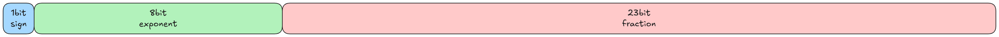
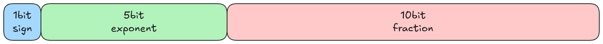
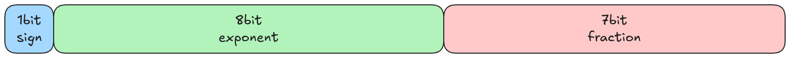
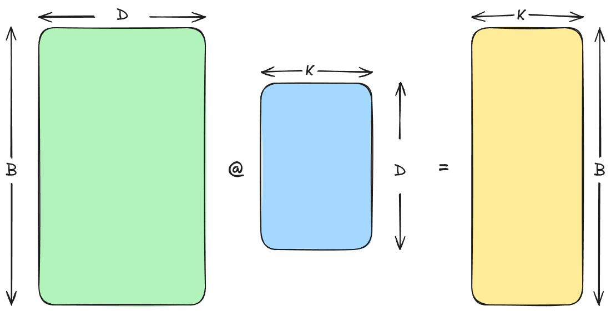



 当你了解一个网络架构的实现之后，一个很自然的问题：我该如何把这样一个模型训练出来？这一节记录了各种各样的工程知识，能够回答这个问题。 

## 前言

大模型架构五花八门，但想要真正了解一个架构，还是要落到实践中去。YouTube 上还是有很多高质量的网课视频可以学习的，比如 [CS336: Language Modeling from Scratch](https://cs336.stanford.edu/) 课程，因此本文也相当于是 CS336 的一个笔记文本。

“实践是检验真理的唯一标准”🫡

所有的内容整体上可以分为五个部分：

1. 基础部分：分词器、可用资源盘点、模型架构、训练思路
2. 系统工程：内核、并行、推理
3. 规模定律(很多翻译为"缩放定律"，但语义上来说规模定律更确切)
4. 数据工程：预训练数据工程，脏但非常关键
5. 模型对齐：RL 后训练微调

## 基础部分

### 分词器

分词器这部分卡帕西有一个非常好的[视频](https://youtu.be/zduSFxRajkE?si=X3hpizNlFcFiIXQt)，深入讲解了分词器的各种相关知识。

分词器从功能上来说是一个独立于 Transformer 主体的一个配件，其主要功能是将一长串的文本字符串编码为整数，也就是 Transformer 模型真正能够处理的数据类型：一连串的整数序列。

一个比较有意思的问题是：从底层来看，如果仅仅只是为了将字符映射为整数的话，数字化的文本其实并不需要进行特意进行编码，因为绝大部分数字文本都使用 UTF-8 进行编码，这些字符在计算机底层天然就是被整数编码的。

```python
>>> test_string = "hello, 世界！"
>>> utf8_encoded = test_string.encode("utf-8")
>>> print(utf8_encoded)
b'hello, \xe4\xb8\x96\xe7\x95\x8c\xef\xbc\x81'
>>> list(utf8_encoded)
[104, 101, 108, 108, 111, 44, 32, 228, 184, 150, 231, 149, 140, 239, 188, 129]
```

从上面这个例子看来，一个非常简短的文本被编码为了 16 个整数，但很明显这个编码太琐碎了。Transformer 的注意力窗口大小有限并且非常昂贵，因此分词器的作用就是将琐碎的底层编码进行分块聚合，从而减少分词后的整数序列长度，提高模型的计算效率。

> [!NOTE] 思考
> 一个值得关注的问题是：假设我们有充足的算力资源，直接在 UTF-8 序列上进行训练效果会不会更好？或者说我们可将 Tokenizer 视作一次简单的空间映射，将数据从嘈杂的 UTF-8 编码的空间中映射到一个更有语义的空间中。我们已经知道这种映射的有效性，毕竟所有主流大模型都是如此训练的，但具体有多少改进以及能否理论量化？

从具体算法上来说，一般都使用的是 OpenAI 当初使用的 BPE 算法，具有代表性的算法库就是 tiktoken。当然 Google 使用的算法库 sentencepices 也是被众多大模型采用的，但配置相比于 tiktoken 确实是复杂很多。

### 可用资源盘点

大体上可用资源可以分为：单位时间计算能力(FLOP/s)、时间、数据量、内存大小、张量计算操作的算力消耗；资源盘点的作用就是根据已知的资源约束去估计训练用时或者估计能够训练出来的最大的模型参数量。

#### 内存占用

几乎所有的数据都是使用张量进行存储的，也就是一堆按照规则排列的浮点数。根据浮点数格式的不同，模型训练或推理占用的内存大小也不相同。一般来说浮点数的格式有如下几种：

1. float32：32-bit float，占用 4B 的内存空间



2. float16：16-bit float，占用 2B 的内存空间，动态范围相比 float32 小，在反向传播算法产生的梯度非常小的情况下会产生数值下溢(这也是 bfloat16 产生的原因)



3. bfloat16：brain floating point，同样占用 2B 空间，通过牺牲分辨率来扩大动态范围，尽量减少奇怪的数值溢出问题(深度学习中分辨率没那么重要)



实际工程中一般都使用混合精度进行训练：float32 用于优化器状态，bfloat16 用于参数、激活值和梯度。当然了，还有一些更加激进的精度表示方式比如 float8， float4 但实际上模型的训练一般不会用。并且 float4 在使用的时候也不会直接用于表示一个参数值，而是与相邻的参数值打包共享一个精度缩放参数，这种操作的有效性依赖于参数的局部相似性，也就是相邻的参数可能具有相近的数量级，于是可以将公共的数量级提取出来从而用一批低精度的数配合缩放参数表达一批高精度的数。

> [!NOTE] 与量化的差别
> 量化是将一个高精度训练的模型对齐到一个低精度的模型空间中，其实现难度比直接在低精度上训练模型更低

#### 张量计算

张量乘法的计算量，以下面这张图的计算为例



总计算量的计算思路：最终得到的张量为 \(B\times K\) 的形状，总共有 \(B\cdot K\) 个元素，每个元素都是由 \(D\) 组元素相乘最后求和得到，也就是最终结果的每个元素都代表了 \(2D\) 的乘法或加法计算量。因此总计算量为：\(2D\cdot B\cdot K\)

> [!NOTE] 说明
> 这里考虑的是最简单的情况，不包含任何硬件的优化，比如所有的加法可以压缩为一次加法等等

这里还有一个比较重要的工程优化指标：MFU(Model FLOPs Utilization)，表示实际模型运行时的算力利用率。可以简单理解为：在实际工程实现中，整个 GPU 的算力并没有被 100% 利用，实际利用率就是 MFU

### 训练思路
