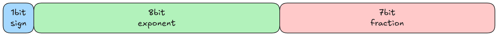
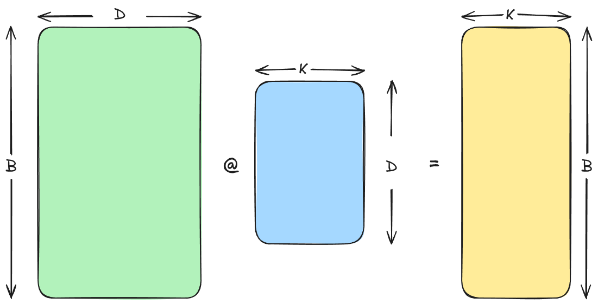
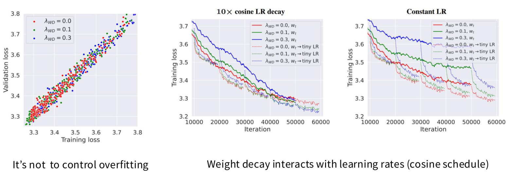



 当你了解一个网络架构的实现之后，一个很自然的问题：我该如何把这样一个模型训练出来？这一节记录了各种各样的工程知识，能够回答这个问题。 

## 前言

大模型架构五花八门，但想要真正了解一个架构，还是要落到实践中去。YouTube 上还是有很多高质量的网课视频可以学习的，比如 [CS336: Language Modeling from Scratch](https://cs336.stanford.edu/) 课程，因此本文也相当于是 CS336 的一个笔记文本，同时也附上我的[代码实现](https://github.com/morethan987/cs336-assignment1-basics)和对讲义中问题的[解答](https://github.com/morethan987/cs336-assignment1-basics/blob/main/Q%26A.md)

“实践是检验真理的唯一标准”🫡

所有的内容整体上可以分为五个部分：

1. 基础部分：分词器、可用资源盘点、模型架构、训练思路
2. 系统工程：内核、并行、推理
3. 规模定律(很多翻译为"缩放定律"，但语义上来说规模定律更确切)
4. 数据工程：预训练数据工程，脏但非常关键
5. 模型对齐：RL 后训练微调

## 基础部分

### 分词器

分词器这部分卡帕西有一个非常好的[视频](https://youtu.be/zduSFxRajkE?si=X3hpizNlFcFiIXQt)，深入讲解了分词器的各种相关知识。

分词器从功能上来说是一个独立于 Transformer 主体的一个配件，其主要功能是将一长串的文本字符串编码为整数，也就是 Transformer 模型真正能够处理的数据类型：一连串的整数序列。

一个比较有意思的问题是：从底层来看，如果仅仅只是为了将字符映射为整数的话，数字化的文本其实并不需要进行特意进行编码，因为绝大部分数字文本都使用 UTF-8 进行编码，这些字符在计算机底层天然就是被整数编码的。

```python
>>> test_string = "hello, 世界！"
>>> utf8_encoded = test_string.encode("utf-8")
>>> print(utf8_encoded)
b'hello, \xe4\xb8\x96\xe7\x95\x8c\xef\xbc\x81'
>>> list(utf8_encoded)
[104, 101, 108, 108, 111, 44, 32, 228, 184, 150, 231, 149, 140, 239, 188, 129]
```

从上面这个例子看来，一个非常简短的文本被编码为了 16 个整数，但很明显这个编码太琐碎了。Transformer 的注意力窗口大小有限并且非常昂贵，因此分词器的作用就是将琐碎的底层编码进行分块聚合，从而减少分词后的整数序列长度，提高模型的计算效率。

> [!NOTE] 思考
> 一个值得关注的问题是：假设我们有充足的算力资源，直接在 UTF-8 序列上进行训练效果会不会更好？或者说我们可将 Tokenizer 视作一次简单的空间映射，将数据从嘈杂的 UTF-8 编码的空间中映射到一个更有语义的空间中。我们已经知道这种映射的有效性，毕竟所有主流大模型都是如此训练的，但具体有多少改进以及能否理论量化？

从具体算法上来说，一般都使用的是 OpenAI 当初使用的 BPE 算法，具有代表性的算法库就是 tiktoken。当然 Google 使用的算法库 sentencepices 也是被众多大模型采用的，但配置相比于 tiktoken 确实是复杂很多。

#### 细节问答

1. 为什么需要使用字节编码而不是直接使用 UTF-8 编码？

答：直接使用 UTF-8 得到的词表非常大，实际数据在词表上的分布极其稀疏(很多词汇几乎没有使用过)；使用字节编码词表大小只有 256，实际数据在词表上的分布更密集。但并不是说字节编码没有缺点，要用如此少的词表来表达所有字符意味着需要很大的序列长度，这会增大模型的计算负担，实际使用的 BPE 就是这两者之间的平衡。

2. 为什么要进行预分词？

答：原始的 BPE 算法复杂度非常高，每一轮合并都需要遍历语料库；并且这种方式会产生一些只有标点符号不同的 token 这不便于模型学习(dog! vs dog.)

3. 运行内存受限的情况下如何处理大数据集？

答：在 RAM 资源受限的情况下，如果想要在大数据集上完成训练就需要使用懒加载的文件读取方式(mmap)，这样能够有效控制峰值内存，必要时还需要完成从文件读取到编码再到写盘全流程的流式懒加载策略。同时，数据结构与算法在分词器这个环节应用非常多，个人体验上使用最多的就是优先队列和哈希表。

### 可用资源盘点

大体上可用资源可以分为：单位时间计算能力(FLOP/s)、时间、数据量、内存大小、张量计算操作的算力消耗；资源盘点的作用就是根据已知的资源约束去估计训练用时或者估计能够训练出来的最大的模型参数量。

#### 内存占用

几乎所有的数据都是使用张量进行存储的，也就是一堆按照规则排列的浮点数。根据浮点数格式的不同，模型训练或推理占用的内存大小也不相同。一般来说浮点数的格式有如下几种：

1. float32：32-bit float，占用 4B 的内存空间


2. float16：16-bit float，占用 2B 的内存空间，动态范围相比 float32 小，在反向传播算法产生的梯度非常小的情况下会产生数值下溢(这也是 bfloat16 产生的原因)


3. bfloat16：brain floating point，同样占用 2B 空间，通过牺牲分辨率来扩大动态范围，尽量减少奇怪的数值溢出问题(深度学习中分辨率没那么重要)



实际工程中一般都使用混合精度进行训练：float32 用于优化器状态，bfloat16 用于参数、激活值和梯度。当然了，还有一些更加激进的精度表示方式比如 float8， float4 但实际上模型的训练一般不会用。并且 float4 在使用的时候也不会直接用于表示一个参数值，而是与相邻的参数值打包共享一个精度缩放参数，这种操作的有效性依赖于参数的局部相似性，也就是相邻的参数可能具有相近的数量级，于是可以将公共的数量级提取出来从而用一批低精度的数配合缩放参数表达一批高精度的数。

> [!NOTE] 与量化的差别
> 量化是将一个高精度训练的模型对齐到一个低精度的模型空间中，其实现难度比直接在低精度上训练模型更低

这里对 MLP 进行一个粗略的内存占用量估计，假设输入、激活和输出都有一个固定的维度 D，网络层数为 L，批量大小为 B，那么总的参数量可以估计为 \(D^2\cdot L\) 也就是有 L 层 \(D\times D\) 方阵；参数占用内存为 \(2D^2\cdot L\) 字节因为每一个参数我们假设使用 bf16 格式进行存储，梯度占用内存与参数占用一致(只有参数才需要梯度并且每一个参数都需要一个梯度值)，优化器状态则需要 \(4D^2\cdot L\) 字节来存储，因为优化器状态一般都使用 fp32 来保证精度(例如 AdaGrad 优化器中的 g2 参数会作为**分母**参与学习率的调控需要较高的精度)，然后激活值的话就与参数占用一致了即 \(2D^2\cdot L\) 字节

> [!NOTE] 说明
> 优化器状态会随着优化器的不同而浮动，比如 Adam 优化器会为每一个参数配置 8 字节的内存来保存第一和第二动量值

一些削减内存占用的方法，比如梯度积累，使用一个 micro_batch_size 参数去计算梯度并在 \(\frac{\text{batch\_size}}{\text{micro\_batch\_size}}\) 这么多步内逐步积累梯度，然后再进行参数更新；选择性存储激活值，比如激活前的参数和激活后的参数可以只存储其中的激活前数据，需要后激活数据可以临时计算，更激进的做法甚至会跨越矩阵乘法进行省略，但速度肯定会慢许多就是了。

#### 张量计算

张量乘法的计算量，以下面这张图的计算为例



总计算量的计算思路：最终得到的张量为 \(B\times K\) 的形状，总共有 \(B\cdot K\) 个元素，每个元素都是由 \(D\) 组元素相乘最后求和得到，也就是最终结果的每个元素都代表了 \(2D\) 的乘法或加法计算量。因此总计算量为：\(2D\cdot B\cdot K\)

> [!NOTE] 说明
> 这里考虑的是最简单的情况，不包含任何硬件的优化，比如所有的加法可以压缩为一次加法等等

这里还有一个比较重要的工程优化指标：MFU(Model FLOPs Utilization)，表示实际模型运行时的算力利用率。可以简单理解为：在实际工程实现中，整个 GPU 的算力并没有被 100% 利用，实际利用率就是 MFU

在计算反向传播的时候，由于需要同时计算前向传播中两个变元的梯度，所以反向传播的计算量大致是前向传播的两倍。

### 模型架构

标准 Transformer 作为一个 2017 年被提出的模型，从某种程度上说已经有点年头了，所以实际工程中实现的 Transformer 模型都是经过"现代化"改良的变体。大致的改动对比图如下所示。


#### 归一化

首先，后归一化变为了前归一化，更有利于数值上的稳定性；其中的关键是把归一化从残差流中去掉，层归一化在线性层模块之前还是之后都可以，甚至可以做 "Double-Norm"

然后就是归一化函数的选择，早期的 LLM 一般都使用标准的 LayerNorm 公式，例如 GPT3/2/1


$$
y=\gamma\frac{x-E(x)}{\sqrt{ Var(x)+\epsilon }} + \beta
$$

而更近期的模型则选择的是 RMSNorm，完全去掉了其中的均值和偏置项


$$
y=\gamma\frac{x}{\sqrt{ \left \| x \right \|_{2}^2 }}
$$

那么为什么要使用 RMSNorm 呢？因为两者在最终训练结果上并没有差别(甚至 RMSNorm 效果略好)，但是 RMSNorm 显然要更快。但为什么要优化这个模块呢？实际上归一化所消耗的 FLOPs 只有 \(0.17\%\) 占比非常可怜按理说没必要优化这个才对，但实际上归一化在实际执行时间中的占比高达 \(25.5\%\) 因为这部分涉及到较高的数据搬运成本。

最后就是丢弃掉线性层中的偏置项，原本的 FFN 层表达式为：


$$
\text{FFN}(x) = max(0, xW_{1}+b_{1})W_{2}+b_{2}
$$

但最新的实现一般都是：


$$
\text{FNN}(x) = \sigma(xW_{1})W_{2}
$$

这种操作的原因主要是节省内存并提高训练稳定性。训练稳定性相关内容见[训练稳定性]()小节。 #### 激活函数

目前各种各样的激活函数层出不穷，但选择哪种激活函数还是有考究的。目前的 LLM 模型一般都选择带有门控机制的激活函数，所谓的门控机制其实就是一个逐元素相乘(Hadamard product, \(\otimes\))，下面是一个具体的对比例子。经典的 FF 层表达式如下：


$$
\text{FF} = max(0, xW_{1})W_{2}
$$

而带有门控机制的 ReGLU 就是在 ReLU 部分使用另外的参数进行了门控调节


$$
\text{FF}_{\text{ReGLU}}(x, W_{1}, V, W_{2}) = (max(0, xW_{1})\otimes xV)W_{2}
$$

参数矩阵 \(V\) 的每个元素会作用在对应的 ReLU 输出中，去放大或者收缩某一个激活值。类似的，就有 GeGLU 和 SwiGLU 激活函数的表达式：


$$
\text{FF}_{\text{GeGLU}}(x, W_{1}, V, W_{2}) = (\text{GeLU}(xW_{1})\otimes xV)W_{2}
$$


$$
\text{FF}_{\text{SwiGLU}}(x, W_{1}, V, W_{2}) = (\text{Swish}(xW_{1})\otimes xV)W_{2}
$$

其中 \(\text{Swish}(x) = x\cdot\text{sigmoid}(x)\) 与 GeLU 和 ReLU 类似都是一些基础的激活函数。

最终经过实验发现，门控激活函数确实是有效果的，尽管效果并不太大，例如 ReLU \(83.80\%\) 到 ReGLU \(84.67\%\) 只有不到 \(1\%\) 的提升，但这部分提升几乎没有代价(显存和计算开销都不大)，所以这是一个免费午餐为何不要呢？

> [!NOTE] 说明
> 由于门控激活函数引入了额外的一个投影参数矩阵，因此这些投影矩阵的维度一般都是非门控激活函数的 \(\frac{2}{3}\) 这样能够保持参数量的一致性

#### 层并行

标准 LLM 中的 Transformer Blocks 一般都是串行堆叠的，换言之就是下面这个表达式：


$$
y = x+\text{MLP}(\text{Norm}(x+\text{Attention}(\text{Norm}(x))))
$$

但 GPT-J 模型就提出了 Transformer 模块两两并行的计算方式：


$$
y = x + \text{MLP}(\text{Norm}(x)) + \text{Attention}(\text{Norm}(x))
$$

虽然在 GPT-J 的论文中，说明这种并行方法在大规模训练中能够带来 \(15\%\) 的速度收益，并且在 8B 量级有可控的质量损失，在 62B 量级的模型上则没有损失，换言之这个方法对模型质量的影响是中性的。但事实上绝大部分的模型还是选择了串行连接 Transformer 模块，毕竟这种并行的方法从逻辑上来讲是将模型的深度砍掉了一半，算是一个非常冒险的改动了。

#### 位置编码

目前最为主流的位置编码方式就是**旋转位置编码**了，Rotary Position Embeddings(RoPE)，其也是一种相对位置编码，与 token 的绝对位置无关。为什么需要相对位置编码呢？因为 Transformer 中的注意力机制逻辑上应该只依赖 token 之间的相对位置，而绝对位置信息不应该被注意力机制捕获并用于逻辑推断。

所以旋转位置编码的动机就是：既然需要找到一种对绝对位置无关的嵌入表示方法，而内积是旋转 无关的，那么我们就可以使用旋转角度来表示相对位置，如图所示


#### 超参数选择

超参数的选择一般是关于这几个问题：

1. FF 层的维度 \(d_{\text{ff}}\) 应该设置为多少倍的模型维度 \(d_{\text{model}}\)？
2. 多头注意力的头数如何选择？是否应该有严格的 \(d_{\text{model}} = d_{\text{head\_num}} \cdot d_{\text{head}}\) 成立？
3. 模型的宽度和深度的比例如何选择？
4. 词表大小如何选择？
5. 在数据量远超模型参数量的情况下是否必要做正则化来防止过拟合？

首先，\(d_{\text{ff}} = 4d_{\text{model}}\) 这个关系在目前绝大部分模型上都是真实存在的，只有极少数的例外，比如 GLU 变体的 FF 层，由于其引入的第三个投影矩阵，其 \(d_{\text{ff}}\) 是标准的 \(\frac{2}{3}\) 所以在这个变体系列中 \(d_{\text{ff}} = \frac{8}{3}d_{\text{model}}\) ，从某种意义上来讲甚至不算是一个特例。真正的特例其实是 Google 的 T5 模型，其 \(d_{\text{ff}} = 64d_{\text{model}}\) 非常夸张，但论文中对此的描述则是出于对 TPU 利用率的考虑才这么设置的。

然后是注意力头的数量选择，绝大部分时候都有 \(d_{\text{model}} = d_{\text{head\_num}} \cdot d_{\text{head}}\) 成立，最大的意外还是某些 Google 的模型。

模型的宽深比，同样也是大量的统计数据标明，\(d_{\text{model}}/n_{\text{layer}} = 128\) 左右是一个比较好的权衡，因为模型并不是越深越好，极度深的模型难以并行化具有非常高的延时。


词表大小这个问题需要分单语言模型和多语言模型两种情况，单语言模型一般 30-50k，多语言模型词表会达到 100-250k；题外话，一个具有多模态生成能力的 Trasformer 的词表则更大。


过拟合和正则化的问题，逻辑上来说应该是不需要考虑过拟合的问题：数据量远超参数量，一般而言根本就不会出现过拟合现象；SGD 类型的优化算法在语料上只会进行一遍训练，模型也很难记住文本片段。而实际上 Dropout 方法确实逐渐被取消了，但是权重衰减方案却一直得到了保留：尽管在大部分情况下权重衰减方案都比非衰减方案更糟糕，但是当配合上动态的小学习率的时候在最终结果上能够反超非衰减方案(下面第二张图最右下角部分蓝色虚线实现了最优的训练损失)



#### 训练稳定性

练稳定性是什么 ，听上去有点神乎其神的对吧？下面这张图就是非常好的示意，图中蓝色曲线虽然 loss 值更低但是常常会出现糟糕的峰值，这意味着在训练结束的时候可能会得到一个非常糟糕的模型，图中蓝色的曲线就是典型的训练不稳定。


这种训练不稳定稳定从何而来？首先是模型输出处的 softmax 函数，其计算中的除法部分比较危险：


$$
\log(P(x)) = \log\left(\frac{e^{U_r(x)}}{Z(x)}\right) = U_r(x) - \log(Z(x))
$$


$$
Z(x)=\sum_{r'=1}^{|V|} e^{U_{r'}(x)}
$$

其中的 \(U_{r}\) 函数表示打分函数，\(|V|\) 表示词表大小。为了稳定这一项，可以将 \(\log(Z(x))\) 部分变为下面的形式，也就是平方之后在使用 \(\alpha\) 进行调节，让除法项能够趋近于 0 最好


$$
\begin{aligned} L &=\sum_i \left[ \log(P(x_i)) -\alpha(\log(Z(x_i))-0)^2 \right] \\ &=\sum_i \left[ \log(P(x_i)) -\alpha\log^2(Z(x_i)) \right] \end{aligned}
$$

其次是注意力模块中的的 softmax 不稳定，但是这里的解决方法并不是直接在 softmax 上动刀，而是在 QK 输入时进行 Norm 操作，也就是一般而言的 "QK Norm" 方法：标准的 Transformer 注意力模块 QK 在得到之后会直接进行内积，而 "QK Norm" 方法会将 QK 进行归一化后再内积，这样送入到 softmax 部分的数据在数量级上会更加一致。

#### 推理时注意力开销

之前的所有讨论基本都关注于模型的训练时，但如果我们需要去部署模型的话，就需要考虑推理时的一些开销，最为显著的就是推理时的注意力开销。先定义这样一个注意力模块，\(d\) 表示模型的隐藏维度，\(b\) 表示批量大小，\(n\) 表示输入序列长度，\(h\) 表示多头注意力的头数，\(k=\frac{d}{h}\) 表示注意力头的维度。

我们首先分析一下训练时注意力模块的算数操作数，输入 \(X\) 的形状为 \(b\times n\times d\)，每一个注意力头的形状为 \(d\times k\) 所以说 QKV 投影矩阵计算量为：\(3\times(b\cdot n\cdot d\cdot k)\times h = 3bnd^2\)；然后计算 Q 和 K 的外积，由于 QK 的形状都是 \(b\times n\times k\) 所以这一步的计算量为 \(bhkn^2 = bdn^2\)，后续还有一些别的计算，但是在 \(d\) 和 \(n\) 较大的时候并不占主导，所以这里就简单地将注意力模块的计算复杂度表示为 \(O(bnd^2+bdn^2)\)

训练时的缓存使用则非常容易计算了首先是输入矩阵和 QKV 矩阵等形状为 \(b\times n \times d\) 的矩阵需要访问内存 \(O(bnd)\)，然后是 softmax 需要访问缓存 \(O(bhn^2)\) 以及各种权重参数需要访问缓存 \(d^2\)，总的访存复杂度为 \(O(bnd+bhn^2+d^2)\)

所以最终训练时的注意力模块算数强度为 \(O\left( \left( \frac{1}{d+n}+\frac{hn}{d^2+dn}+\frac{d}{bnd+bn^2} \right)^{-1} \right)\)，很明显随着序列长度 \(n\) 的增长其算数密集程度会越来越高。

但是推理时则不同，因为推理时必须要顺序输出 token，在推理时我们引入了 KV Cache 技术用来避免重复的计算，所以其计算复杂度和原来保持一致 \(O(bnd^2+bdn^2)\) 但是访存复杂度变为了 \(O(bn^2d+d^2)\)

训练时的算数强度会随着序列长度 \(n\) 的增长而收敛至 1，这是一个非常地的算数强度 A100 上满载的算数强度为 156 左右，换言之 LLM 推理是典型的数据密集型任务。

想要削减内存的访问强度可以使用 GQA 技术，可以对注意力头进行分组，让同组的注意力头共享一组 KV Cache，如果用 \(g\) 表示分组的个数的话，那么 GQA 可以将访存复杂度变为 \(O\left( \frac{1}{g}bn^2d+d^2 \right)\)

另外还有一种技术用于降低注意力的计算复杂度，就是分组滑动窗口技术，简单理解就是，每四个注意力层才进行一次完整的输入序列的注意力，其他的注意力层都只关注固定的滑动窗口内的 token 之间的关联。
