

 当你了解一个网络架构的实现之后，一个很自然的问题：我该如何把这样一个模型训练出来？这一节记录了各种各样的工程知识，能够回答这个问题。 

## 前言

大模型架构五花八门，但想要真正了解一个架构，还是要落到实践中去。YouTube 上还是有很多高质量的网课视频可以学习的，比如 [CS336: Language Modeling from Scratch](https://cs336.stanford.edu/) 课程，因此本文也相当于是 CS336 的一个笔记文本，同时也附上我的[代码实现](https://github.com/morethan987/cs336-assignment1-basics)和对讲义中问题的[解答](https://github.com/morethan987/cs336-assignment1-basics/blob/main/Q%26A.md)

“实践是检验真理的唯一标准”🫡

所有的内容整体上可以分为五个部分：

1. [基础部分]()：分词器、可用资源盘点、模型架构、训练思路
2. [系统工程]()：内核、并行、推理
3. 规模定律(很多翻译为"缩放定律"，但语义上来说规模定律更确切)
4. 数据工程：预训练数据工程，脏但非常关键
5. 模型对齐：RL 后训练微调

## 基础部分

### 分词器

分词器这部分卡帕西有一个非常好的[视频](https://youtu.be/zduSFxRajkE?si=X3hpizNlFcFiIXQt)，深入讲解了分词器的各种相关知识。

分词器从功能上来说是一个独立于 Transformer 主体的一个配件，其主要功能是将一长串的文本字符串编码为整数，也就是 Transformer 模型真正能够处理的数据类型：一连串的整数序列。

一个比较有意思的问题是：从底层来看，如果仅仅只是为了将字符映射为整数的话，数字化的文本其实并不需要进行特意进行编码，因为绝大部分数字文本都使用 UTF-8 进行编码，这些字符在计算机底层天然就是被整数编码的。

```python
>>> test_string = "hello, 世界！"
>>> utf8_encoded = test_string.encode("utf-8")
>>> print(utf8_encoded)
b'hello, \xe4\xb8\x96\xe7\x95\x8c\xef\xbc\x81'
>>> list(utf8_encoded)
[104, 101, 108, 108, 111, 44, 32, 228, 184, 150, 231, 149, 140, 239, 188, 129]
```

从上面这个例子看来，一个非常简短的文本被编码为了 16 个整数，但很明显这个编码太琐碎了。Transformer 的注意力窗口大小有限并且非常昂贵，因此分词器的作用就是将琐碎的底层编码进行分块聚合，从而减少分词后的整数序列长度，提高模型的计算效率。

> [!NOTE] 思考
> 一个值得关注的问题是：假设我们有充足的算力资源，直接在 UTF-8 序列上进行训练效果会不会更好？或者说我们可将 Tokenizer 视作一次简单的空间映射，将数据从嘈杂的 UTF-8 编码的空间中映射到一个更有语义的空间中。我们已经知道这种映射的有效性，毕竟所有主流大模型都是如此训练的，但具体有多少改进以及能否理论量化？

从具体算法上来说，一般都使用的是 OpenAI 当初使用的 BPE 算法，具有代表性的算法库就是 tiktoken。当然 Google 使用的算法库 sentencepices 也是被众多大模型采用的，但配置相比于 tiktoken 确实是复杂很多。

#### 细节问答

1. 为什么需要使用字节编码而不是直接使用 UTF-8 编码？

答：直接使用 UTF-8 得到的词表非常大，实际数据在词表上的分布极其稀疏(很多词汇几乎没有使用过)；使用字节编码词表大小只有 256，实际数据在词表上的分布更密集。但并不是说字节编码没有缺点，要用如此少的词表来表达所有字符意味着需要很大的序列长度，这会增大模型的计算负担，实际使用的 BPE 就是这两者之间的平衡。

2. 为什么要进行预分词？

答：原始的 BPE 算法复杂度非常高，每一轮合并都需要遍历语料库；并且这种方式会产生一些只有标点符号不同的 token 这不便于模型学习(dog! vs dog.)

3. 运行内存受限的情况下如何处理大数据集？

答：在 RAM 资源受限的情况下，如果想要在大数据集上完成训练就需要使用懒加载的文件读取方式(mmap)，这样能够有效控制峰值内存，必要时还需要完成从文件读取到编码再到写盘全流程的流式懒加载策略。同时，数据结构与算法在分词器这个环节应用非常多，个人体验上使用最多的就是优先队列和哈希表。

### 可用资源盘点

大体上可用资源可以分为：单位时间计算能力(FLOP/s)、时间、数据量、内存大小、张量计算操作的算力消耗；资源盘点的作用就是根据已知的资源约束去估计训练用时或者估计能够训练出来的最大的模型参数量。

#### 内存占用

几乎所有的数据都是使用张量进行存储的，也就是一堆按照规则排列的浮点数。根据浮点数格式的不同，模型训练或推理占用的内存大小也不相同。一般来说浮点数的格式有如下几种：

1. float32：32-bit float，占用 4B 的内存空间


2. float16：16-bit float，占用 2B 的内存空间，动态范围相比 float32 小，在反向传播算法产生的梯度非常小的情况下会产生数值下溢(这也是 bfloat16 产生的原因)


3. bfloat16：brain floating point，同样占用 2B 空间，通过牺牲分辨率来扩大动态范围，尽量减少奇怪的数值溢出问题(深度学习中分辨率没那么重要)


实际工程中一般都使用混合精度进行训练：float32 用于优化器状态，bfloat16 用于参数、激活值和梯度。当然了，还有一些更加激进的精度表示方式比如 float8， float4 但实际上模型的训练一般不会用。并且 float4 在使用的时候也不会直接用于表示一个参数值，而是与相邻的参数值打包共享一个精度缩放参数，这种操作的有效性依赖于参数的局部相似性，也就是相邻的参数可能具有相近的数量级，于是可以将公共的数量级提取出来从而用一批低精度的数配合缩放参数表达一批高精度的数。

> [!NOTE] 与量化的差别
> 量化是将一个高精度训练的模型对齐到一个低精度的模型空间中，其实现难度比直接在低精度上训练模型更低

这里对 MLP 进行一个粗略的内存占用量估计，假设输入、激活和输出都有一个固定的维度 D，网络层数为 L，批量大小为 B，那么总的参数量可以估计为 \(D^2\cdot L\) 也就是有 L 层 \(D\times D\) 方阵；参数占用内存为 \(2D^2\cdot L\) 字节因为每一个参数我们假设使用 bf16 格式进行存储，梯度占用内存与参数占用一致(只有参数才需要梯度并且每一个参数都需要一个梯度值)，优化器状态则需要 \(4D^2\cdot L\) 字节来存储，因为优化器状态一般都使用 fp32 来保证精度(例如 AdaGrad 优化器中的 g2 参数会作为**分母**参与学习率的调控需要较高的精度)，然后激活值的话就与参数占用一致了即 \(2D^2\cdot L\) 字节

> [!NOTE] 说明
> 优化器状态会随着优化器的不同而浮动，比如 Adam 优化器会为每一个参数配置 8 字节的内存来保存第一和第二动量值

一些削减内存占用的方法，比如梯度积累，使用一个 micro_batch_size 参数去计算梯度并在 \(\frac{\text{batch\_size}}{\text{micro\_batch\_size}}\) 这么多步内逐步积累梯度，然后再进行参数更新；选择性存储激活值，比如激活前的参数和激活后的参数可以只存储其中的激活前数据，需要后激活数据可以临时计算，更激进的做法甚至会跨越矩阵乘法进行省略，但速度肯定会慢许多就是了。

---

这里详细给出 Transformer 中一些特色模块的峰值内存上界，因为是求上界所以这里就简单地将训练过程中需要保存的数据全部加起来(实际运行时会有动态的内存释放，会比上界更小)，并忽略一些使用临时计算来降低内存的优化操作(在计算梯度时有些中间变量就会重算，因为重算的开销更小)

从整体上来说，峰值内存可以划分为四个部分：可训练参数(权重)、优化器状态(取决于优化器种类，下文默认使用 AdamW 优化器)、梯度值、激活值。前三个都很好理解：可训练参数本身就写在代码里面的，AdamW 优化器每个参数都有第一和第二动量也就是可训练参数量的两倍，梯度值每一个可训练参数都有一个梯度。但是激活值具体是什么？激活值是求梯度值的过程中需要使用的中间变量(比如输入张量)，与梯度的计算过程强耦合，并且还有动态重算机制来节约内存，因此一般认为每一步基本操作的产出都会计入激活值。

**RMSNorm**：含有一个 \(d_{\text{model}}\) 的可训练缩放参数，优化器占用 \(2 \times d_{\text{model}}\) 的参数量，梯度需要 \(d_{\text{model}}\) 参数，激活值只需要输入张量一个即可，也就是 \(\text{batch\_size}\times \text{context\_length}\times d_{\text{model}}\)

**多头自注意力**：默认 \(d_{k}=\frac{d_{\text{model}}}{\text{num\_heads}}\)，可训练参数也就是 \(W_{Q}\)  \(W_{K}\)  \(W_{V}\) 三个矩阵，每个矩阵都是 \(d_{\text{model}}\times d_{\text{model}}\) 的形状；优化器是两倍可训练参数量即 \(6\times d_{\text{model}}\times d_{\text{model}}\) 的参数量；梯度与可训练参数一致有 \(3\times d_{\text{model}}\times d_{\text{model}}\) 的参数量；激活值包括输入张量 \(\text{batch\_size}\times \text{context\_length}\times d_{\text{model}}\)， \(Q\) \(K\) \(V\) 三个投影张量，每一个投影张量都是 \(\text{batch\_size}\times\text{contex\_length}\times d_{\text{model}}\)，注意力打分和 softmax 都产出 \(\text{batch\_size}\times \text{num\_heads} \times \text{contex\_length}\times \text{contex\_length}\) 形状的张量(二次项)，加权线性求和 \(\text{batch\_size}\times \text{context\_length}\times d_{\text{model}}\)，输出层线性投影同样为 \(\text{batch\_size}\times \text{context\_length}\times d_{\text{model}}\)

**FFN**：一般来说 \(d_{ff} = \frac{8}{3}\times d_{\text{model}}\) 因此可训练参数量为 \(3 \times (\text{d\_model} \times d_{ff}) = 8 \times \text{d\_model}^2\)；梯度和优化器状态则分别为 \(8 \times \text{d\_model}^2\) 和 \(16 \times \text{d\_model}^2\)；激活值包括输入张量 \(\text{batch\_size}\times \text{context\_length}\times d_{\text{model}}\) 和三个投影矩阵的计算结果 \(3 \times (\text{batch\_size} \times \text{context\_length} \times \frac{8}{3} \text{d\_model}) = 8 \times \text{batch\_size} \times \text{context\_length} \times \text{d\_model}\)

#### 张量计算

张量乘法的计算量，以下面这张图的计算为例


总计算量的计算思路：最终得到的张量为 \(B\times K\) 的形状，总共有 \(B\cdot K\) 个元素，每个元素都是由 \(D\) 组元素相乘最后求和得到，也就是最终结果的每个元素都代表了 \(2D\) 的乘法或加法计算量。因此总计算量为：\(2D\cdot B\cdot K\)

> [!NOTE] 说明
> 这里考虑的是最简单的情况，不包含任何硬件的优化，比如所有的加法可以压缩为一次加法等等

这里还有一个比较重要的工程优化指标：MFU(Model FLOPs Utilization)，表示实际模型运行时的算力利用率。可以简单理解为：在实际工程实现中，整个 GPU 的算力并没有被 100% 利用，实际利用率就是 MFU

在计算反向传播的时候，由于需要同时计算前向传播中两个变元的梯度，所以反向传播的计算量大致是前向传播的两倍。

### 模型架构

标准 Transformer 作为一个 2017 年被提出的模型，从某种程度上说已经有点年头了，所以实际工程中实现的 Transformer 模型都是经过"现代化"改良的变体。大致的改动对比图如下所示。


在最终输出部分有一个值得注意的点，那就是最后输出张量的形状，根据经验最终得到的应该是对整个词表的词汇的概率分布也就是 \(\text{batch\_size}\times \text{vocab\_size}\) 的一个张量，但实际上输出的应该是 \(\text{batch\_size} \times \text{seq\_len} \times \text{vocab\_size}\) 也就是对每一个位置的 token 都预测下一个词的分布(这正是 Transformer 高度并行化训练的由来)。猜你想问，那么推理的时候不会很浪费吗？实际上推理的时候只需要最后一个 token 上的概率分布。是的，如果直接照搬训练的逻辑确实很浪费，但推理的时候有 KV Cache 技术，所以只有在生成**首个** token 的时候会产生浪费，后续逐 token 生成的时候会直接令序列长度为固定的 1 不变，因为本身也没必要再重复传入先前的序列。

#### 归一化

首先，后归一化变为了前归一化，更有利于数值上的稳定性；其中的关键是把归一化从残差流中去掉，层归一化在线性层模块之前还是之后都可以，甚至可以做 "Double-Norm"

然后就是归一化函数的选择，早期的 LLM 一般都使用标准的 LayerNorm 公式，例如 GPT3/2/1


$$
y=\gamma\frac{x-E(x)}{\sqrt{ Var(x)+\epsilon }} + \beta
$$

而更近期的模型则选择的是 RMSNorm，完全去掉了其中的均值和偏置项


$$
y=\gamma\frac{x}{\sqrt{ \left \| x \right \|_{2}^2 }}
$$

那么为什么要使用 RMSNorm 呢？因为两者在最终训练结果上并没有差别(甚至 RMSNorm 效果略好)，但是 RMSNorm 显然要更快。但为什么要优化这个模块呢？实际上归一化所消耗的 FLOPs 只有 \(0.17\%\) 占比非常可怜按理说没必要优化这个才对，但实际上归一化在实际执行时间中的占比高达 \(25.5\%\) 因为这部分涉及到较高的数据搬运成本。

最后就是丢弃掉线性层中的偏置项，原本的 FFN 层表达式为：


$$
\text{FFN}(x) = max(0, xW_{1}+b_{1})W_{2}+b_{2}
$$

但最新的实现一般都是：


$$
\text{FNN}(x) = \sigma(xW_{1})W_{2}
$$

这种操作的原因主要是节省内存并提高训练稳定性。训练稳定性相关内容见[训练稳定性]()小节。

#### 激活函数

目前各种各样的激活函数层出不穷，但选择哪种激活函数还是有考究的。目前的 LLM 模型一般都选择带有门控机制的激活函数，所谓的门控机制其实就是一个逐元素相乘(Hadamard product, \(\otimes\))，下面是一个具体的对比例子。经典的 FF 层表达式如下：


$$
\text{FF} = max(0, xW_{1})W_{2}
$$

而带有门控机制的 ReGLU 就是在 ReLU 部分使用另外的参数进行了门控调节


$$
\text{FF}_{\text{ReGLU}}(x, W_{1}, V, W_{2}) = (max(0, xW_{1})\otimes xV)W_{2}
$$

参数矩阵 \(V\) 的每个元素会作用在对应的 ReLU 输出中，去放大或者收缩某一个激活值。类似的，就有 GeGLU 和 SwiGLU 激活函数的表达式：


$$
\text{FF}_{\text{GeGLU}}(x, W_{1}, V, W_{2}) = (\text{GeLU}(xW_{1})\otimes xV)W_{2}
$$


$$
\text{FF}_{\text{SwiGLU}}(x, W_{1}, V, W_{2}) = (\text{Swish}(xW_{1})\otimes xV)W_{2}
$$

其中 \(\text{Swish}(x) = x\cdot\text{sigmoid}(x)\) 与 GeLU 和 ReLU 类似都是一些基础的激活函数。

最终经过实验发现，门控激活函数确实是有效果的，尽管效果并不太大，例如 ReLU \(83.80\%\) 到 ReGLU \(84.67\%\) 只有不到 \(1\%\) 的提升，但这部分提升几乎没有代价(显存和计算开销都不大)，所以这是一个免费午餐为何不要呢？

> [!NOTE] 说明
> 由于门控激活函数引入了额外的一个投影参数矩阵，因此这些投影矩阵的维度一般都是非门控激活函数的 \(\frac{2}{3}\) 这样能够保持参数量的一致性

#### 层并行

标准 LLM 中的 Transformer Blocks 一般都是串行堆叠的，换言之就是下面这个表达式：


$$
y = x+\text{MLP}(\text{Norm}(x+\text{Attention}(\text{Norm}(x))))
$$

但 GPT-J 模型就提出了 Transformer 模块两两并行的计算方式：


$$
y = x + \text{MLP}(\text{Norm}(x)) + \text{Attention}(\text{Norm}(x))
$$

虽然在 GPT-J 的论文中，说明这种并行方法在大规模训练中能够带来 \(15\%\) 的速度收益，并且在 8B 量级有可控的质量损失，在 62B 量级的模型上则没有损失，换言之这个方法对模型质量的影响是中性的。但事实上绝大部分的模型还是选择了串行连接 Transformer 模块，毕竟这种并行的方法从逻辑上来讲是将模型的深度砍掉了一半，算是一个非常冒险的改动了。

#### 位置编码

目前最为主流的位置编码方式就是**旋转位置编码**了，Rotary Position Embeddings(RoPE)，其也是一种相对位置编码，与 token 的绝对位置无关。为什么需要相对位置编码呢？因为 Transformer 中的注意力机制逻辑上应该只依赖 token 之间的相对位置，而绝对位置信息不应该被注意力机制捕获并用于逻辑推断。

在 RoPE 之前也有一些相对位置编码的方案，但是大都面临计算成本高昂或者将不利于 KV Cache 实现等等缺点。理想中的相对位置编码：我可以按照绝对位置的方式应用到每一个 token 上，当计算注意力(内积)的时候就自动变为相对位置的函数。那么什么数学操作能够满足这两个条件呢？答案就是平面矢量的旋转，如下图所示


猜你想问：一个二维的向量当然可以这么旋转了，那么高维的向量怎么旋转呢？很难想象一个四维的矢量应该怎么旋转才能够满足上面的条件。但实际上我们没必要真的去旋转一个高维向量，因为最终还是要进行内积，所以大可以将高维矢量的分量两个一组当成平面矢量来处理。具体数学公式如下，引入两个索引参数 \(i\in\{0, 1, \dots ,\text{max\_seq\_len}-1\}\) 表示 token 的绝对位置索引(最多处理 \(\text{max\_seq\_len}\) 个 token)，\(k \in \{0,1, \dots ,\frac{d}{2}-1\}\) 表示 \(d\) 维的 token 嵌入向量按照两个一组划分后的组编号。


$$
\theta_{i,k} = \frac{i}{\Theta^{\frac{2k}{d}}}
$$


$$
R_k^i = \begin{pmatrix} \cos(\theta_{i,k}) & -\sin(\theta_{i,k}) \\ \sin(\theta_{i,k}) & \cos(\theta_{i,k}) \end{pmatrix}
$$


$$
R^i = \begin{pmatrix} R_1^i & 0 & 0 & \dots & 0 \\ 0 & R_2^i & 0 & \dots & 0 \\ 0 & 0 & R_3^i & \dots & 0 \\ \vdots & \vdots & \vdots & \ddots & \vdots \\ 0 & 0 & 0 & \dots & R_{d/2}^i \end{pmatrix}
$$

具体代码实现的时候则一般不会直接存储 \(\text{max\_seq\_len}\) 个 \(R^i\) 矩阵，一个更好的方法是单独存储正弦值和余弦值矩阵，两个都是二维的稠密矩阵并且可以全局复用，计算的时候将输入进行变换然后直接应用逐元素乘法即可。一个简单的理解性的例子就是，对二维向量 \([x_0, x_1]^\top\) 旋转 \(\theta\) 角：


$$
\begin{pmatrix} \cos\theta & -\sin\theta \\ \sin\theta & \cos\theta \end{pmatrix} \begin{pmatrix} x_0 \\ x_1 \end{pmatrix} = \begin{pmatrix} x_0 \cos\theta - x_1 \sin\theta \\ x_1 \cos\theta + x_0 \sin\theta \end{pmatrix}
$$

我们可以把它改写成逐元素相乘的形式： $\(x \odot \cos(\theta) + \tilde{x} \odot \sin(\theta)\)$

其中 \(\tilde{x} = [-x_1, x_0, -x_3, x_2, \dots]\)，把相邻元素两两交换位置并加个负号，这个结果可以使用批量化的矩阵操作得到。

#### 超参数选择

超参数的选择一般是关于这几个问题：

1. FF 层的维度 \(d_{\text{ff}}\) 应该设置为多少倍的模型维度 \(d_{\text{model}}\)？
2. 多头注意力的头数如何选择？是否应该有严格的 \(d_{\text{model}} = d_{\text{head\_num}} \cdot d_{\text{head}}\) 成立？
3. 模型的宽度和深度的比例如何选择？
4. 词表大小如何选择？
5. 在数据量远超模型参数量的情况下是否必要做正则化来防止过拟合？

首先，\(d_{\text{ff}} = 4d_{\text{model}}\) 这个关系在目前绝大部分模型上都是真实存在的，只有极少数的例外，比如 GLU 变体的 FF 层，由于其引入的第三个投影矩阵，其 \(d_{\text{ff}}\) 是标准的 \(\frac{2}{3}\) 所以在这个变体系列中 \(d_{\text{ff}} = \frac{8}{3}d_{\text{model}}\) ，从某种意义上来讲甚至不算是一个特例。真正的特例其实是 Google 的 T5 模型，其 \(d_{\text{ff}} = 64d_{\text{model}}\) 非常夸张，但论文中对此的描述则是出于对 TPU 利用率的考虑才这么设置的。

然后是注意力头的数量选择，绝大部分时候都有 \(d_{\text{model}} = d_{\text{head\_num}} \cdot d_{\text{head}}\) 成立，最大的意外还是某些 Google 的模型。

> [!NOTE] 细节说明
> 你可能会疑惑，如果 \(d_{\text{model}} \neq d_{\text{head\_num}} \cdot d_{\text{head}}\) 那么 token 嵌入的维度不就变化了吗？怎么还能够输入到下一个 Transformer Block 里面呢？这个问题只需要再在最终输出外面套一层线性层 \(W_{O}\) 将输出维度重新调整为 \(d_{\text{model}}\) 就行了，当然这个 \(W_{O}\) 还有一个作用就是混合不同注意力头产出的结果的作用，因此即便 \(d_{\text{model}} = d_{\text{head\_num}} \cdot d_{\text{head}}\) 的时候也会套一层 \(W_{O}\)

模型的宽深比，同样也是大量的统计数据标明，\(d_{\text{model}}/n_{\text{layer}} = 128\) 左右是一个比较好的权衡，因为模型并不是越深越好，极度深的模型难以并行化具有非常高的延时。


词表大小这个问题需要分单语言模型和多语言模型两种情况，单语言模型一般 30-50k，多语言模型词表会达到 100-250k；题外话，一个具有多模态生成能力的 Trasformer 的词表则更大。


过拟合和正则化的问题，逻辑上来说应该是不需要考虑过拟合的问题：数据量远超参数量，一般而言根本就不会出现过拟合现象；SGD 类型的优化算法在语料上只会进行一遍训练，模型也很难记住文本片段。而实际上 Dropout 方法确实逐渐被取消了，但是权重衰减方案却一直得到了保留：尽管在大部分情况下权重衰减方案都比非衰减方案更糟糕，但是当配合上动态的小学习率的时候在最终结果上能够反超非衰减方案(下面第二张图最右下角部分蓝色虚线实现了最优的训练损失)


#### 训练稳定性

练稳定性是什么 ，听上去有点神乎其神的对吧？下面这张图就是非常好的示意，图中蓝色曲线虽然 loss 值更低但是常常会出现糟糕的峰值，这意味着在训练结束的时候可能会得到一个非常糟糕的模型，图中蓝色的曲线就是典型的训练不稳定。


这种训练不稳定稳定从何而来？首先是模型输出处的 softmax 函数，其计算中的除法部分比较危险：


$$
\log(P(x)) = \log\left(\frac{e^{U_r(x)}}{Z(x)}\right) = U_r(x) - \log(Z(x))
$$


$$
Z(x)=\sum_{r'=1}^{|V|} e^{U_{r'}(x)}
$$

其中的 \(U_{r}\) 函数表示打分函数，\(|V|\) 表示词表大小。为了稳定这一项，可以将 \(\log(Z(x))\) 部分变为下面的形式，也就是平方之后在使用 \(\alpha\) 进行调节，让除法项能够趋近于 0 最好。这种方法一般被称为 Z-loss 方法。


$$
\begin{aligned} L &=\sum_i \left[ \log(P(x_i)) -\alpha(\log(Z(x_i))-0)^2 \right] \\ &=\sum_i \left[ \log(P(x_i)) -\alpha\log^2(Z(x_i)) \right] \end{aligned}
$$

其次是注意力模块中的的 softmax 不稳定，但是这里的解决方法并不是直接在 softmax 上动刀，而是在 QK 输入时进行 Norm 操作，也就是一般而言的 "QK Norm" 方法：标准的 Transformer 注意力模块 QK 在得到之后会直接进行内积，而 "QK Norm" 方法会将 QK 进行归一化后再内积，这样送入到 softmax 部分的数据在数量级上会更加一致。

#### 推理时注意力开销

之前的所有讨论基本都关注于模型的训练时，但如果我们需要去部署模型的话，就需要考虑推理时的一些开销，最为显著的就是推理时的注意力开销。先定义这样一个注意力模块，\(d\) 表示模型的隐藏维度，\(b\) 表示批量大小，\(n\) 表示输入序列长度，\(h\) 表示多头注意力的头数，\(k=\frac{d}{h}\) 表示注意力头的维度。

我们首先分析一下训练时注意力模块的算数操作数，输入 \(X\) 的形状为 \(b\times n\times d\)，每一个注意力头的形状为 \(d\times k\) 所以说 QKV 投影矩阵计算量为：\(3\times(b\cdot n\cdot d\cdot k)\times h = 3bnd^2\)；然后计算 Q 和 K 的外积，由于 QK 的形状都是 \(b\times n\times k\) 所以这一步的计算量为 \(bhkn^2 = bdn^2\)，后续还有一些别的计算，但是在 \(d\) 和 \(n\) 较大的时候并不占主导，所以这里就简单地将注意力模块的计算复杂度表示为 \(O(bnd^2+bdn^2)\)

训练时的缓存使用则非常容易计算了首先是输入矩阵和 QKV 矩阵等形状为 \(b\times n \times d\) 的矩阵需要访问内存 \(O(bnd)\)，然后是 softmax 需要访问缓存 \(O(bhn^2)\) 以及各种权重参数需要访问缓存 \(d^2\)，总的访存复杂度为 \(O(bnd+bhn^2+d^2)\)

所以最终训练时的注意力模块算数强度为 \(O\left( \left( \frac{1}{d+n}+\frac{hn}{d^2+dn}+\frac{d}{bnd+bn^2} \right)^{-1} \right)\)，很明显随着序列长度 \(n\) 的增长其算数密集程度会越来越高。

但是推理时则不同，因为推理时必须要顺序输出 token，在推理时我们引入了 KV Cache 技术用来避免重复的计算，所以其计算复杂度和原来保持一致 \(O(bnd^2+bdn^2)\) 但是访存复杂度变为了 \(O(bn^2d+d^2)\)

训练时的算数强度会随着序列长度 \(n\) 的增长而收敛至 1，这是一个非常地的算数强度 A100 上满载的算数强度为 156 左右，换言之 LLM 推理是典型的数据密集型任务。

想要削减内存的访问强度可以使用 GQA 技术，可以对注意力头进行分组，让同组的注意力头共享一组 KV Cache，如果用 \(g\) 表示分组的个数的话，那么 GQA 可以将访存复杂度变为 \(O\left( \frac{1}{g}bn^2d+d^2 \right)\)

另外还有一种技术用于降低注意力的计算复杂度，就是分组滑动窗口技术，简单理解就是，每四个注意力层才进行一次完整的输入序列的注意力，其他的注意力层都只关注固定的滑动窗口内的 token 之间的关联。

#### 注意力机制

注意力机制的优化思路有两种，保持 \(O(n^2)\) 的复杂度转而优化其他常数项，或者从机制上改进注意力使其只有 \(O(n)\) 的线性复杂度。前者在上下文不特别长(2M 以内)的时候非常有效果，比如 ChatGPT 中使用的局部滑动窗口注意力，另外也可以通过极致的系统工程来优化常数项，在这方面做得非常极致的一个框架就是 FlashAttention，能够达到普通 PyTorch 速度的 4 倍左右。

但如果我们想要处理更长的输入序列，就需要从 \(O(n^2)\) 这个角度下手了，我们需要将其优化为 \(O(n)\)，核心的思路就是从标准平方注意力机制的公式入手：


$$
\text{Attn(Q,K,V)} = \text{softmax}(QK^T)V
$$

如果 softmax 函数能够被忽略的话，那么注意力机制天然就是线性的，下面给出的是批处理形式的表达式，可以方便地用于训练时：


$$
\text{Attn(Q,K,V)} = (QK^T)V = Q(K^TV)
$$

还有递推形式的表达式可以用于推理时，此时的表达式非常类似 RNN：


$$
\begin{matrix} S_{t} = S_{t-1} + k_{t}v_{t}^T \\ y_{t} = q_{t}^TS_{t} \end{matrix}
$$

在实际的模型中这种线性的注意力层确实是有使用的，比如 MiniMax-M1 模型就使用了 7 层线性注意力结合 1 层平方注意力的混合注意力形式，缓解了纯线性注意力召回率不佳的弊端和纯平方注意力开销太大的弊端。为了对线性注意力带来的召回率损失有一个更加直观的印象，这里引用一张字节对于混合线性注意力机制的调研论文中的结果图：


从右图中可以看出，纯线性注意力在召回率上会出现显著的下降。一个有意思的现象是左图中部分纯线性注意力模型语言能力表现竟然优于标准二次方注意力机制(这里的模型表现评分其实是综合了困惑度和基准测试的综合评分指标)，这也说明了纯召回任务和实际的语言任务并非完全对齐，实际的语言任务对于精确召回的要求并不高。从右图中可以得出另一个更有实际意义的结论：按照 \(3:1\) 混合的线性注意力机制在召回率上可以达到与标准注意力机制持平的效果，这也是为什么后文提及的实际应用中常常使用 \(3:1\) 混合方案的依据。

在线性注意力的递推表示形式的基础上，叠加记忆衰退因子 \(\gamma_{t} = f(x_{t})\) 用于清理旧的记忆状态，输出补充上一个 \(v_{t}^TD\) 作为门控输出项(让部分信息可以避免状态压缩直接输出)，这样就得到了 Mamba-2 的表达式。Mamba 系列可以说是线性注意力中非常出名的一个系列了，在 Nemotron-3 模型中使用 \(3:1\) 的形式与标准注意力进行混合，获得了比纯线性更优的性能。


$$
\begin{matrix} S_{t} = \gamma_{t} S_{t-1} + k_{t}v_{t}^T \\ y_{t} = q_{t}^TS_{t} + v_{t}^TD \end{matrix}
$$

在 Mamba-2 表达式的基础上对特定方向进行 Delta 修正，并对新的记忆项使用 \(\beta_{t} = f(x_{t})\) 进行门控输入这样就得到了门控 Delta 网络的表达形式：


$$
\begin{matrix} S_{t} = \gamma_{t} (I-\beta_{t}k_{t}k_{t}^T) S_{t-1} + \beta_{t}k_{t}v_{t}^T \\ y_{t} = q_{t}^TS_{t} \end{matrix}
$$

其中 \((I-\beta_{t}k_{t}k_{t}^T)\) 表示清除掉当前 \(k_{t}\) 相关的部分记忆，然后让新的记忆项 \(\beta_{t}k_{t}v_{t}^T\) 输入其中。这个方案最大规模的时间就是 Qwen-3.5 模型，但同样并非纯线性注意力而是使用 \(3:1\) 混合的形式来扬长避短。可以注意到的一个趋势就是：线性注意力机制逐步收敛到了类似 LSTM 系列的相关方案上了。

当然除了使用隐状态方案，还有稀疏激活的方案，具体的实践就是 DSA(DeepSeek Attention)，使用轻量化的索引去计算得到最优的 Top-k 个需要的 token，这样能够控制 \(O(n^2)\) 的注意力机制成本可控。这种方案在 DeepSeek-v3.2 和 GLM-5 模型中都有使用，实际效果非常不错。

> [!NOTE]- 题外话
> 虽然跑分结果看上去很不错，但是实际使用过程中就会发现上下文约束遗忘的现象还是很严重，一般来说并不放心让 DeepSeek 的模型去干很复杂的工作，如果仔细审核的话能够发现很多上下文中提过的约束并没有很好地遵守。总之就是有些笨笨的🤔特别是和 Anthropic 的模型对比来看确实是有明显的差距

#### MoE

混合专家架构(Mixture of Experts, MoE)是目前非常主流的一个架构方案，这个方案让更大规模的模型以成本可控的方式运行，既享受了参数规模扩大带来的性能收益又控制了推理成本，可以说是一举两得的方案。当然 MoE 架构并不是一开始就很流行，因为其架构和训练平衡比较麻烦，从某种程度上来说 MoE 并不是单纯的算法上的进步，其在 LLM 系统工程上的意义似乎更大一些。

MoE 可以作用在 FF 层，也可以作用在注意力层，但几乎所有的 MoE 都只作用在 FF 层，默认情况下 MoE 指的都是 FF 层的 MoE，下文也遵循这个惯例。

MoE 有几个关键的组件：路由函数，专家数量，训练目标；路由函数和专家数量非常容易理解，但训练目标一般而言有两层含义，一则是训练语言模型本身，二则是路由平衡，让不同的专家都得到充分的训练。

常见的路由函数包括 Top-k 和 Hash，还有使用 RL 去学习路由策略的方案，将路由平衡问题建模为线性分配问题的策略。其中使用最为广泛的就是 Top-k 策略其公式表达如下：


$$
h_t^l = \sum_{i=1}^{N} \left( g_{i,t}\operatorname{FFN}_i(u_t^l) \right) + u_t^l
$$


$$
g_{i,t} = \begin{cases} s_{i,t}, & s_{i,t}\in \operatorname{TopK} \left( \{s_{j,t}\mid 1\le j\le N\}, K \right),\\ 0, & \text{otherwise}, \end{cases}
$$


$$
s_{i,t} = \operatorname{Softmax}_i \left( (u_t^l)^T e_i^l \right)
$$

虽然这一堆花里胡哨的公式看着非常令人头大，但是翻译成人话就是：输入 \(u_{t}^l\) 先和每一个专家的键值 \(e_{i}^l\) 进行内积运算然后进行 softmax 归一化获得最终的匹配程度分布，然后在门控函数 \(g_{i,t}\) 中计算 Top-k 其余归零(这其实是一个批量计算的技巧，用特殊值避免了计算 \(h_{t}^l\) 的时候去做分支判断)，然后就是正常的前馈计算流程，使用简单的求和对不同专家的输出进行聚合，然后再加上残差即可。

更进一步，可以对专家进行合适的分片并提取出公共的权重，这样可以让非共享专家的功能更加分化，从而实现更好的集成学习效果。这种方式就是广为使用的 DeepSeekMoE 方案。


逻辑上来说，共享专家和其他非共享的专家对于模型表现都应该具有贡献，但是 OlMoE 的消融实验结果则表明，这种方式带来的性能增长来源于合理的非共享专家划分，而不是共享专家本身。


具体的专家切分比例如下面表格所示，同时从中也可以看出 DeepSeek-v1 确实是首次提出对专家模块进行再分片的模型。

Model | Routed | Active | Shared | Fine-grained ratio
:----- | :-----: | :-----: | :-----: | :-----:
GShard | 2048 | 2 | 0 | -
Switch Transformer | 64 | 1 | 0 | -
ST-MOE | 64 | 2 | 0 | -
Mixtral | 8 | 2 | 0 | -
DBRX | 16 | 4 | 0 | -
Grok | 8 | 2 | 0 | -
DeepSeek v1 | 64 | 6 | 2 | 1/4
Qwen 1.5 | 60 | 4 | 4 | 1/8
DeepSeek v3 | 256 | 8 | 1 | 1/14
OLMoE | 64 | 8 | 0 | 1/8
MiniMax | 32 | 2 | 0 | ~1/4
Llama 4 (maverick) | 128 | 1 | 1 | 1/2

最后就是 MoE 的训练方案部分了，为什么 MoE 的训练比较困难，最大的原因就是路由函数本身并不具备可微的性质并且训练过程往往不够稳定。一些早期的思路尝试将路由策略建模为 RL 过程，但没有明显的效果提升；使用带有噪声的 Top-k 采样，虽然能够提高训练稳定性，但是略微降低了模型的性能表现；目前最有效果的方案就是采用类似正则化的方法，在损失函数中引入启发式的路由平衡正则项：


$$
\text{loss} = \alpha \cdot N \cdot \sum_{i=1}^{N} f_i \cdot P_i
$$


$$
f_i = \frac{1}{T} \sum_{x \in \mathcal{B}} \mathbb{1}\{\operatorname{argmax} p(x) = i\}
$$


$$
P_i = \frac{1}{T} \sum_{x \in \mathcal{B}} p_i(x)
$$

其中 \(f_{i}\) 表示专家 \(e_{i}\) 实际接收 Token 的比例，\(P_{i}\) 表示路由函数意向分配给 \(e_{i}\) 的期望概率。这种形式利用了不可导的 \(f_{i}\) 来引导可导的 \(P_{i}\) 从而对不平衡的分配意向进行梯度惩罚：


$$
\frac{\partial \text{loss}}{\partial p_i(x)} = \frac{\alpha N}{T^2} \sum_{x \in \mathcal{B}} \mathbb{1}_{\operatorname{argmax} p(x) = i}
$$

最终实验的结果表明，这种启发式的方案效果好像真的还不错，很好地平衡了不同专家的负载。当然，标准的 DeepSeekMoE 还加上了设备负载平衡的正则项。


后续的 DeepSeekMoE-v2 又在 DeepSeekMoE 的基础上增加了 Top-M 的设备路由机制和设备之间的通信开销的正则项，用于降低设备之间的通信开销。实话实说，这个正则项实在是有点太多了，虽然有效但不够优雅。所以 DeepSeekMoE-v3 尝试通过增加偏置项来抹掉这些正则项，虽然最终并没有完全抹掉就是了。

当然 MoE 的训练稳定和微调都与标准的密集 FF 模块有所区别，具体来说就是更差了。训练不稳定是由于路由函数中引入的 softmax 函数(十处训练不稳定九处都是 softmax🤣)，这个问题可以使用[训练稳定性]()小节提到的 Z-loss 方法进行缓解。而微调部分的问题则是 MoE 模型在小规模的数据上进行微调相比于标准方案更容易过拟合。DeepSeek 对此的解决方案是：用大规模的数据进行微调。

整体上来说 MoE 相关的部分都有很浓烈的工程色彩，这也是为什么我在本节开头就说明了：MoE 在系统工程上的意义似乎更大一些。本质上来说 MoE 是用极具工程色彩的方案拉高了规模定律的适用范围，使得我们能够继续简单地从模型的规模中榨取性能。

## 系统工程

这部分内容的核心就是了解现代 GPU 的大致工作原理以及如何将这些原理用于模型架构的选择以及算法的改进。对于模型架构方面，一个比较著名的例子就是 NanoGPT Speedrun (一个竞速项目)，最大的速度提升是将模型的词表扩大为最近的 64 的整数倍。

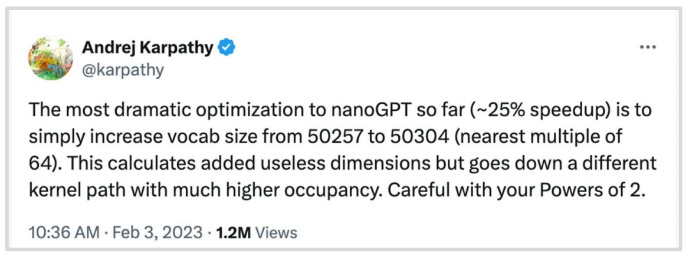

而算法设计上的例子就是 FlashAttention，不用多说，这个方法的提升甚至都是按照整数倍来计量的而不是百分比。

### GPU 架构

GPU 的内部架构与调度机制，可以清晰地拆解为"编程与存储视角"和"硬件与调度视角"两个正交维度，其中编程与存储视角如下

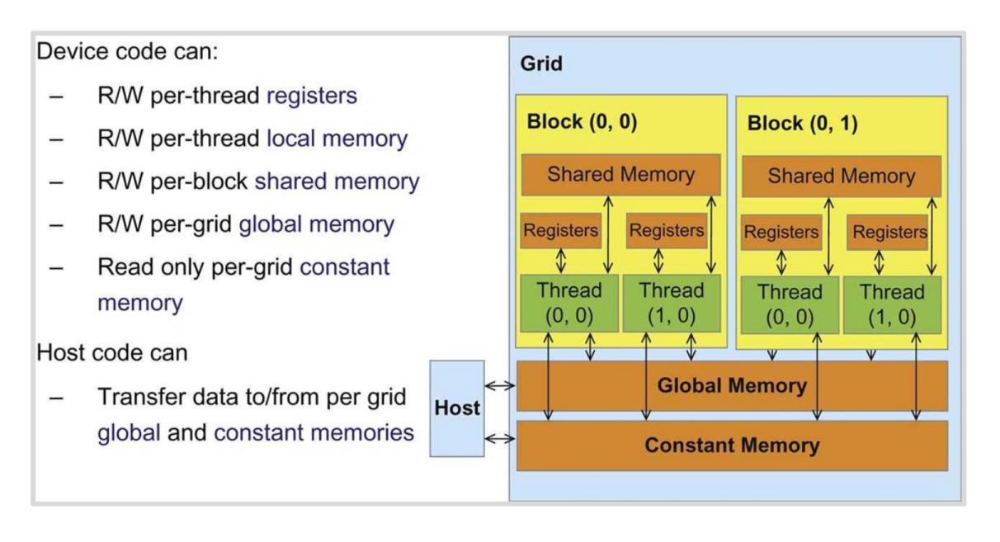

1. Thread：并行计算的实际单元，所有 Threads 执行相同的指令但作用在不同的输入数据上
2. Block：一组 Threads，重点是一个 Block 中的 Threads 可以通过共享内存通信
3. Grid：一组 Block 并配备共享的全局内存和静态内存进行通信
4. Host：主机端 CPU 及其内存，数据在 Host 与 GPU 显存之间通过 PCIe 传输，由于带宽和延迟受限，跨 Host 相关的交互与数据搬运是非常昂贵的

而从硬件与调度视角来看则有下面这些概念：

1. SM(Streaming Multiprocessor)：GPU 的物理大核心，拥有独立的 Warp 调度器、寄存器堆、共享内存和计算单元，负责承接并执行 Block
2. Warp：微观层面的硬件最小执行单元，通常固定为 32 个 Threads。它与 Block 的主要区别在于：Block 是开发者根据逻辑定义的任务块(大小与维度可变)，但硬件在实际调度时会把它切片划分为若干个 Warp，同一个 Warp 内的 32 个线程步调一致地接收调度器指令；Warp 存在的核心意义是通过快速上下文切换来隐藏高访存延时以提高整体吞吐（例如当 Warp 0 读内存卡顿等待时，调度器能零开销立刻切换给 Warp 1 发射计算指令）
3. Wave：宏观层面的整卡调度批次，指整块 GPU 的所有 SM 一次性能够同时并发容纳并执行的最大 Block 总量，GPU 只能以整波为单位推进计算任务

直观上来说，GPU 的架构与传统的 CPU 架构非常类似，有计算机体系结构基础的同志应该能够轻松理解，其多级缓存结构与 CPU 的多级缓存几乎一致。另外，TPU 的设计架构与 GPU 其实很类似，TPU 中的概念在 GPU 中几乎都有对等的概念。最大的区别就是：更轻量化的控制器，更大的矩阵乘法单元，更快的 L1 Cache(GPU 中的 Share Memory，TPU 中的 Vector Memory)

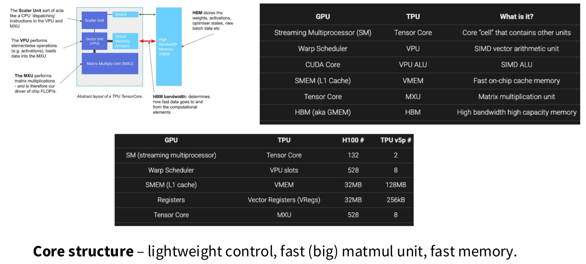

GPU 架构中的不同部分的迭代速度是不同的，计算能力的迭代速度远高于缓存的迭代速度，如下图所示。这也是为什么目前系统工程的优化大部分都集中于缓存优化，因为计算能力远高于缓存的加载速度：减少 1 次访存可以带来 10000 次的吞吐量提升(甚至更高)

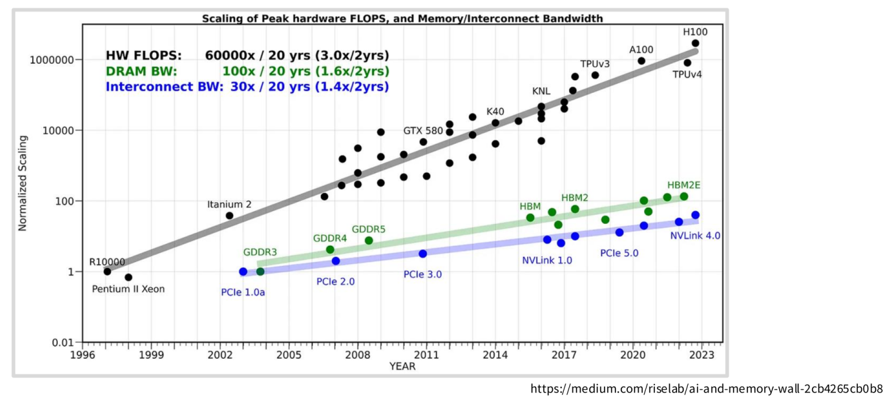

### 优化技巧

#### 分支控制

简而言之：使用 mask 替代分支指令(if-else)；这么做的主要原因是 Thread 的一个核心约束：每一个 Thread 都需要执行相同的指令，如果有分支判断的话不同的输入数据可能选择不同的分支，这是一个需要解决的矛盾。当然，硬件层面的解决方法也非常直接：不同的分支都会被计算一遍，最后再选择性丢弃一部分计算结果

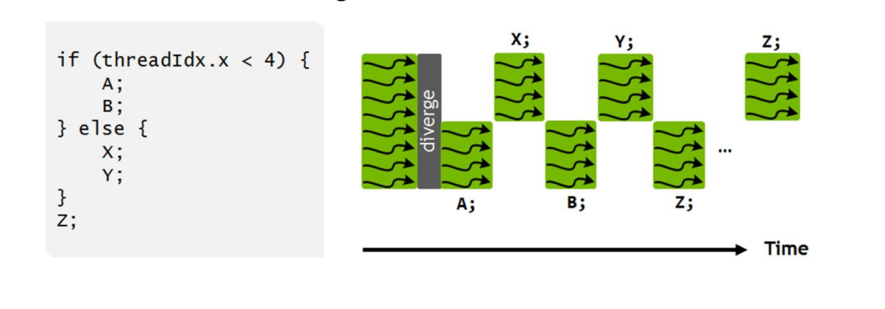

#### 低精度计算

很直白，降低参与计算的数据精度，换取数据吞吐。为了用如此低的比特数来训练模型，总是需要一些技巧的。目前主流的思路是一组低精度数据配上一个缩放因子，代表就是 MXFP8 格式的数据。这种方式有一个需要处理的问题：转置如何计算？数据是按照行来分块并配备缩放参数的，转置之后行变成了列，与原有的数据结构不一致了。这个问题其实很难用优雅的方式解决，在实际训练的过程中，是直接拷贝一份数据专门用于转置操作。

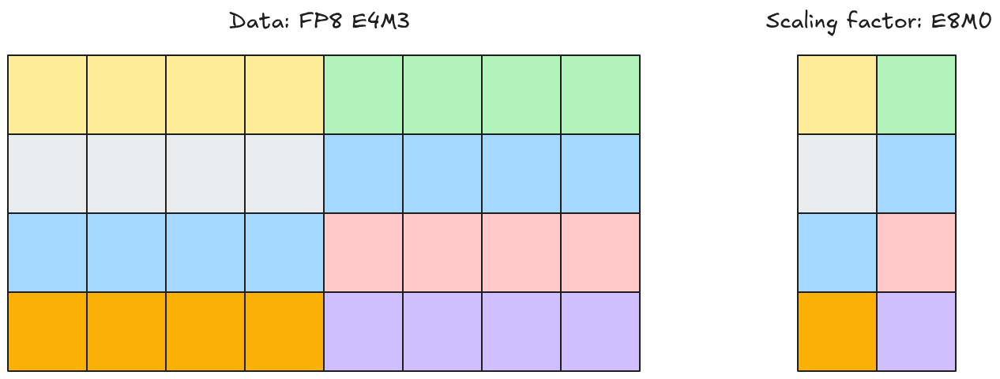

还有一种思路在 CS336 课程中没有提及，可能是这个方法比较复杂并且目前没有生产级的大模型使用了这种方法，[论文链接](https://arxiv.org/abs/2509.00404)附上，该论文在 8B 规模的 LLM 训练中实现了全流程 FP4 精度。在此之前，NVIDIA 其实已经有相关的方案能够使用 FP4 精度来训练模型，但没有开源出来。于是该论文根据 NVIDIA 公开的技术博客使用 BF16 模拟了 FP4 的训练行为，据说能够模拟模型的精度，训练损失和收敛性，算是非常严谨的对比实验了。

具体而言，这篇研究想要解决的问题是：深度学习参数的数值分布较为广泛，直接使用 Scaling factor 方案作用于原始矩阵数值会导致小数值被大数值抹平(典型的量化损耗)，因为大的动态范围会让量化精度网格变得稀疏，小数据会挤在很小的一个接近 0 的范围内，很容易就被量化为 0 了。一个直觉是大数值和小数值应该分开表示，于是研究使用 SVD 的方法对矩阵数值进行了分解，其中 \(\sigma_{i}\) 就是从大到小排序后的奇异值：


$$
M = \sum_{i=1}^{r} \sigma_i \cdot (u_i v_i^T)
$$

实验结果如下所示，大约 3% 的奇异值主导了数值的分布上界(大约相差一两个数量级)，如果分离这些大奇异值的话，剩余的残差矩阵的数值就能够更均匀地分布在量化网格上；而分离出来的主导分量则天然可以被一个缩放参数和两个数值相对平坦的奇异向量表示，很适合 FP4 量化

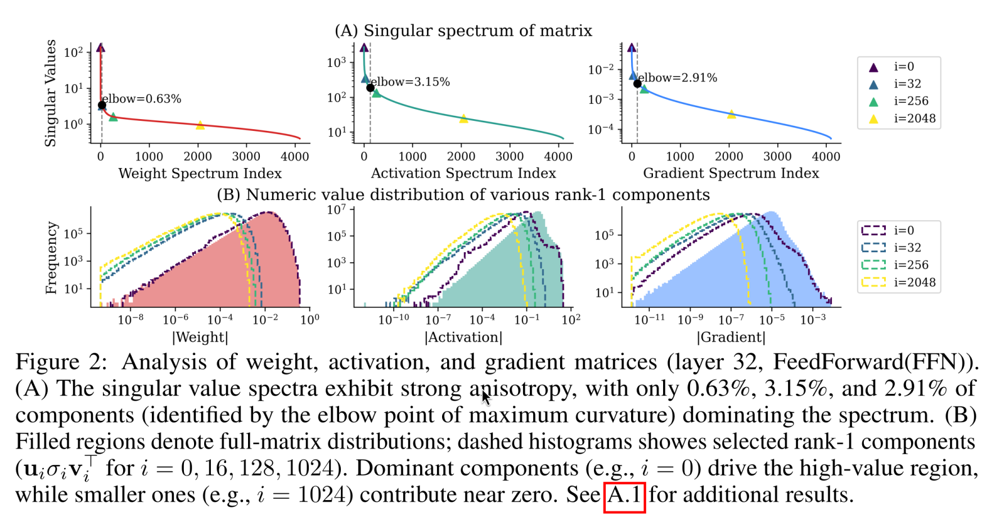

值得一提的是 SVD 量化这个思路并非首创，在上面这篇研究之前就已经有一个类似的方案了：[SVDQuant](https://arxiv.org/abs/2411.05007)，虽然都是使用 SVD 但这篇研究感觉没做干净，高精度矩阵还是在搬来搬去并且还需要处理稀疏矩阵乘法等难题，而上面这篇研究则很漂亮地放进了 Scaling factor 和奇异向量里面。

#### 算子混合

将不同的算子融合为一个整体，避免在 HBM 中反复进行读写，降低访存次数，这也是 FlashAttention 中的一个核心操作。下面这个插图能够非常直观地看出其动机：一次数据读取之后尽可能多地计算，避免中途写回。

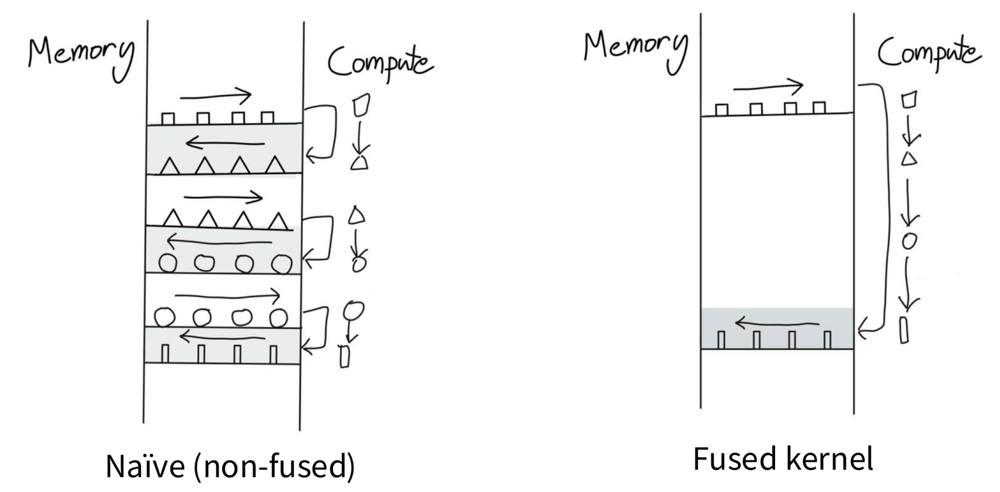

#### 重计算

字面意思，中间变量不写缓存，需要的时候重新通过输入计算一遍。以下面的这个计算为例，能够将 8 次访存变为 5 次。

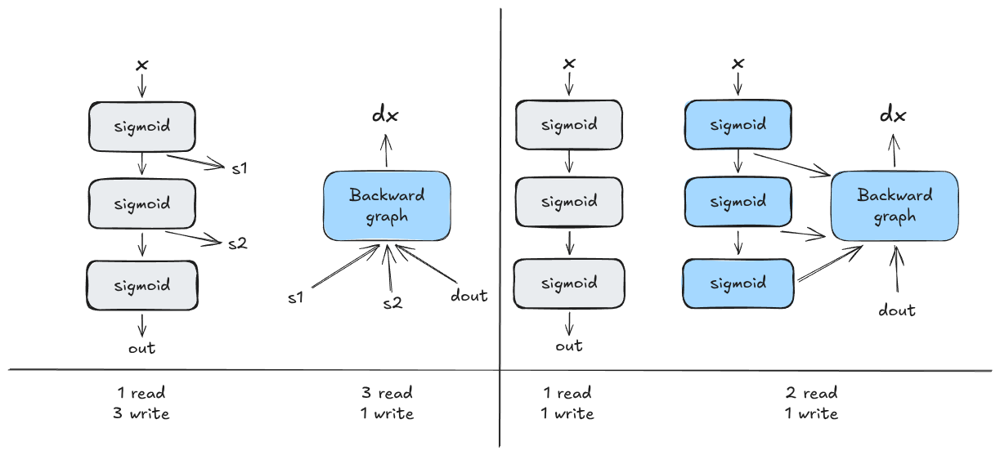

#### 批量访存

这个技巧涉及更加复杂的底层细节，DRAM (global memory) 的读取方式是并发式的，其工作原理就决定了一整行的数据都需要进入"预备状态"然后才能够从中片选出你需要的数据。换言之，一整行数据加载的成本已经付出了，我们能做的只是尽量从中片选出尽量多的数据来摊薄成本。

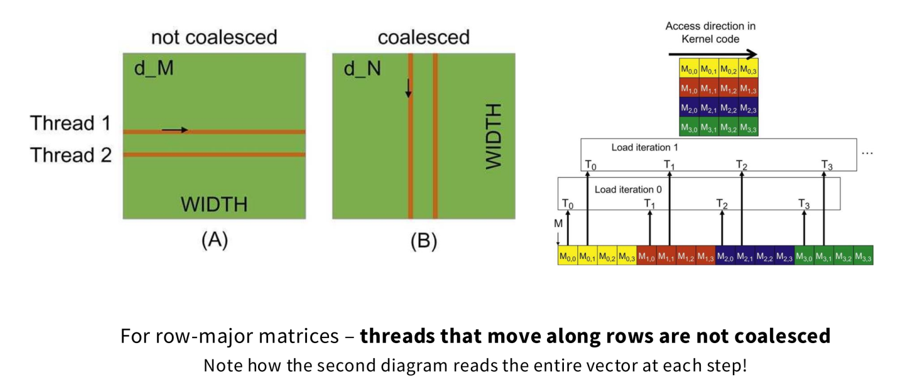

举个例子，一个行优先矩阵如果让 Thread 工作于不同的行索引，就会产生不连续的访存；但是如果让 Thread 工作在同一个行索引，这样就能够利用 DRAM 整行加载的特性，一次性满足大量 Thread 的数据需求。

#### 分块

与算子混合的目标一致，都是降低访存次数，或者说减少不必要的访存，让一次数据读取对应尽量多的计算。

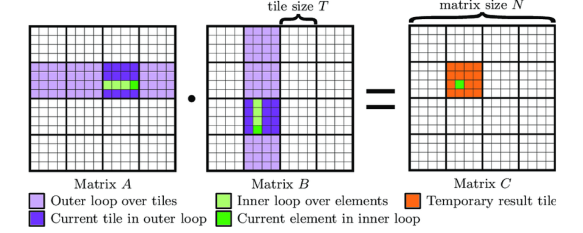

如上所示，如果不进行分块的话，那么每一个输入都需要从全局缓存读取 N 次，进行分块之后每一个输入只需要从全局缓存中读取 N/T 次，然后在 Block 中的共享缓存再读取 T 次即可，而共享缓存的读取速度是很高的，几乎将全局缓存的访问变为了原来的 \(\frac{1}{T}\)，是一个非常强悍的优化了。

值得一提的是，这个技巧的效果与参与运算的矩阵形状有很大的关系，如果矩阵的形状不合适则会产生很大的损耗。一则是不良分块，某些分块中几乎没有数据纯粹空转，如下图所示。

)

二则是对齐，如果矩阵的形状合适，那么一次 Tiling 读取的数据就能够非常高效地利用 DRAM 的并发读取特性；如果形状不合适，那么对于吞吐的影响也是巨大的。

" )

#### 数据图品鉴

" )

了解了先前所有的优化技巧之后，这幅图中诡异的现象就能够被解释了：首先大体上的趋势是算数强度随着矩阵变大而增长；非常明显的断点则是由于不良矩阵形状造成的(具体原因见[分块]()小节)，一个对齐的矩阵形状能够带来接近一半的吞吐提升；最后图线中的神秘周期性断点，是由于 GPU 按整波推进过程中产生的，简而言之，当矩阵的形状达到某一个特定的临界之后，会突然产生一个 Wave 无法完成的计算任务，从而被强制向上舍入量化为整数 Wave，但实际上最后一个 Wave 的负载是不够的。这也是这个现象叫作波次量化(Wave Quantization)的原因

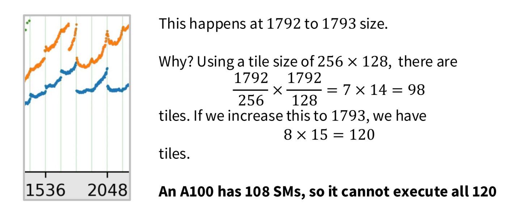
