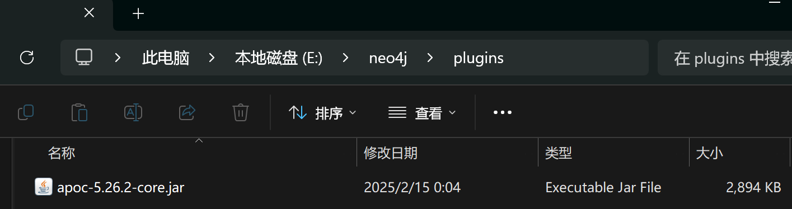


The basic info and operations of Neo4j Graph Database.


## Introduction

[Neo4j](https://github.com/neo4j/neo4j) is a high-performance graph database that stores data and the relationships between data in the form of graphs.

The specific form of the graph is a **labeled property graph**, and the query language used is `Cypher`.

## Labeled Property Graph

A **labeled property graph** is a specific type of graph:
- A node has one or more labels to define its type.
- Relationships and nodes are treated equally, holding the same level of importance.
- Each node and relationship possesses accessible properties.

## Cypher

> Cypher is a **declarative** query language that allows you to identify **patterns** in your data using an **ASCII-art style syntax** consisting of **brackets**, **dashes** and **arrows**.

### Patterns
A **pattern** in a graph database is a specific combination of nodes and relationships. For example, a person (Person) acting in a movie (Movie) is a pattern, represented in code as:

```cypher
(p:Person)-[r:ACT_IN]->(m:Movie)
```

Here, the parts enclosed in parentheses represent nodes, while the parts enclosed in square brackets represent relationships. In the node section, `p` and `m` are variables referring to the respective nodes, with `Person` and `Movie` being the labels of the nodes, connected by a colon. In the relationship section, `r` is the variable referring to the relationship, and `ACT_IN` is the specific type of relationship. Translated into natural language, this means: use `p` to refer to a node labeled `Person`, use `m` to refer to a node labeled `Movie`, and represent the relationship between them with `r`, which is of type `ACT_IN`.

### Data Reading

Data reading operations rely on **pattern matching**, using the keyword `MATCH`. This is equivalent to sending an instruction to the database to filter out only the **node-relationship pairs** that match the specified pattern, i.e., a collection of triples `(p, r, m)`.

```cypher
MATCH (p:Person)-[r:ACT_IN]->(m:Movie)
```

Similar to SQL, you can further filter using the `WHERE` keyword:

```cypher
MATCH (p:Person)-[r:ACT_IN]->(m:Movie)
WHERE p.name = 'Tom Hanks'
RETURN p, r, m
```

Here, `name` is a property of the node `p`, accessed using the `.` operator. The `RETURN` keyword marks the values to be returned.

Below is a more complex pattern matching command, where the `AS` keyword is used to set aliases:

```cypher
MATCH (p:Person)-[:ACTED_IN]->(m:Movie)<-[r:ACTED_IN]-(p2:Person)
WHERE p.name = 'Tom Hanks'
RETURN p2.name AS actor, m.title AS movie, r.role AS role
```

This command filters out all actors who have acted in the same movie as Tom Hanks, returning their names, the movies they acted in, and the roles they played.

Sorting by a specific property and pagination are also supported:

```cypher
MATCH (m:Movie)
WHERE m.released IS NOT NULL
RETURN m.title AS title, m.url AS url, m.released AS released
ORDER BY released DESC LIMIT 5
```

This will filter out the 5 most recent movies.



Cypher keywords are case-insensitive; property names, variable names, and other identifiers are case-sensitive.


### Data Writing

Data writing uses the `MERGE` keyword, which means **merging** a node or relationship into the data graph.

- Merging nodes:

```cypher
MERGE (m:Movie {title: "Arthur the King"})
SET m.year = 2024
RETURN m
```

This command creates a new `Movie` node with the `title` property set to `"Arthur the King"` and the `year` property set to `2024`.

You might wonder why not write it like this:

```cypher
MERGE (m:Movie)
SET m.year = 2024, m.title = "Arthur the King"
RETURN m
```

The reason is that the content within the curly braces is used to check whether the **pattern** you want to create already exists, avoiding duplicate patterns.

- Merging relationships:
```cypher
MERGE (m:Movie {title: "Arthur the King"})
MERGE (u:User {name: "Adam"})
MERGE (u)-[r:RATED {rating: 5}]->(m)
RETURN u, r, m
```

## Installation

As of February 15, 2025, after extensive testing by the developer community, it has been found that Neo4j Desktop is blocked for users in mainland China, causing the software interface to fail to display properly. While bypassing the block through methods such as disabling the network is possible, this removes the key advantage of the desktop version—easy deployment.

Thus, I recommend using the Docker deployment method.

### Docker Desktop

Simply install Docker Desktop and run it in the background.

### Pulling the Image

Normally, you can simply pull the latest image with the command: `docker pull neo4j`.

However, if your project requires the [APOC](https://neo4j.com/labs/apoc/4.1/installation/) plugin, you should consider the version of APOC, as the image may be ahead of the APOC version. The community version of APOC is released on [Releases · neo4j/apoc](https://github.com/neo4j/apoc/releases).

For APOC compatibility, use the following command: `docker pull neo4j:5.26.2`.

### Building the Container

```sh
docker run -d -p 7474:7474 -p 7687:7687 -v E:/neo4j/data:/data -v E:/neo4j/logs:/logs -v E:/neo4j/conf:/var/lib/neo4j/conf -v E:/neo4j/import:/var/lib/neo4j/import -v E:/neo4j/plugins:/var/lib/neo4j/plugins -e NEO4J_dbms_security_procedures_unrestricted="apoc.*" -e NEO4J_dbms_security_procedures_allowlist="apoc.*" -e NEO4JLABS_PLUGINS='["apoc"]' -e NEO4J_AUTH=neo4j/mo123456789 --name neo4j neo4j:5.26.2
```

Explanation of the parameters:

- The `-p` option exposes ports; here, we open two ports.
- The `-v` option mounts directories from the host machine (this means specifying where the Docker application will store its data).
- The `-e` option configures environment variables. The `apoc`-related configurations are for the APOC plugin; `NEO4J_AUTH` sets the username to `neo4j` and the password to `mo123456789`.



If you use Neo4j for language model-enhanced generation (RAG), be sure to include the APOC-related configurations. Otherwise, you can omit these settings.


After running the command above, check the host machine's mounted directory to confirm if the APOC plugin is installed:



### Manual Installation of APOC

Visit [Releases · neo4j/apoc](https://github.com/neo4j/apoc/releases), download the latest `apoc-5.26.2-core` from the "Assets" section, and paste it into the host machine's specified directory. Then restart the Docker container.

### Browser UI

By default, the 7474 port is used for the browser UI, and the 7687 port is for other backend applications.

When the container is running in the background, access the UI at: `http://localhost:7474/browser/preview`.

Connect to the database using: `neo4j://localhost:7687`.

You should now be able to access the browser UI successfully. 😄

## References

- [Docker: Docker Deployment of Neo4j Graph Database - Angry Radish - Blog](https://www.cnblogs.com/nhdlb/p/18703804)
