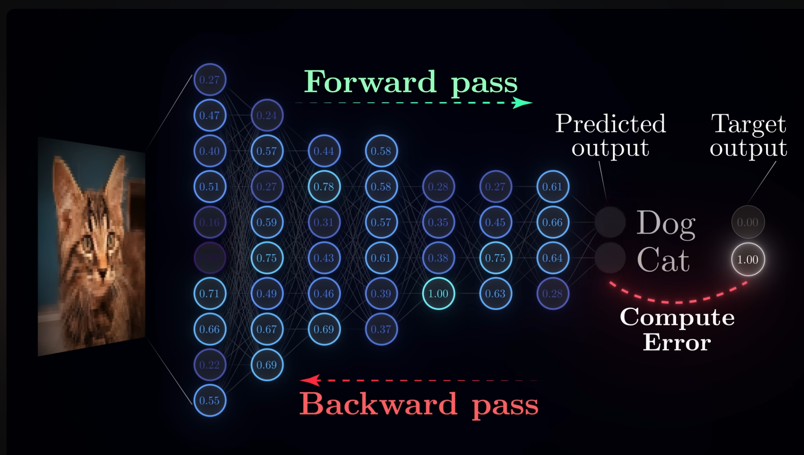
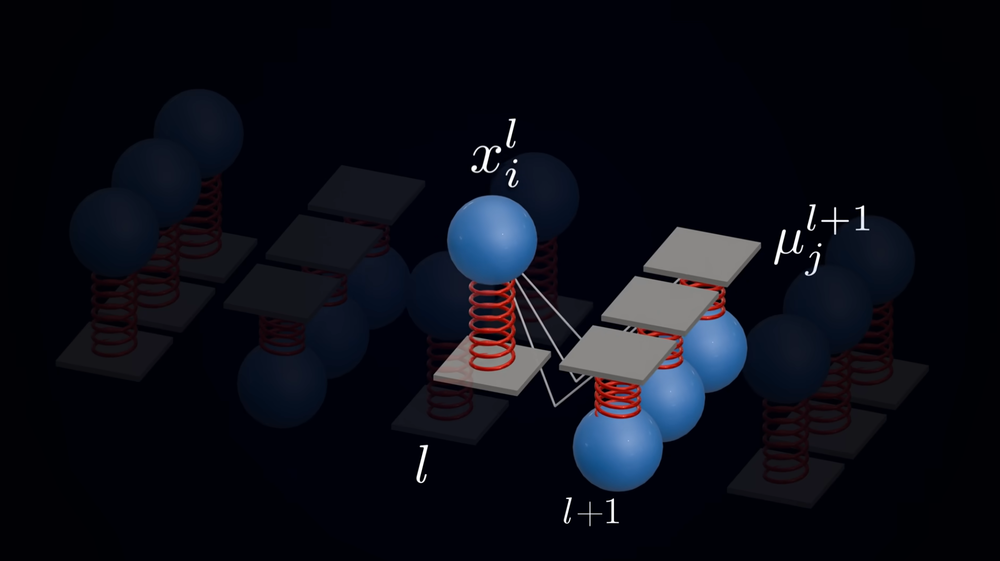



The starting point was a [video](https://youtu.be/l-OLgbdZ3kk?si=ZiSDoIJVegOHlAlp) on YouTube explaining predictive coding. Its biggest selling point is this: a more biologically plausible alternative to the backpropagation algorithm.

## The Backpropagation Algorithm

Backpropagation is the cornerstone of today's deep learning landscape. Virtually all deep learning models rely on it for training. The core problem it solves is the *credit assignment problem*: if a neural network produces a wrong output, how should we adjust the parameters to improve the model's output?

Consider the connection weights between the last layer and the second-to-last layer. Here we have a very clear alignment signal—the training labels. We can compute a scalar loss value from the model output and the label, then unfold that loss layer by layer using the chain rule of calculus. This lets us iteratively optimize the network's performance as evaluated by that loss function.

There is, however, an implicit assumption here: the network's connectivity pattern must be the one most commonly used today—strictly feedforward layers with no intra-layer dependencies. In the early days of neural network exploration, many topologies did not look like this at all; there were plenty of other connection schemes.

Several representative non-feedforward-layer topologies appeared in early neural network research:

- **Intra-layer / lateral connections**: Neurons within the same layer connect to one another, enabling lateral inhibition, competition, or normalization. Common in early vision models (e.g., “winner-take-all” networks).
- **Recurrent feedback connections**: Feedback loops across layers or across time, allowing information to flow through the network repeatedly. Classic examples include Hopfield networks and the simple recurrent networks of Elman and Jordan.
- **Symmetric connections**: Bidirectional symmetric weights (\(w_{ij}=w_{ji}\)), which make it convenient to define an energy function and analyze convergence. Hopfield networks and Boltzmann machines are the canonical cases.

These topologies were gradually marginalized, mainly because they are incompatible with efficient gradient-based backpropagation training:

1. Backpropagation requires the network to be (or be unrolled into) a directed acyclic graph. Recurrent networks with loops must be unrolled along the time dimension (backpropagation through time, BPTT), which brings vanishing/exploding gradients and training instability.
2. Lateral and feedback connections disrupt clean layer-wise credit assignment. They easily cause oscillations and divergence, making stable convergence difficult.
3. Training symmetric-connection networks (e.g., Boltzmann machines) relies on MCMC sampling to estimate gradients. This is computationally prohibitive and hard to scale to large problems.
4. By contrast, the feedforward layered structure is simple, stackable, and easy to parallelize on GPUs. Together with the maturation of automatic differentiation frameworks, it won out in engineering practice and became the de facto standard.

In short, today's dominant neural network topology and its companion backpropagation algorithm rule the deep learning world.

However, the biological plausibility of backpropagation has long been questioned. Even one of its chief architects, Geoffrey Hinton, has publicly acknowledged the issue and tried to propose alternatives like the Forward-Forward algorithm. The criticisms concerning biological plausibility can be roughly summarized into two points:

1. Learning would put the brain on hold: Backpropagation requires a clean separation between a forward pass and a backward pass. You cannot do both at the same time—doing so would cause severe parameter chaos (part of the network updated while another part is not). Therefore, during error backpropagation, the affected neurons would effectively shut down. Behaviorally, this implies the brain would exhibit a much longer refractory period than what is actually observed.
2. Global phase coordination: A clear-cut forward/backward phase division implies the need for a global signal to orchestrate everything, and the forward and backward processes must be temporally symmetric in a mirror-like fashion. Shallow layers must wait until all subsequent layers have computed their errors before they can compute their own. Such strict temporal scheduling is almost certainly impossible given our current understanding of brain science.

## Predictive Coding

### Algorithm Implementation

Predictive Coding (PC) revolves around one core idea: every neuron updates the network parameters using only locally available information. Deeper-layer neurons try to predict the activity of the neurons in the layer below, and the entire network's optimization objective is to minimize the overall prediction error. The most intuitive mental model is a spring network.

In this picture, the prediction from an upper layer to a lower layer is analogous to a spring's anchor point. The deviation of the lower layer's actual activity state from that prediction is analogous to the spring's extension, and the error is understood as the energy stored in the spring. Adjusting the length of one spring affects not only that spring's own energy, but also the prediction value for the next spring down, thereby affecting the overall energy of the entire lower layer. Therefore, we need an algorithm that tunes the whole network to minimize the total energy.

With some intuitive understanding in place, we can lay out the formal modeling.

Below is the standard formalization of predictive coding, following the notation in the original Rao & Ballard (1999) paper and subsequent reviews. More related papers can be found in this [GitHub collection](https://github.com/BerenMillidge/Predictive_Coding_Papers.git). Consider a hierarchical network. Let the neural activity state at layer \(l\) be denoted \(x_l\). Higher layers generate top-down predictions of lower-layer activity via a weight matrix \(W_{l+1}\) and a (usually nonlinear) generative function \(f\):

$$
The difference between the actual activity at this layer and the top-down prediction, i.e., the prediction error:
$$

The optimization objective of the entire network is to minimize the weighted sum of squared prediction errors across all layers. There are two ways to think about why this objective is designed this way: one is the physical intuition of energy minimization, the other is more mathematical, deriving it from the principle of least action:

$$
Here $\Pi_l = \Sigma_l^{-1}$ is called the precision (the inverse of the noise covariance $\Sigma_l$ in the generative model), which measures the confidence placed on the prediction error at that layer—the higher the precision, the more reliable the prediction and the larger its weight in the total energy. Mapping this back to the spring network: the prediction $\hat{x}_l$ is the anchor point, $\|\varepsilon_l\|$ is the spring's extension, $\frac{1}{2}\,\varepsilon_l^{\top}\Pi_l\varepsilon_l$ is the energy stored in the spring, and the precision $\Pi_l$ can be understood as the spring constant. A predictive coding model maintains two important representations of the model state: one is the activity states, analogous to neural activation values; the other is the weights, analogous to synaptic strengths between neurons. For state updates, we perform gradient descent on $E$ with respect to the activities $x_l$, yielding the dynamical equation for each layer:
$$

The first term \(-\Pi_l\varepsilon_l\) pulls the activity of this layer toward the higher layer's prediction to eliminate local error (the higher the precision, the tighter the pull). The second term is the backpropagated signal from the lower layer's error \(\varepsilon_{l-1}\), demanding that this layer's activity better explain the lower layer's activity. Together, they force each layer to strike a balance between "obeying the top-down prediction" and "explaining the bottom-up activity." Notably, this dynamics uses only local quantities from the layer itself and its immediate neighbors, so convergence can proceed in parallel across layers.

For weight updates, we perform gradient descent on \(E\) with respect to the top-down weights \(W_{l+1}\), giving the learning rule:

$$
where $\odot$ denotes element-wise multiplication. The key feature of this rule is that the weight update depends only on the local prediction error $\varepsilon_l$ and the local activity $x_{l+1}$ —it is a local Hebbian-style learning rule. That is, the change in the synapse is proportional to the product of the presynaptic activity $x_{l+1}$ and the postsynaptic error signal $\varepsilon_l$. It requires neither a global loss signal nor precise temporal scheduling. It is precisely here that predictive coding addresses the biological plausibility criticisms of backpropagation: every layer can update parameters using only local information. There is no need for global phase coordination, nor a strict forward/backward pass separation, making it far more biologically plausible. ### Experimental Results Because predictive coding was proposed quite early and spans both neuroscience and artificial intelligence, a large number of early papers are conceptual and review-oriented. It was not until ICLR 2025 that a thorough [benchmark study](https://proceedings.iclr.cc/paper_files/paper/2025/hash/581df42e8ebbeeac39aeda03519b7c0e-Abstract-Conference.html) appeared, providing a JAX implementation of predictive coding and a controlled comparison with the backpropagation algorithm. The paper itself is very compact—only 9 pages of main text, with the rest being references (24 pages)—so I highly recommend reading the original directly. I do not particularly recommend this [blog post](https://www.verses.ai/research-blog/benchmarking-predictive-coding-networks-made-simple). Although it is by the paper's authors, the content differs somewhat from the version actually published at ICLR. Comparing the two, it is clear that ICLR is quite authoritative; it made the author team add quite a bit more experimental data 🤣 The study tested predictive coding algorithms across different architectures and tasks, and analyzed the underlying mechanisms: **Discriminative tasks**: Mainly focused on image classification, using multiple datasets, various network architectures, and several predictive coding variants. ![[pc_benchmark_table1.png]] **Generative tasks**: Primarily tested the generation and memory capabilities of predictive coding algorithms, broken down into three subtests: 1. Image reconstruction: essentially an autoencoder task, comparing MSE reconstruction error. ![[pc_benchmark_table2.png]] 2. Probability distribution sampling: Using Monte Carlo predictive coding with injected Gaussian noise, they tested the ability to learn complex probability distributions and generate new samples on the Iris dataset and MNIST, and compared the results with variational autoencoders. (The experimental results here were not turned into a table 😑) ![[pc_benchmark_mcpc.png]] 3. Associative memory retrieval: On Tiny ImageNet, they tested a PC neural network's ability to recover the original training image when the input is corrupted by noise or occluded. This experiment did not compare against backpropagation. Traditional feedforward networks trained with BP are unidirectional, whereas this bidirectional associative memory ability is unique to PCNs, requiring no extra complex architecture. ![[pc_benchmark_table3.png]] The **mechanism analysis** part mainly ran these experiments: 1. State initialization experiments: Compared the effects of zero initialization, Gaussian prior initialization, and forward-pass initialization on model performance. 2. Energy propagation experiments: Analyzed the flow imbalance of prediction errors across layers during the inference phase. 3. Training stability experiments: Studied the interplay among model width, state learning rate, and weight optimizer (AdamW vs. SGD). 4. Out-of-distribution (OOD) detection: Tested whether one can directly use the variational free energy of a PCN to distinguish in-distribution data (MNIST) from out-of-distribution data (FashionMNIST). Here, to sum up the conclusions from all the experiments above: 1. On small- to medium-scale models, performance is on par with BP, but there is a distinct "depth bottleneck": deeper networks perform worse, which is exactly the opposite conclusion from backprop. 2. Energy propagation imbalance and training instability are the main factors limiting the scalability of PC: in deep networks, error energy predominantly piles up at the outermost layers and struggles to propagate effectively toward the input layer. When using wide hidden layers and the AdamW optimizer, state updates become extremely unstable. 3. It demonstrates remarkable flexibility on generative and associative memory tasks. For image reconstruction, a decoder-only PCN achieves reconstruction accuracy comparable to, or even better than, a full BP autoencoder. 4. Without any task-specific training, the free energy metric of a PC network can very effectively identify out-of-distribution data. Using free energy for OOD detection significantly outperforms traditional softmax scores. There is a noteworthy issue here: the energy propagation imbalance problem. This problem exists in BP as well, but it was, in an engineering sense, completely solved after the introduction of residual connections. So a reasonable question is: can the poor performance of PCNs be attributed to the lack of technical support akin to residual connections? In fact, this study already tested the effect of standard residual connections on image classification tasks. On a ResNet-18 architecture with standard residual structure, PC's performance was far worse than the BP algorithm. Furthermore, the study manually designed skip connections for VGG-19 (Appendix E). Without skip connections, the highest test accuracy on CIFAR-10 was only **25.32%**. With skip connections, the highest test accuracy shot up significantly to **73.95%**. Yet compared to the **90%+** accuracy routinely achieved by standard BP, there is still a performance gap of roughly **20 percentage points**. ### Personal Take In a nutshell, on raw benchmark numbers, PC still cannot beat BP. This outcome is similar to many other more biologically plausible training algorithms. I believe this reflects a trade-off. Simply chasing biological plausibility for its own sake has little meaning; we must ask what price we pay for this plausibility, and what substantive gains we get in return. Or, to put it more bluntly, in what ways is human intelligence genuinely better than artificial intelligence? These genuinely superior aspects are where the value of "biological plausibility" truly lies. On this topic, I'd like to cite a [paper](https://arxiv.org/abs/2602.23643) by Yann LeCun from February this year (2026), described on X as the most "heretical" paper of the year. Generally, we tacitly assume that human intelligence is the true form of general intelligence, which is why biological plausibility is a metric worth caring about. But this paper directly criticizes the generality of human intelligence itself, and questions whether the adaptation speed of human intelligence is any better than that of artificial intelligence. Of course, the paper itself is highly controversial, but it indeed offers a rather different perspective for scrutinizing the commonly held view that "human intelligence is general intelligence," and forces us to answer objectively: in what ways is human intelligence actually better than artificial intelligence? ## Latest Developments ### Research Assessment It's easy to notice that predictive coding as an algorithm was proposed quite a while ago (1999)—nearly 30 years ago. Have there been any subsequent developments? How does academia currently evaluate this algorithm? The most up-to-date conclusion is this: predictive coding has lost its dominant status, and its key assumptions have been experimentally falsified. The good news, however, is that new algorithmic frameworks have emerged from the new experimental evidence, and related research has carried out initial computational verification. Let's first review two key implicit assumptions of predictive coding: 1. Top-down feedback is suppressive: The upper layer suppresses the predictable information of the lower layer, because by design, the lower layer is closer to the real information source, and the lower layer only reports the error signal upward. 2. Response reduction comes from top-down suppression: This is the dual of the previous assumption; i.e., if the lower layer's response to predictable stimuli weakens, the cause is the prediction from above (prediction equals suppression). However, a substantial body of experimental evidence shows that true predictive coding does not occur in early sensory processing, but is a specialized ability of higher cognitive regions. Response reduction mostly arises from local adaptation in the feedforward pathway (to put it bluntly, the neurons get tired). Moreover, a recent [review from the OpenScope community](https://arxiv.org/abs/2504.09614) explicitly states that the brain likely adopts a "model ensemble" approach, dynamically deploying different strategies depending on the context. Predicting the next input may well be a fundamental capability of the cortex, but it does not arise from a single mechanism; rather, it is cobbled together from a set of interacting strategies. > This document was co-authored by over 50 scientists through Google Docs and can be considered representative of a substantial segment of the academic community's understanding. In short, the genuine academic stance is to retain PC as a local computational principle (especially for higher cognitive areas and generative models), while introducing competing frameworks and a "mechanism ensemble" perspective to explain sensory cortex function. Since experimental data has falsified some assumptions of PC, is there a better framework than PC that can explain these experimental findings? Enter the [BELIEF](https://doi.org/10.1016/j.tics.2025.09.018) framework, which reassigns the locus of "suppression": suppression occurs in the feedforward/lateral pathways, while feedback is always an excitatory spotlight. The structure of this new framework is strongly isomorphic to the attention mechanism in Transformers. The core of the biased competition theory is: "competition among representations occurs first, then top-down signals selectively enhance the chosen representations." The Transformer's attention mechanism does exactly this: it computes a set of weights (softmax-normalized) for all Vs and produces a weighted sum. In a sense, this is a form of "soft competitive selection." Related research has also been covered by media reports, such as this [article](https://news.qq.com/rain/a/20260128A01NLF00?pullappbar=1), which contains even richer content. ### Code in Practice Brain science has conducted rigorous experimental measurements and gathered substantial evidence supporting the correctness of the BELIEF framework. Has there been any code-level practice? In fact, yes—and it was published just this year (2026) in *Nature*, in a [research paper](https://doi.org/10.1038/s41467-026-72146-9) proving that a "BP + BELIEF-style architecture" can reproduce the full suite of hallmark biological attention phenomena. Specifically, they trained a bidirectional recurrent-gated U-Net-style architecture using BP, employing feedforward feature pathways, top-down attention pathways, lateral connections, divisive normalization (approximated by LayerNorm), and working-memory recurrent layers. The result: this architecture spontaneously exhibited multiplicative gain modulation, border-ownership coding, attentional contrast gain, perceptual load effects, inattentional blindness, and other textbook psychophysical phenomena. Here there are two key conclusions: 1. A BELIEF-style architecture does, indeed, reproduce the full behavioral repertoire of biological attention. 2. The entire network was trained using BP, yet it still replicated standard biological attention behaviors. **This might suggest that biological plausibility depends primarily on architecture/computational function, not on the learning algorithm.** This is a highly illuminating conclusion: the biological implausibility of the BP algorithm itself may not matter very much. As long as the architecture is right, it can still replicate the performance of biological functions. Taking this further, BP is an algorithm for searching network parameters. Is there a corresponding search algorithm for the network architecture itself? Indeed, there is a research field for that: Neural Architecture Search (NAS). However, to be frank, the current state of this field is not optimistic. Here I quote a perspective from a [paper](https://arxiv.org/abs/2510.04938): > However, NAS has largely failed to deliver on its promise of discovering fundamentally new architectures—for instance, facilitating the shift from convolutional networks to Transformers. Returning to the BELIEF framework itself: although it holds the advantage in biological plausibility, it cannot fully match PC from a unified computational framework perspective. All of BELIEF's claims lie at the runtime level: top-down feedback is excitatory enhancement, suppression happens in the feedforward/lateral pathways, competition-selection-gain. It does not itself propose a learning rule, nor does it have a unified objective function like free energy. ## Summary When theory and practice repeatedly clash, perhaps it is time to consider whether the theory itself is flawed. Is the biological plausibility we keep bringing up truly that important? Only now do I truly savor the depth of one sentence from the *Deep Learning* book: it is best to think of neural networks as universal function approximators, not as realistic models of neuronal networks. A relatively objective viewpoint: the human brain is not the only possible implementation of intelligence. It is even an open question whether human intelligence itself is as universally capable as we like to think. Some views in this [paper](https://arxiv.org/abs/2602.23643) are highly controversial, but at least one point is, I believe, reasonable: humans are indeed creatures highly optimized for survival-related skills. In the vast majority of physical, microscopic, and mathematical domains beyond human cognition, the **average human performance** may not represent the **best achievable optimum**. > [!NOTE]- Explanation > "Average human performance" is intended to exclude rare, extremely high-talent individuals; the capabilities of isolated, extraordinarily gifted individuals do not represent the overall level. "Best achievable optimum" rather than "already achieved optimum"—in truth, the true level of human intelligence has long lacked an uncontroversial baseline for comparison, because we are the most intelligent beings known to exist. We should not treat human intelligence as the only form of intelligence. Instead, we should analyze, from an information-theoretic perspective, how such information systems evolve iteratively. More concretely: the human brain at birth is not a blank slate. It comes with a certain innate structure, and postnatal learning allows it to adapt to a broader data distribution. This is exactly what post-training reinforcement learning does: building on general language capabilities, it trains LLMs to have robust chain-of-thought reasoning, to use tools, to answer questions, and so on. However, there are still questions that need clarification: Can reinforcement learning enable LLMs to acquire capabilities beyond those present in pre-training? Is there a fundamental difference between long-term and short-term reinforcement learning? Can we achieve continuous reinforcement learning across tasks? Yes, after all the twists and turns, I am struck by the realization that the current technical trajectory does, in fact, seem profoundly well-justified. Although I spent a great deal of time on this, at least I gained valuable "why not" experience—something that has been rarely mentioned in the education I have received.
$$
