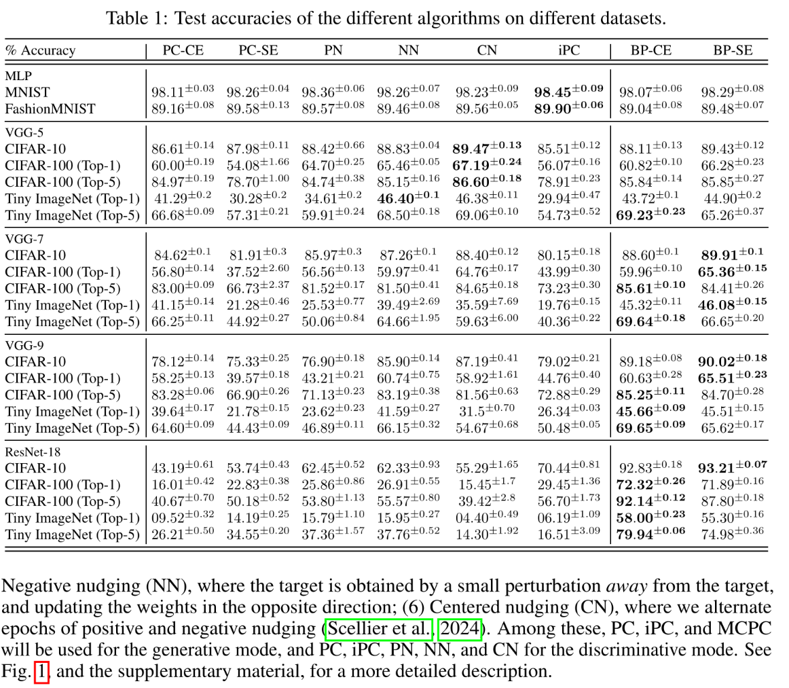
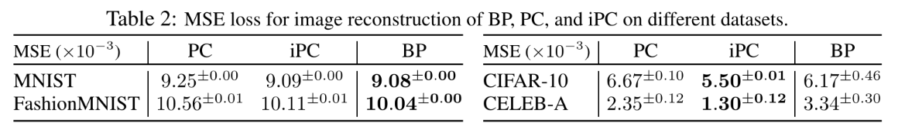
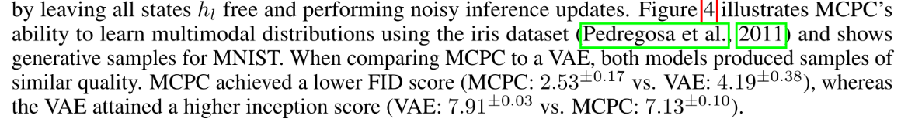
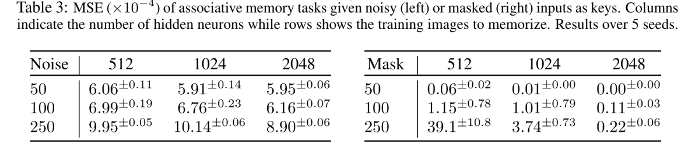



出发点就是在 YouTube 上看到了一个讲解预测编码的[视频](https://youtu.be/l-OLgbdZ3kk?si=ZiSDoIJVegOHlAlp)，其最大的一个亮点就是：一个更具生物合理性的反向传播算法的平替。

## 反向传播算法

反向传播算法是目前深度学习领域的基石，几乎所有的深度学习模型都依赖反向传播算法进行训练。该算法主要解决的一个问题是：信用分配问题，即如果一个神经网络产生了错误的输出，那么我们该如何调整参数从而改进模型输出？

首先考虑网络的最后一层与倒数第二层之间的连接权重。这里有非常明确的对齐信号，也就是训练数据的标签，我们可以利用模型输出与标签计算一个标量损失值，然后对这个损失值进行逐层链式梯度展开，这样就可以通过迭代的方式来优化网络在这个损失函数的评估下的表现。

这里其实有一个隐藏的前提：神经网络的连接方式应该是目前最一般使用的连接方式，也就是前后相连并且同层之间无依赖。早期的神经网络探索中其实有很多网络的拓扑并不这样，有很多其他的连接方式。

早期神经网络探索中出现过多种非前馈分层的拓扑，比较有代表性的几类：

- **层内 / 侧向连接（lateral connections）**：同一层内的神经元互相连接，用于实现侧向抑制、竞争或归一化，在早期视觉模型(如“赢者通吃”网络)中很常见
- **循环反馈连接（recurrent connections）**：跨层或跨时间的反馈回路，信息可以在网络中反复流动，典型代表是 Hopfield 网络、Elman 与 Jordan 的简单循环网络
- **对称连接（symmetric connections）**：权重双向对称(\(w_{ij}=w_{ji}\))，便于定义能量函数与收敛性分析，代表是 Hopfield 网络与玻尔兹曼机

这些拓扑之所以逐渐被边缘化，核心原因是它们与高效的梯度反向传播训练范式不兼容：

1. 反向传播要求网络是(或可展开为)有向无环图。带环的循环网络必须沿时间维度展开(BPTT)，随之而来的是梯度消失 / 爆炸和训练不稳定
2. 侧向与反馈连接破坏了清晰的层级信用分配，容易引发振荡和发散，难以稳定收敛
3. 对称连接网络(如玻尔兹曼机)的训练依赖 MCMC 采样来估计梯度，计算代价极高，难以扩展到大规模问题
4. 相比之下，前馈分层结构简单、可堆叠、易于在 GPU 上并行，再加上自动微分框架的成熟，最终在工程实践中胜出，成为事实标准

总之，当前的神经网络拓扑以及配套的反向传播算法占据了主导地位，统治了当前的深度学习领域。

但反向传播算法的生物合理性一直都备受质疑，包括其主要奠基人 Hinton 也曾公开承认这个问题并尝试提出了 FF 算法。关于生物合理性的质疑大致可以总结为以下几个点：

1. 学习会导致大脑宕机：反向传播算法需要划分明确的前向过程和反向过程，你无法同时进行前向传播和反向传播，这两者同时进行会导致严重的参数混乱(一部分网络没更新另一部分更新了)。因此，误差反向传播的过程中受到波及的神经元会宕机，这从表现上来说就是大脑会有明显比实际更长的反应真空期
2. 全局方向协调：明确的前向和反向阶段的划分意味着需要有一个全局的信号来统一管理，并且前向和反向的过程需要在时间上镜像对称，浅层需要等待所有后续层的误差计算完毕之后才能够计算自己的误差，这种严格的时序调度在当前的脑科学认知中是几乎不可能实现的

## 预测编码

### 算法实现

预测编码，即 Predictive Coding(PC)，其核心就是：每个神经元都根据自己的局部信息来更新网络参数，深层的神经元会去预测下一层神经元的活动状态，整个网络的优化目标就是让整体的预测偏差最小化。一个最为形象的认知模型就是一个弹簧网络

在这幅图中，我们将上层对下层的预测理解为弹簧的铆定点，将下层的实际活动状态与预测值的偏离理解为弹簧拉伸的长度，误差则被理解为弹簧中存储的能量。调节某一个弹簧的长度不仅会影响该弹簧自身的能量值，还会影响下一层弹簧的预测值，从而影响下一层整体的能量值。因此，我们需要通过算法来调节整个网络，让网络的整体能量最小化。

有了一些形式上的理解之后，下面就可以给出具体的形式化建模了。

下面给出预测编码的标准形式化建模，记号沿用 Rao & Ballard（1999）原始论文及后续综述中的约定，更多相关论文见 [GitHub 集锦](https://github.com/BerenMillidge/Predictive_Coding_Papers.git)。设一个分层网络，第 \(l\) 层的神经活动状态记为 \(x_l\)；高层通过自上而下的权重矩阵 \(W_{l+1}\) 对低层活动做出预测，预测由一个(通常非线性的)生成函数 \(f\) 给出：

$$
\hat{x}_l = f(W_{l+1}\, x_{l+1})
$$

本层真实活动与高层预测之差，即预测误差：

$$
\varepsilon_l = x_l - \hat{x}_l = x_l - f(W_{l+1}\, x_{l+1})
$$

整个网络的优化目标是最小化所有层预测误差的加权平方和。至于为什么要这么设计，其实有两种理解思路，一种就是能量最小化的物理直觉，另一种则偏数学分析，可以通过最小作用量原理来推导：

$$
E = \sum_l \frac{1}{2}\,\varepsilon_l^{\top}\, \Pi_l\, \varepsilon_l
$$

其中 \(\Pi_l = \Sigma_l^{-1}\) 称为精度（precision），是生成模型中噪声协方差 \(\Sigma_l\) 的逆，衡量该层预测误差的可信程度——精度越高，该层预测越可靠，其误差在总能量中的权重也越大。对应到前文的弹簧网络：预测 \(\hat{x}_l\) 是铆定点，\(\|\varepsilon_l\|\) 是弹簧拉伸量，\(\frac{1}{2}\,\varepsilon_l^{\top}\Pi_l\varepsilon_l\) 是弹簧存储的能量，而精度 \(\Pi_l\) 可理解为弹簧的劲度系数。

在预测编码模型中，有两个重要的表征模型状态的数据：一个是活动状态，类似于神经元的激活值；另一个是权重，类似于神经元之间的连接强度。

状态更新，主要是对 \(E\) 关于活动 \(x_l\) 做梯度下降，得到每一层活动的演化方程：

$$
\tau\,\dot{x}_l = -\,\Pi_l\,\varepsilon_l + \left(\frac{\partial f(W_l\, x_l)}{\partial x_l}\right)^{\!\top} \Pi_{l-1}\,\varepsilon_{l-1}
$$

第一项 \(-\Pi_l\varepsilon_l\) 把本层活动拉向高层预测以消除本层误差(精度越高拉得越紧)；第二项是来自更低层误差 \(\varepsilon_{l-1}\) 的反传，要求本层活动能更好地解释低层活动。两者共同作用，使每一层在“服从高层预测”与“解释低层活动”之间达到平衡。值得注意的是，该动力学只用到本层及相邻层的局部量，因此可以逐层并行地收敛。

权重更新，主要是对 \(E\) 关于自上而下权重 \(W_{l+1}\) 做梯度下降，得到学习规则：

$$
\dot{W}_{l+1} = \big(\Pi_l\,\varepsilon_l \,\odot\, f'(W_{l+1}\, x_{l+1})\big)\, x_{l+1}^{\top}
$$

其中 \(\odot\) 表示逐元素乘积。这条规则的关键特征在于：权重更新只依赖本层的预测误差 \(\varepsilon_l\) 与本层活动 \(x_{l+1}\)，是一种局部的赫布式学习，即突触的变化正比于突触前活动 \(x_{l+1}\) 与突触后误差信号 \(\varepsilon_l\) 的乘积，既不需要全局损失信号，也不需要精确的时序调度。

正是在这一点上，预测编码回应了反向传播的生物合理性质疑：每一层只凭局部信息即可更新参数，既不存在全局方向协调，也无需严格的前向 / 反向阶段划分，因而具备更强的生物合理性。

### 实验结果

由于预测编码提出时间较早并且跨越了脑科学与人工智能两大学科，因此大量的早期论文是概念性和综述性的，直到 ICLR 2025 才出现了一篇详尽的[基准测试](https://proceedings.iclr.cc/paper_files/paper/2025/hash/581df42e8ebbeeac39aeda03519b7c0e-Abstract-Conference.html)对预测编码进行了 JAX 实现并与 BP 算法进行受控对比评测。论文本身非常紧凑，正文内容只有 9 页，其余全是引用文献(24 页)，因此推荐直接食用原文。

这里并不推荐这篇[博客文章](https://www.verses.ai/research-blog/benchmarking-predictive-coding-networks-made-simple)，虽然出自论文作者之手，但与 ICLR 实际发表的论文内容有出入。两相对比之下，ICLR 还是很权威的，让作者团队增加了不少实验数据🤣

该研究对预测编码算法在不同架构、任务上进行了测试，并从机制上进行了分析：

**判别式任务**：主要聚焦于图像分类任务，使用多种数据集、多种网络架构、多种预测编码的变体

**生成式任务**主要测试预测编码算法的生成与记忆能力，主要细分为三个测试：

1. 图像重构：主要为 Autoencoder 任务，即对图像进行编解码任务，对比 MSE 重构误差

2. 概率分布采样：利用加入高斯噪声的蒙特卡洛预测编码，在 Iris 数据集和 MNIST 上测试其学习复杂概率分布并生成新样本的能力，并与变分自编码器进行对比(这里的实验结果没有做成表格😑)

3. 联想记忆检索：在 Tiny ImageNet 上，测试 PC 神经网络在输入被噪声污染或被遮挡的图像时，恢复出原始训练图像的能力；这个实验没有与 BP 进行对比，传统利用 BP 训练的前馈神经网络是单向传导的，这是 PCN 相比于传统 BP 网络所独有的，无需额外复杂架构即可实现的双向联想记忆

**机制分析**部分主要进行了这些实验：

1. 状态初始化实验：对比了零初始化、高斯先验初始化和前向传导初始化对模型性能的影响
2. 能量传播实验：分析了在推断阶段，预测误差在网络各层之间的流动不平衡问题
3. 训练稳定性实验：研究了模型宽度、状态学习率以及权重优化器(AdamW 与 SGD)之间的相互作用
4. 分布外检测(OOD)：测试了是否可以直接利用 PCN 的变分自由能来区分在分布内(MNIST)和分布外(FashionMNIST)的数据

最后总结一下上面所有实验的结论：

1. 在中小规模模型上与 BP 性能相当，但存在明显的“深度瓶颈”，越深的网络表现越糟糕，这与 BP 的结论完全相反
2. 能量传播不平衡和训练不稳定是限制 PC 扩展性的主因：在深层网络中，误差能量主要堆积在最外层，难以有效向输入层传播；当使用较宽的隐藏层和 AdamW 优化器时，状态更新会变得极度不稳定
3. 在生成和联想记忆任务上展现了出色的灵活性，在图像重构中，仅包含解码器的 PCN 能够达到与完整 BP 自动编码器相当甚至更好的重构精度
4. PC 网络的自由能指标在无需针对性训练的情况下，可以非常有效地识别出分布外数据。利用自由能进行 OOD 检测的效果显著优于传统的 Softmax 分数

这里有一个值得关注的问题：能量传播不平衡问题，这个问题在 BP 算法中其实也存在，只不过在残差连接之后这个问题从工程上可以说是完全解决了。因此一个合理的问题是：PCN 糟糕的表现是否可以归因于没有残差连接类似的技术支撑？

实际上，这个研究在图像分类任务上就已经测试了传统残差连接的效果，在带有标准残差结构的 ResNet-18 架构上 PC 的表现远远不如 BP 算法；另外研究还针对 VGG 19 进行了手动设计跳跃连接(附录 E)，无跳跃连接在 CIFAR-10 上的最高测试准确率仅为 **25.32%**，加入跳跃连接最高测试准确率显著飙升至 **73.95%**，但是与标准 BP 动辄 **90% 以上** 的精度，两者之间依然有约 **20% 的性能断层**

### 个人观点

一句话，在单纯跑分上 PC 还是打不过 BP 算法，这个结果与其他众多更具生物合理性的训练算法类似。这里我认为就是一种取舍了，单纯追求生物合理性没有太大意义，而要看为了这种合理性我们付出了何种代价，又有什么实质性的收获？或者说更直白一些，人类智能到底比人工智能好在哪里，这些真正好的地方才是"生物合理性"的价值所在。

相关话题我在这里援引一篇今年(2026)二月的来自 Yann LeCun 的[论文](https://arxiv.org/abs/2602.23643)，在 X 上被评价为今年最"异端"的论文。一般来说，我们其实默认人类智能是真正意义上的通用智能，因此生物合理性才是一个值得关注的评价指标。但这篇论文直接就批判了人类智能本身的通用性，并质疑人类智能的适应速度并不比人工智能更好。

当然这篇论文本身也非常有争议，但确实是给出了一个不太一样的视角来审视我们习以为常的"人类智能是通用智能"这个观点，并迫使我们必须客观地回答：人类智能到底比人工智能好在哪里？

## 最新进展

### 研究评价

不难发现，预测编码这个算法其实很早就已经提出来了(1999)，都快 30 年了，有什么后续发展吗？现在学界对于这个算法的评价如何呢？

一个最新的结论就是：预测编码已经失去其统治地位，其关键性假设已经被实验证伪。但好消息是在新的实验证据的基础上又产生了新的算法框架并有相关研究进行了代码化的初步验证。

首先回顾一下预测编码关键的两个隐性的假设：

1. 自上而下反馈是抑制性的：上层会压制下层的可预测信息，因为从设计上来说，下层更靠近真实的信息源，而下层对上汇报的只有误差信号
2. 反应减弱来源于高层的抑制：与上一条假设对偶，即如果下层对可预测信号的响应减弱原因是上层的预测(上层的预测即抑制)

然而许多实验证据表明：真正的预测编码不在早期感觉处理中出现，而是高级认知区域的专属能力，反应减弱多源于前馈通路的局部适应性(直白点说就是神经元累了)。并且最近的 [OpenScope 社区综述](https://arxiv.org/abs/2504.09614)也明确表述，大脑可能采用一种"模型集合"方法，根据情境动态调用不同策略。预测下一个输入或许是皮层的基本能力，但它不源于单一机制，而是由一组相互作用的策略拼凑而成。

> 这份文档是 50 多位科学家通过 Google Docs/共同编写的产物，也算是代表了相当一部分的学术界认知

总之学界的真实姿态是，保留 PC 作为局部计算原则(尤其高级认知区、生成模型层面)，同时引入竞争性框架和"机制集合"视角来解释感觉皮层。

既然这些实验数据的将 PC 的部分假设证伪了，那么是否有一个比 PC 更好的框架可以解释这些实验数据呢？于是出现了 [BELIEF](https://doi.org/10.1016/j.tics.2025.09.018) 框架，其重新分配了"抑制"的位置：抑制发生在前馈/横向通路，而反馈始终是兴奋性的聚光灯。

这个新框架的思路其实与 Transformer 中的注意力机制在结构上是强同构的。偏向竞争理论的核心是："先有表征之间的竞争，再用自上而下信号对被选中的表征做选择性增强"。而 Transformer 的注意力机制做的就是：对所有 V 计算一组(softmax 归一化的)权重，再加权求和，这从某种程度上说是一种"软性的竞争式选择"。相关的研究也被追问报道过，也就是[这篇文章](https://news.qq.com/rain/a/20260128A01NLF00?pullappbar=1)，里面的内容更加丰富。

### 代码实践

脑科学进行了严谨的实验测量，获得了大量的证据证明 BELIEF 框架的正确性，那么是否有代码上的实践呢？实际上还真有，并且刚好是今年(2026)发表在 Natrue 上的[研究成果](https://doi.org/10.1038/s41467-026-72146-9)，其证明了"BP + BELIEF 式架构"能够复现生物注意力的全套标志特征。

具体来讲，他们用 BP 训练一个带双向循环门控的 U-Net 式架构，使用前馈特征通路、自上而下注意力通路、侧向连接、除法归一化(用 LayerNorm 近似)和工作记忆循环层。结果这套架构自发涌现出：乘性增益调制、border-ownership 编码、注意对比增益、知觉负荷效应、非注意盲等心理物理教科书现象。

这里其实有两个关键的结论：

1. BELIEF 式架构确实能够复现出完整的生物注意力的行为
2. 整个网络是使用 BP 训练的，但同样复现了标准的生物注意力行为

**这或许意味着生物合理性主要看架构/计算功能，不是看学习算法**。这是一个非常有启发性的结论：BP 算法本身的生物不合理性貌似并没有那么重要，只要架构到位，同样能够复制出生物功能的表现。更进一步，BP 算法本身是用于搜索网络参数的算法，那么网络架构本身有没有对应的搜索算法？实际上还真有相关的研究领域：神经网络架构搜索(NAS)，但说实话目前这个领域的情况并不乐观，这里引用[一篇文献](https://arxiv.org/abs/2510.04938)上的观点：

> 然而，NAS 在很大程度上未能兑现其发现根本性新架构的承诺——例如促进从卷积网络向 Transformer 的转变

回归 BELIEF 框架本身，虽然这个框架在生物合理性上更占优势，但是从统一的计算框架的视角来看并不能完全与 PC 对标，BELIEF 的全部主张都落在运行时层面：自上而下反馈是兴奋性增强、抑制发生在前馈/横向、竞争-选择-增益。它本身没有提出一个学习规则，也没有一个像自由能那样的统一目标函数。

## 总结

当一个理论与实践反复发生冲突的时候，我们或许是时候考虑这个理论本身是否有问题了。我们反复提及的生物合理性是否真的那么重要？此刻才回味起来《深度学习》中一句话的深意：最好是将神经网络视为一个万能的函数而不是真实的神经元网络。

一个比较客观的观点：人脑并不是唯一的智能实现方式，甚至人类智能本身是否如我们所期望的那样万能都是一个未知数。这篇[论文](https://arxiv.org/abs/2602.23643)中的某些观点虽然备受争议但至少一个观点我认为是合理的：人类确实是一个被高度优化了生存相关技能的生物，在人类认知范围之外的绝大多数物理、微观和数学领域，人类的**平均表现**可能并非**可实现的最优**。

> [!NOTE]- 说明
> 人类的平均表现意在排除极个别超高天赋的个体，个别极高天赋的能力并不能代表整体水平；可实现的最优而不是已实现最优，实际上人类智能到底是什么水平长期缺乏无争议的对照基线，因为我们是已知的智能最高的存在

我们不应该将人类智能作为唯一的智能形式，而应该从信息论的角度来分析这样的信息系统是如何迭代演化的？

具体来说：人类出生时的大脑并非白纸一张，而是携带了一定的基础结构，后天的学习会让其适应更广泛的数据分布，这正是后训练强化学习所做的事情，即在通用的语言能力基础上让 LLM 训练其稳健的思维链推导、训练其调用工具的能力、训练其问答能力等等。然而目前还有需要明确的问题是：强化学习能否让 LLM 获得预训练之外的能力？长期强化学习与短期强化学习是否有本质的区别？能否实现跨任务的连续强化学习？

是的，最后兜兜转转，才惊觉当前的技术路线貌似确实是非常有道理。虽然是花费了非常多的时间，但至少获得了宝贵的 why not 经验，这也是我在经受的教育中罕有提及的东西。
