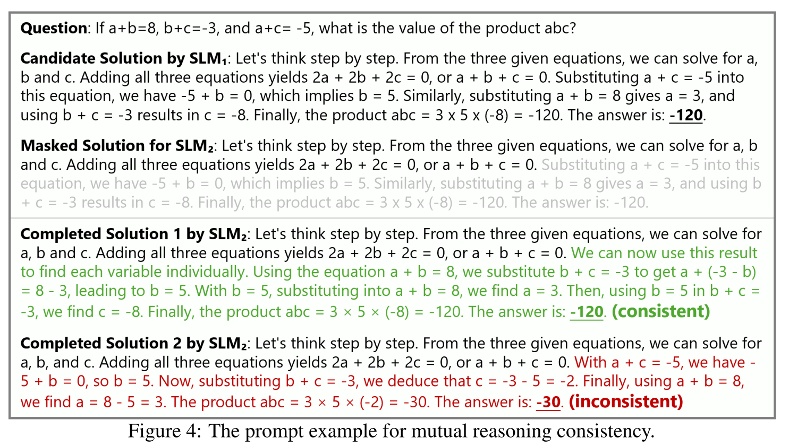



Keywords: Mutual Reasoning; Small Models; Reasoning Capability Enhancement


## Research Background

### Existing Work

The following content is generated by AI to quickly explain what RAP is.

The research foundation is a framework called RAP (Reasoning via Planning), which aims to enhance the reasoning capabilities of models in complex tasks by using language models (LLMs) as both world models and reasoning agents, combined with the Monte Carlo Tree Search (MCTS) algorithm for strategic exploration.

1. **Problem Background**:
   - Current large language models (LLMs) have limitations in reasoning tasks, mainly due to the lack of mental representations of the environment (world models), making it difficult to predict the outcomes and long-term effects of actions.
   - Additionally, LLMs lack a reward mechanism to evaluate reasoning paths and cannot balance exploration and exploitation, leading to inefficient reasoning.

2. **RAP Framework**:
   - **Language Model as World Model**: Defines states and actions through natural language, models the reasoning process as a Markov Decision Process (MDP), and uses LLMs to predict the outcomes of each action.
   - **Reward Design**: Uses the log probability of actions, confidence levels, and the LLM's own evaluation results as rewards to guide reasoning towards an ideal state.
   - **Monte Carlo Tree Search (MCTS)**: Iteratively constructs a search tree through MCTS, balancing exploration and exploitation, and ultimately selects high-reward reasoning paths.

### Shortcomings

1. LLMs struggle to effectively explore the solution space, often generating low-quality reasoning paths.
2. LLMs have difficulty accurately assessing the quality of reasoning paths.
3. These issues are more pronounced in small models.

## Method Overview

### Human-like Reasoning

The reasoning paths are still generated using MCTS, but with more actions that simulate human thinking processes: decomposing and searching a reasoning step, proposing sub-problems, problem transformation, etc.

### Path Evaluation

The mutual consistency principle is used to determine the quality of paths, i.e., introducing another small model of comparable capability as a "peer" to evaluate the quality of reasoning paths. The specific process is as follows:

1. The framework provides the "peer" small model with some local reasoning paths as prompts, and then asks this small model to complete the reasoning path.
2. If the path generated by MCTS matches the path completed by the "peer" small model, then this reasoning path is considered high-quality and can be a candidate path.


Using small models of comparable capability avoids distilling large models; using "peer models" to evaluate paths rather than directly guiding path generation; judging "path consistency" mainly relies on the final result.


## Detailed Methodology

Symbol Explanation Table:

| Symbol             | Meaning                  |
| -------------- | ------------------- |
| \(x\)            | Target Problem                |
| \(M\)            | Target Small Model               |
| \(T\)            | Search Tree Generated by Small Model Using MCTS   |
| \(s\)            | Intermediate Reasoning Step               |
| \(t\)            | Candidate Path, a Complete Reasoning Path in \(T\) |
| \(ans\)          | Final Reasoning Path for \(M\) to Solve \(x\)  |
| \(Score\)        | Reasoning Path Evaluation Function            |
| \(a\)            | An Action Sampled from the Action Space     |
| \(s_{d}\)        | Termination Reasoning Step, Contains the Answer       |
| \(\hat{M}\)      | "Peer" Small Model             |
| \(T_{validate}\) | \(T\) Pruned by Path Evaluation Function    |
| \(Estimate\)     | Path Evaluation Function              |

### Problem Formalization

Formalize the abstract natural language description of "small model solving reasoning problems":

$$
t=x\oplus s_1 \oplus s_2 \oplus ...\oplus s_d
$$

$$
T=\left \{ t^1, t^2, ..., t^n \right \}
$$

$$
T_{validate}=Estimate(T)
$$

$$
ans = max(Score(T_{validate}))
$$

### Human-like Reasoning

#### Action Space

1. **One-step Thinking**: Given the existing reasoning path, let the model generate the next reasoning step.
2. **Quick Thinking**: Directly let the model complete all reasoning steps until the final result is produced.
3. **Sub-problem + Answer**: Let the model propose a sub-problem and answer it.
4. **Sub-problem Re-answer**: The answer generated in the previous step may be inaccurate, so provide an additional action option to re-answer the sub-problem.
5. **Problem Restatement**: Let the model reorganize the conditions of the problem.


Note that action 4 can only occur after action 3, and action 5 can only occur after the problem itself (root node).


#### Reward Function

Inspired by AlphaGo, the evaluation (reward) of intermediate steps is set as their contribution to the correct result. The specific implementation is as follows:

1. Initialize \(Q(s_{i},a_{i})=0\); randomly generate the next step until a termination node \(s_{d}\) is encountered.
2. Use **consistency voting** to calculate \(Q(s_{d},a_{d})\), which is also the **confidence score** of the termination node.
3. Backpropagation: \(Q(s_{i},a_{i})=Q(s_{i},a_{i})+Q(s_{d},a_{d})\).

#### MCTS

Generally, the classic MCTS is used: selection, expansion, simulation (Rollout), and backpropagation; however, to obtain more accurate reward values, multiple simulation evaluations are performed.

The exploration-exploitation balance still uses the classic UCT formula:

$$
UCT(s,a) = \frac{Q(s,a)}{N(s,a)}+c\sqrt{ \frac{\ln N_{parent}(s)}{N(s,a)} }
$$

Where \(N(s,a)\) represents the number of times a node has been visited, \(Q(s,a)\) is the cumulative reward value, and \(c\) represents the balance rate.

### Path Evaluation

1. For a reasoning path \(t=x\oplus s_1 \oplus s_2 \oplus ...\oplus s_d\), randomly select a reasoning step \(s_{i}\).
2. Inject the reasoning path before \(s_{i}\), \(t_{1}=x\oplus s_1 \oplus s_2 \oplus ...\oplus s_i\), as a prompt into the "peer" small model \(\hat{M}\).
3. \(\hat{M}\) completes the path, generating a new path \(t'=x\oplus s_1 \oplus s_2 \oplus ...\oplus s_i \oplus s_{i+1}' \oplus \dots \oplus s_{d}'\).
4. If the "path consistency" is achieved, i.e., the problem answers are consistent, then \(t'\) is considered a candidate path.


The process of selecting candidate paths is the pruning process of \(T\), ultimately producing \(T_{validate}\).


### Final Selection

For each candidate path in the candidate path tree \(t=x\oplus s_1 \oplus s_2 \oplus ...\oplus s_d\):

$$
Score(t)=\prod_{i=1}^{d} Q(s_{i},a)
$$

Finally, select the reasoning path with the highest score:

$$
ans = max(Score(T_{validate}))
$$

## Other Details

1. MCTS performs 32 Rollouts.
2. When processing the MATH dataset, the maximum depth of MCTS is 8; in other cases, the maximum depth is 5.
3. The reasoning of the "peer" small model and the target small model can be executed in parallel to improve computational efficiency.
4. During path evaluation, the truncation point of the path should be between 20% and 80% of the total path.

## In-depth Understanding

rStar generates high-quality paths to solve problems. For example, consider the original figure from the following paper:

The entire process is: \(SLM_{1}\) generates a solution path for the problem via MCTS, then this path is masked, and \(SLM_{2}\) attempts to solve the problem under the condition of the original line of thought. If it successfully derives the correct answer, this path is considered a high-quality path.

Below, let's analyze some key points step by step:

1. Problem information: In mathematical problems, the information in the problem should be sufficient to completely solve the mathematical problem, and all necessary information is fully provided within the problem itself.
2. The final result can be precisely verified.

These characteristics are actually the **prior knowledge** specific to the domain of "mathematical question-answering." Without these priors, the rStar process cannot proceed. As we all know, mathematical question-answering and coding are recognized as relatively closed domains; therefore, AI achieves relatively excellent results when performing reinforcement learning in these areas.

Here, it is important to clarify the connection between rStar and classic reinforcement learning. In classical reinforcement learning, the Agent selects an action, the environment provides feedback, and the Agent immediately updates its parameters (or accumulates a small batch before updating). What rStar essentially does is decouple the data generation and training processes: first, let the Agent generate a large amount of data on its own, then further filter out the high-quality data, and finally train uniformly.


Can the data filtering process of rStar be combined with the real-time update strategy of traditional reinforcement learning? 🤔 Indeed, someone has done this; see [TTRL](https://arxiv.org/abs/2504.16084) for details.


In summary, if we want to apply the successful experience of rStar to the field of clinical medical diagnosis, we need to transform clinical medical diagnosis into a closed domain. How to make it a closed domain? This requires considering what existing data can achieve.

What is the existing data? It includes the patient's basic information, admission diagnosis, etc. All of this data is obtained from actual examinations. Here, it can be broken down into individual actions, such as obtaining the result of an "admission diagnosis" after performing it. Then, this result can be compared with real data to provide reverse supervision for fine-tuning the model to better perform admission diagnoses. Similar operations can be performed for each critical step.

In other words, an important prior in the field of clinical medical diagnosis is the **complete diagnostic process that human experts have developed through years of practice**. In this diagnostic process, each step generates data that can be used for model training, and the model ultimately learns to **better complete the aforementioned process**. Although the resulting model cannot fully handle emergencies (these situations are not included in the training data), in fact, emergencies should not be handled by models at all. Models should deal with repetitive general problems, while emergencies should be handled by experienced human experts.

To summarize further, what we can do is to distill and summarize the diagnostic process of human experts into a comprehensive workflow. In each step of the workflow, the model should independently collect relevant information and derive conclusions for that step. During this process, MCTS can be used for search sampling, thereby enabling the model to better autonomously gather information and reason about conclusions.