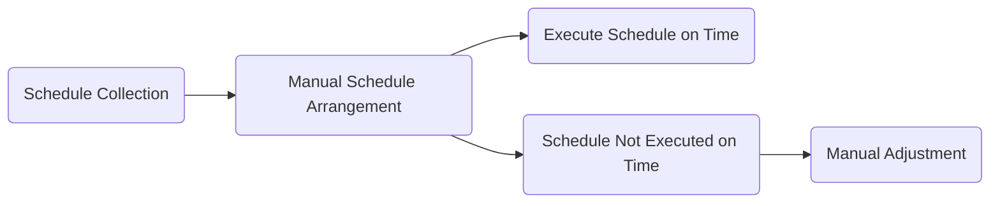
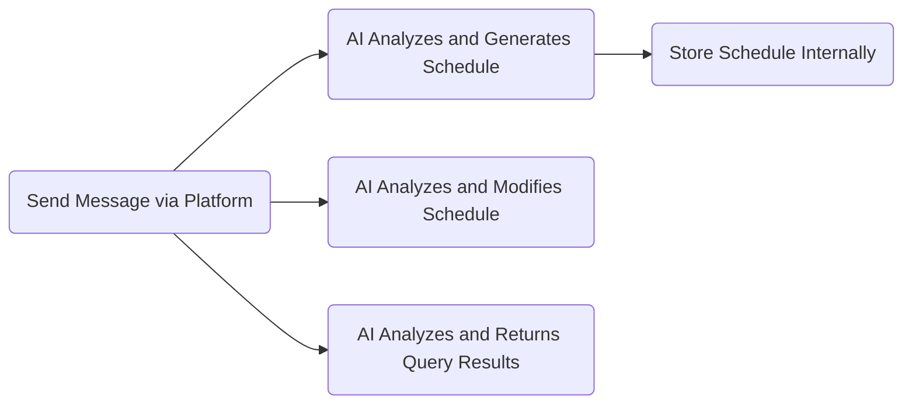

TODO_UPDATE

Analysis Report on the Current State of Schedule Management Software Functionality  


## Preface  

The term "schedule management" frequently appears in our daily lives, yet it remains elusive: What exactly is schedule management? Why do we need it? What purpose does it serve? Who engages in schedule management, and how effective is it?  

### What is Schedule Management?  

On the surface, "schedule management" seems like a common concept, but in reality, it encompasses complex and multifaceted content.  

**In summary**, schedule management is a method of clearly recording, planning, organizing, and optimizing personal or team time and tasks to achieve set goals.  

Depending on different needs, it can be categorized into the following types:  

1. **Personal Growth and Self-Improvement**:  
   - Characteristics: Entirely dependent on personal will, often with a broad goal but no specific events or timelines, possibly with a quantitative metric.  
   - Primary Purpose: Facilitate long-term personal growth, improve quality of life, and enhance satisfaction.  

2. **Professional and Academic Management**:  
   - Characteristics: Highly specific events and timelines, not driven by personal preference, often requiring collaboration with others, usually with one or more quantitative metrics.  
   - Primary Purpose: Achieve concrete career goals, enhance professional skills, and improve efficiency.  

3. **Social and Relationship Management**:  
   - Characteristics: Involves complex interpersonal dynamics, lacks quantitative metrics, is unpredictable, and has low controllability.  
   - Primary Purpose: Maintain, expand, and optimize social networks, increase social capital.  

4. **Financial and Daily Life Management**:  
   - Characteristics: Tasks are trivial, frequently repetitive, flexible yet follow periodic patterns, and generally short in duration.  
   - Primary Purpose: Ensure a sense of order and stability in life.  

In reality, schedules are a mix of the above aspects. Thus, when we casually refer to "schedule management," we vaguely mean "managing all aspects of life," leading to a very ambiguous understanding of the concept. 

### What Constitutes "Good" Schedule Management?  

Generally, "good schedule management" is a clear, realistic, flexible system that effectively balances long-term goals with short-term actions, incorporates regular feedback and continuous adjustment mechanisms, significantly enhances personal control, reduces stress, and is easy to record and execute. Specifically, it should meet the following criteria:  

1. **Goal Clarity**  
2. **Realistic and Executable**  
3. **Flexibility & Resilience**  
4. **Balance between Long-term and Short-term**  
5. **Feedback and Adjustment Mechanisms**  
6. **Reduce Stress and Enhance Control**  
7. **Ease of Use & Clear Recording**  

From a user experience perspective, "good schedule management" simply needs to answer the following questions:  

1. **How to collect necessary information**: User schedules, preferences, weather data, online information, etc.  
2. **How to process the collected information**: Different workflows for different types of schedules.  
3. **How to enhance user experience**: Streamlined and warm interactions, intuitive and concise information presentation.  

## Industry Status  

Below is a list of existing schedule management solutions. However, to be honest, there are few domestic applications in this niche, while international offerings, though numerous, suffer from severe homogenization.  

#### TickTick  

TickTick offers comprehensive functionality with a clean design, representing a classic static schedule management app. Its logic for schedule management is roughly as follows:  

#### Dola

[Dola](https://heydola.com/zh) is a futuristic AI-powered schedule management app: it has no interface, and all interactions with the AI occur via messaging platforms like `WhatsApp` or `Apple Messages`. However, it does not support mainstream Chinese apps like QQ or WeChat.  

Based on official descriptions, here’s an approximate user flow:  

#### Motion  

[Motion](https://usemotion.com/) is an AI-driven work management app primarily targeting entrepreneurial teams, with many features designed for collaboration. During testing, we focused on its schedule arrangement capabilities but found the results underwhelming.  

The core logic is: divide time into work and personal blocks, then let the AI insert tasks into available slots. The outcome essentially devolves into simple task insertion: if there’s free time, a task is added—even if the deadline is a month away or the day is already packed.  

### Summary  

#### Static Schedule Management  

**Manual adjustments** are unavoidable in static schedule management apps and represent the most labor-intensive part of the process. While these apps can create time blocks for scheduling, they lack dynamic adjustment capabilities. This isn’t an issue for fixed, external schedules with clear start and end times.  

However, for internal, flexible, or trivial tasks—like memorizing 15 words, doing laundry, or reading a magazine—these tasks often lack specific start times and only need completion by the end of the day. They also lack clear end times; for example, memorizing 15 words might take 30 minutes, but on a good day, it could take only 20.  

These trivial tasks pose a significant challenge to static scheduling. While a single task’s delay or early completion may not disrupt the schedule, their cumulative effect can be highly disruptive.  

Additionally, if these scattered tasks aren’t aligned, they can create **time vacuums**, leaving users unsure of what to do next. For instance, if a user finishes memorizing words early and has 10 minutes to spare, how should they use it? Without clear guidance, they might default to scrolling through short videos, leading to further delays and more time vacuums.  

To break this vicious cycle, three strategies exist:  

1. **Manual Adjustment by the User**: Highly cumbersome, wasting precious time on trivial arrangements, and potentially causing further delays.  
2. **Ignore Adjustments and Time Control**: This renders schedule management meaningless, reducing it to a simple to-do list without time control—defeating its purpose.  
3. **Strict Adherence to the Schedule**: Theoretically perfect, but practically ineffective. Life is unpredictable, and delays or early completions disrupt subsequent tasks, leading to rushed work or wasted time.  

**Time vacuums and their cascading effects are the Achilles' heel of static schedule management apps**, severely limiting their adoption. Consequently, schedule management is often seen as a niche activity for highly disciplined individuals, and the software is perceived as catering only to this small group.  


I’ve used several static schedule management apps but struggled to stick with them: either the learning curve was too steep, or rigid schedules were impractical to follow.


Thus, a truly meaningful schedule management tool shouldn’t demand a life free of surprises or strict adherence to plans. Instead, it should provide solutions for when things go off track.  

#### Dynamic Schedule Management  

Existing dynamic schedule management apps partially address the inflexibility of static tools but remain constrained by traditional paradigms, requiring extensive manual input. This creates a paradox: if users are inputting so much manually, why use AI at all? Why not rely on faster, more precise algorithms?  

Bolder innovations are needed to leverage the full potential of large language models for generalized processing.  

## Understanding the Current Landscape  

Understanding public perceptions and needs regarding schedule management is crucial for defining the app’s form.  

We conducted a small-scale survey, revealing:  

1. Most respondents only occasionally plan their schedules.  
2. Dedicated schedule management apps are less popular than built-in phone notes.  
3. Over half reported that most planned schedules weren’t completed as intended.  
4. Among desired features, "ease of use" ranked highest, followed by "personalization."  

Though the sample size was small, we can infer:  

1. Public awareness of schedule management is low.  
2. Simplicity and lowering barriers to use should be foundational.  
3. Personalization is another key area for optimization.  

## Technical Proposal  

Based on the above, we propose the following goals:  

Break the illusion that mental scheduling is efficient, reduce reliance on deadlines, address the high cost and inflexibility of traditional tools, and solve AI’s inability to capture implicit preferences or balance long- and short-term goals. Make schedule management a practical part of daily life, genuinely improving efficiency and quality of life—truly enabling: *Easy Schedule, Simple Life*.  

For feasibility, we exclude: social/relationship management, financial tracking, and team collaboration, focusing solely on individual users’ needs for personal growth and daily task management.  

### Interface Design  

To keep the interface intuitive, we draw inspiration from life: a boss communicates simply with a secretary to arrange schedules.  

Thus, the interface adopts the simplest form: a chat dialog, akin to messaging a personal assistant on QQ or WeChat.  

### Essential Data Collection  

Since user interaction occurs via chat, all **user-related** data must be extracted from messages. Key data includes:  

1. **Schedule Data**: Tasks the user needs to complete, e.g., "Submit academic English homework by next Monday."  
2. **User Preferences**: Unconscious habits, e.g., procrastinating on English homework.  
3. **Execution Data**: Whether scheduled tasks were completed.  
4. **External Data**: Weather, news, etc., fetched from the web.  

Schedule data comes from user messages, preferences are inferred from adjustments to "unreasonable" schedules, and external data is retrieved as needed.  

Processed data is stored long-term in a "memory system," technically implemented as RAG: vector databases for schedules/preferences, relational databases for arranged tasks, with AI granted direct access for "memory updates."  

### Data Processing  

The "memory system" uses semantic and temporal searches to populate prompts, guiding the AI’s scheduling decisions.  

A pre-built knowledge base provides scientific principles for scheduling, ensuring plans are both personalized and scientifically sound.  

### Data Presentation  

To maintain simplicity, only two elements are displayed:  

1. **Chat Dialog**: For input and scheduling.  
2. **TODO List**: For tracking task completion.  

## System Implementation  

  

The system architecture is shown above, with the following workflow:  

1. User input is saved to an internal message history database for global access.  
2. **Parameter Extraction**: The LLM extracts parameters from input and handles unsupported messages.  
3. **Memory Query**: Relevant data is fetched from schedules and vector databases, formatted into XML for the LLM to decide the next action and extract parameters.  
4. **Action Execution**: Database APIs update schedules and vector stores based on the LLM’s decision.  
5. **Response Generation**: Update logs are formatted into XML prompts, and the LLM generates a user-friendly response.  

### Schedule Storage Implementation  
#### Vector Schedule Database  

#### Schedule Table  

### Parameter Extraction Implementation  

### Memory Query Implementation  

### Action Decision Implementation  

### Database Interface Implementation  

### Response Generation Implementation  

## Testing Analysis