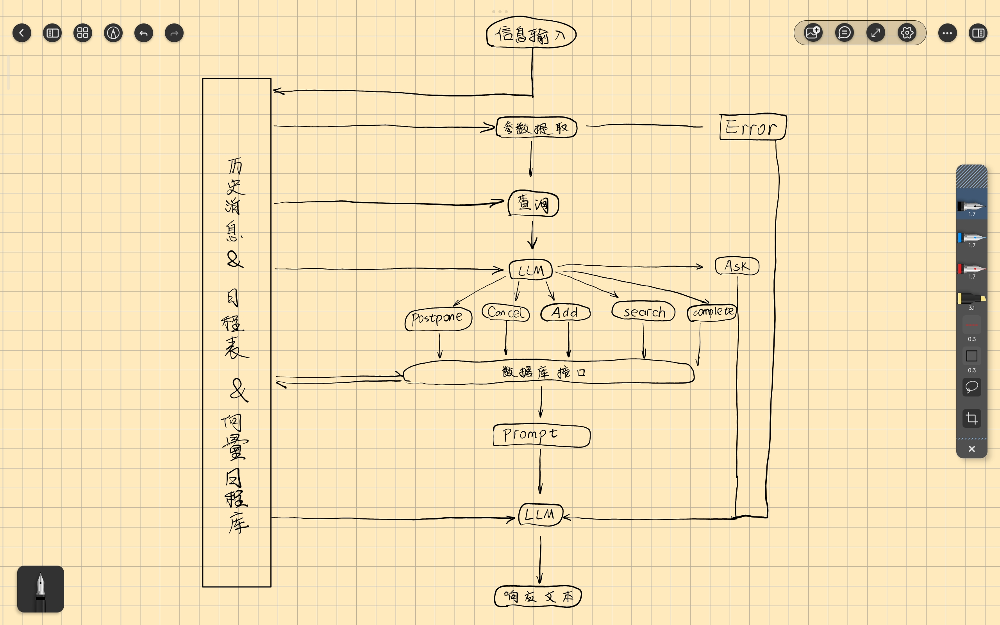

TODO_UPDATE

日程管理软件功能现状分析报告


## 前言

"日程管理"这个词在我们的生活中经常出现，但是又非常令人捉摸不透：日程管理到底是个啥？我们为什么需要它？它有什么作用？有哪些人在进行日程管理？效果如何？

### 何为日程管理？

表面上‘日程管理’是一个常见概念，但实际上它涵盖了复杂且多元的内容。

**总的来说**，日程管理是一种明确记录、规划、组织和优化个人或团队的时间与任务，以实现设定目标的管理方法。

针对不同的需求，可以具体细分为以下品类：

1. **个人成长与自我提升**：
	- 特点：完全取决于个人意愿，往往只有一个宏大的目标，没有明确的事件、时间，可能存在一个定量指标
	- 主要目的：促进个人长期成长、提高生活质量和满足感

2. **个人职业与学业管理**：
	- 特点：有非常明确的事件、时间，不以个人主观意愿为主，往往还需要与他人协作，一般存在定量指标甚至不止一个
	- 主要目的：实现具体的职业目标、提高职业技能和效率

3. **社交与人际关系管理**：
	- 特点：需要处理复杂的人际关系，没有定量指标，具有偶然性，可控性较低
	- 主要目的：维护、拓展和优化人际关系网络，提高个人社会资本

4. **财务与生活事务管理**：
	- 特点：任务琐碎，频繁重复，灵活但又具有一定的周期性规律，持续时间一般不长
	- 主要目的：保障生活的秩序感和稳定感

实际生活中，日程其实是上述几个方面的混合，因此当我们泛泛地提及"日程管理"，其实我们就模糊地指代了"管理生活的方方面面"，导致人们对于日程管理的认知非常模糊。

### 何谓"好的"日程管理

一般来说，“好的日程管理”是一套清晰明确、现实可行、富有弹性，且能有效平衡长期目标与短期行动，具备定期反馈与持续调整机制，显著提高个人掌控感并降低压力，且易于持续记录与执行的管理体系。具体来说需要满足以下标准：

1. 清晰明确的目标导向性（Goal Clarity）
2. 可执行性和合理性（Realistic and Executable）
3. 灵活且有韧性（Flexibility & Resilience）
4. 长期与短期平衡（Balance between Long-term and Short-term）
5. 反馈与调整机制（Feedback and Adjustment）
6. 降低心理压力，提高掌控感（Reduce Stress and Enhance Control）
7. 易于使用且有明确的记录方式（Ease of Use & Clear Recording）

但是从用户体验的角度来说，“好的日程管理”其实只用回答下面这几个问题：

1. 如何收集必要信息：用户日程、用户偏好、天气信息、网络资讯等等
2. 如何处理上述信息：根据不同的日程类型进行不同的处理流程
3. 如何降提升用户体验：精简而有温度的交互方式、直观简洁的信息呈现

## 行业现状

现有的日程管理解决方案罗列如下，但是说实话，日程管理这个赛道的应用国内真的不多，国外的应用虽多但存在严重的同质化

#### 滴答清单

滴答清单的功能覆盖全面，设计风格简洁，是一个经典的静态日程管理应用。它的日程管理逻辑大概如下：


graph LR;
id1("日程收集")-->id2("手动日程安排")-->id3("按时执行日程");
id2("手动日程安排")-->id4("没有按时执行日程")-->id5("手动进行调整");


#### Dola

[Dola](https://heydola.com/zh) 非常具有未来气息的一款 AI 日程管理软件：完全没有软件界面，与 AI 的交流全部通过常见的消息平台，例如 `WhatsApp`，`Apple Messages` 等。但是完全不支持国内的主流软件例如 QQ，微信等。

根据官方说明大概绘制了一下体验流程图：


graph LR;
id1("通过消息平台发送消息")-->id2("AI分析生成日程")-->id3("软件内部存储日程");
id1("通过消息平台发送消息")-->id4("AI分析后修改日程");
id1("通过消息平台发送消息")-->id5("AI分析后返回查询结果")


#### Motion

[Motion](https://usemotion.com/) 是一款主打 AI 驱动的工作管理软件，软件主要的服务群体是创业团队，在团队协作方面进行了很多的设计。在测试过程中重点测试了一下对于具体日程的安排效果，但是发现并没有那么好的效果。

日程安排的主体逻辑就是：通过工作时间和私人时间来进行分块，然后 AI 就根据空闲时间来直接安排日程。最后的效果其实退化为了简单的日程插入：有空就会插入日程，即便这个工作的截止日期还有一个月，即便你这一天已经非常忙碌。

### 总结

#### 静态日程管理

**手动安排调整**日程是静态日程管理软件使用过程中必不可少的环节，也是是整个流程中最耗费精力的，静态日程管理应用虽然能够创建时间块来安排日程，但是对于缺乏动态调整的能力。这对于一些固定的、来自外界的日程并没有什么影响，因为它们一般都具有明确的起止时间。

但是对于一些来自内在的、软性的、琐碎的日程，例如背 15 个单词、洗衣服、阅读杂志等。这些日程一般用于自我提升，没有明确的开始时间，只需要当天完成就行；同时也没有明确的结束时间，例如 15 个单词往往 30 分钟才能背完，结果某天状态良好 20 分钟就背完了。

这些琐碎的日程对于静态的日程安排是一个不小的挑战。尽管单个琐碎日程的提前或者延误对于整个日程安排并无大碍，但是他们的累积效果对于静态日程安排的破坏非常明显。

除此之外，这些零散的日程如果没有对齐的话，还会产生**时间真空**，导致用户在某个时间点突然不知道该干什么。例如，用户提前背完了单词，空余了 10 分中的时间。这十分钟该如何妥善处理？如果没有明确的安排的话，用户可能会选择在这 10 分钟刷短视频，然后紧接着又是一段休息时间，又继续刷视频。这不出意外会导致下一个任务因为时间不足而再次延误，然后又产生一段时间真空，如此延续。

想要终止这种恶性传导，有三种对策：

1. **用户手动进行调整**：这将非常非常麻烦，宝贵的时间浪费在了安排一些琐碎的事情上；并且手动调整所花费的时间也可能会导致任务的延误

2. **直接不进行调整，忽略具体的时间控制**：这样做日程管理将失去其本身的意义，精确安排时间使得时间价值最大化。这个时候的日程安排完全退化为了一个任务表，失去了对于时间的控制作用，倒不如一开始就使用没有时间控制能力的更加专业的清单工具

3. **用户严格按照日程执行**：理论很完美，实际上效果非常糟糕。生活中不可避免出现意外情况，如果出现延误，那么下一项任务的时间受到挤压，可能无法按时完成，或者匆忙完成导致效果不佳；如果提前完成，那么难以临时添加一个合适的任务填补时间真空，导致时间浪费的同时也不利于执行力和专注力的培养

**时间真空的恶性传导是静态日程管理软件的致命伤**，严重限制了日程管理软件的普及程度。因此人们往往心照不宣地认为日程管理是一些极其自律的人的专属行为，日程管理软件也只是为这类人设计的小众软件。


我自己曾经使用过一些静态日程管理软件，但都难以坚持：要么是软件的学习曲线过于陡峭，要么是难以遵循固定的日程安排


因此，一个真正有意义的时间管理软件不应该要求用户的生活没有任何意外，或者用户必须遵守日程安排，而应该给用户提供出现意外后的解决方案。

#### 动态日程管理

现有的动态日程管理应用已经在一定程度上解决了静态日程管理软件难以快速动态调整的问题，但是在智能化、个性化方面还受传统的日程管理思路的束缚，需要用户手动输入大量的信息，但这是一个很矛盾的地方：用户都手动输入这么多信息了，为什么还要 AI 来安排？那么多科学算法又快又准为什么不用呢？

因此还需要有更大胆的尝试来释放大语言模型的强大的通用处理能力。

## 认识现状

了解人们对于日程管理的认知程度以及需求是确定应用形态的重要依据。

我们在小范围内进行了问卷调查，结果显示：

1. 大部分受访者只是偶尔进行日程规划
2. 专门的日程管理软件的普及程度甚至不及手机自带的备忘录
3. 有超过一半的受访者表示大部分日程规划都没能按照预期完成
4. 在众多功能中“操作简单”成为呼声最高的功能，其次就是“个性化”

虽然样本量不多，但是可以做出如下推断：

1. 人们对于日程管理的认知程度不高
2. 操作简单、降低用户使用门槛应该成为日程管理应用的基础
3. 个性化也应成为一个需要重点优化的一个功能

## 技术方案

基于上面的调查内容，我们正式明确提出应用的发展目标：

打破人们对于头脑中进行的日程规划很高效的虚假想象，打破人们对于ddl的严重依赖，解决传统日程管理软件使用成本过高、动态调整能力不足的痛点，解决现有AI难以捕捉用户隐性偏好、难以进行长短期目标综合规划的难题。让日程管理真正的落到个体的日常生活中去，实实在在提高办事效率和生活质量，达到真正的：轻松规划，简单生活(Easy Schedule, Simple Life)

为了保证方案的可实施性，我们不考虑：社交与人际关系管理、财务记录和团队协作功能，只专注服务个体用户，满足其在个人成长与自我提升、生活琐事管理方面的需求。

### 交互界面设计

要想交互界面简洁直观，最好的方式其实就是从生活中取材：老板通过与秘书的简单交流就能够完成日程的安排。

因此交互界面就直接选用最最简洁的聊天对话框的形式，就类似于在 QQ、微信中和你的私人秘书发消息。

### 必要信息收集

既然用户与系统的交互方式只是通过一个聊天对话框，那么所有**用户相关**的信息也都应该从用户的消息中获得。必要的信息有大致下面这几类：

1. 日程信息：用户有哪些事情要做，比如下周一之前要交学术英语写作的作业
2. 用户偏好：用户不自觉地生活习惯，比如用户不喜欢学术英语的作业，经常拖延完成
3. 日程执行信息：原本安排好的日程用户是否完成
4. 其他客观信息：需要搜集网络上的信息，例如天气信息等等

其中，用户的日程信息是通过用户主动向系统发送消息来获取，用户的偏好通过用户对于某些安排得“不合理”的日程的调整来获得，其他客观信息系统根据情况从互联网上获取。

这些信息经过必要处理之后都会进行长期存储，也就是存储到“记忆系统”，这个“记忆系统”从技术本质上来说就是 RAG：依赖向量数据库来存储日程和偏好，依赖关系数据库来存储被安排好的日程信息，直接把这两个数据库的操作权限开放给 AI，实现“记忆更新”

### 信息处理

“记忆系统”中的信息通过语义搜索与时间区间搜索，填充到提示词当中作为大模型安排日程的依据。

同时有一个提前准备好的科学知识库提供给大模型，让它能够依据一定的科学原理来进行日程的安排。

这样就能够兼顾科学性与个性化，让安排出来的日程真正被用户接受并执行

### 信息呈现

为了保持“简洁性”，避免给用户呈现太多的非必要信息，因此只做两个信息呈现：

1. 聊天对话框
2. TODO List

通过聊天对话框完成日程的存入与安排，通过 TODO List 来收集用户执行情况的信息

## 系统实现

系统整体的架构图如上所示，流程详述如下：

1. 用户的信息输入会直接保存到内部历史消息数据库内，供全局访问
2. 参数提取步骤会利用大模型来对用户的输入进行参数提取，同时处理一些系统不支持的用户消息
3. 提取参数之后就会从日程表和向量日程库中查询相关记忆并封装为 xml 模板提供给大模型，由模型决定下一步的操作，并提取出操作所需的参数
4. 模型决定下一步需要的操作之后，数据库接口函数就会依据参数处理这些操作，对日程表和向量日程库进行更新
5. 更新之后，系统会返回一个更新日志，并封装为 xml 提示词模板，提供给大模型生成一个合适的响应文本，呈现给用户

### 日程存储实现
#### 向量日程库

#### 日程表

### 参数提取实现

### 记忆查询实现

### 操作决策实现

### 数据库接口实现

### 响应文本实现

## 测试分析
